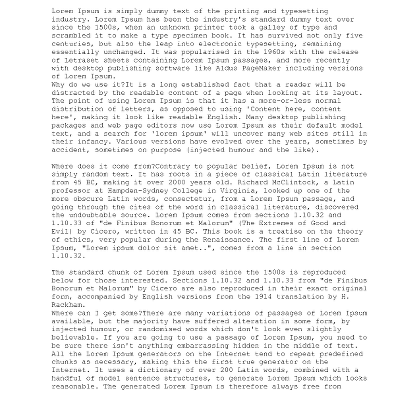
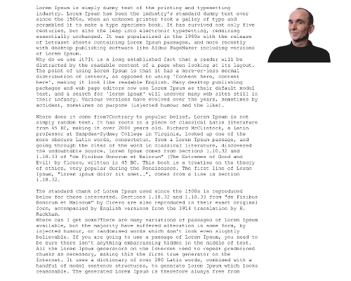
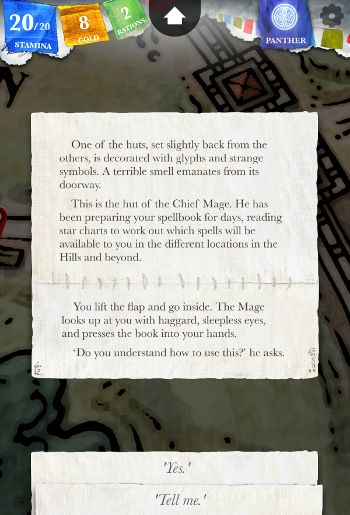
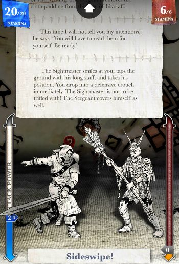
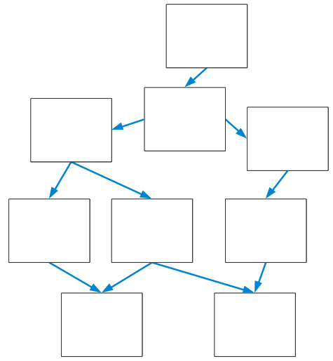
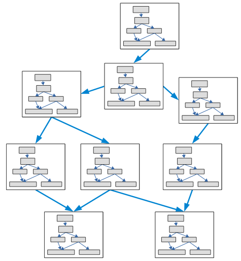

Коли я розповідаю про текстові ігри, з’ясовується, що мої співрозмовники про них чули. У кожного з них своє ставлення до них, що врешті-решт зводиться до двох варіантів: “А, текстові квести! Це такі ретро-ігри, я пам’ятаю, як складно було в них грати” або “Це щось незвичайне, авангардне, дуже цікаво і дивно, але незрозуміло”. Працюючи над "Sorcery!", ми постаралися знайти золоту середину між цими двома крайнощами та створити гру, що була б зрозумілою та зручною для пересічного гравця.

<!-- cut -->

Чому ж ми обрали текст нашим інструментом?

## Текст багатогранний

Одна картина варта тисячі слів. Так, це правда. Але за допомогою тисячі слів я можу зробити набагато більше, ніж одною картинкою.

Ось наочний приклад з Sorcery 2:

> Ви йдете навпростець через поля, подалі від дороги, прямуючи до пагорбів біля ріки.

Описуємо поточну дію гравця.

> Десь у центрі Кхаре знаходяться доки -- людне місце,

Трохи розповідаємо про світ, що нас чекає.

> де ви зможете знайти місце, щоб переночувати,

Встановлюємо середньострокову ціль.

> і, можливо, дізнатися більше про місто.

І ще одну - в один абзац ми умістили дві цілі.

> Ви підіймаєтеся на вершину пагорба, де трави не так багато, і завмираєте, почувши звук позаду вас. Це тихий шелест клинка, що витягується з піхов…

Перекидаємо гравця до того, що відбувається зараз і на що потрібно негайно відреагувати.

Отже, в два абзаци ми умістили опис світу, поставили цілі для гравця і дали зрозуміти, що відбувається в теперішню мить і що гравцю потрібно робити зараз.

За допомогою тексту можна описати будь-які речі, в будь-якому масштабі і в будь-яких рамках, протягом будь-якого проміжку часу і з будь-якої точки зору. В одному абзаці ми легко можемо перейти від руху планет до переживань головного героя.

Ще один приклад. В Sorcery гравець робить вибір з декількох варіантів дій -- “Дістати меч”, “Промовити закляття” і т.і. Дії можуть бути як негайними (“Бігти”, “Закричати”), так і довгостроковими (“Йти у тому напрямку”, “Сісти та відпочити”, “Лягти спати”). Незважаючи на те, що це абсолютно різні часові категорії, ми можемо поєднати їх в одному переліку варіантів дій. Я вважаю, жодна інша система не дозволяє зробити щось подібне.

## Текст легко змінювати

Sorcery -- не книга-гра, тут нема сторінок з текстом у звичному для книг розумінні. Так, текст написаний автором, але він не є статичним -- він створюється відповідно до умов, створеним гравцем у грі. В залежності від того, що знає гравець, яким є його персонаж, які його поточні цілі, текст одного і того ж ігрового екрану буде змінюватися.

Давайте подивимося ще раз на текст із попереднього прикладу, але в інших умовах:

> Ви йдете навпростець через поля, подалі від дороги, прямуючи до пагорбів біля ріки.
> Десь у центрі Кхаре знаходяться доки -- людне місце, **де, можливо, вдасться знайти допомогу в пошуку заклять.**

Друге речення в абзаці змінилося, оскільки у мене тепер інша середньострокова ціль. Я більше не шукаю, де зупинитися на ніч -- мені потрібно знайти закляття для відкриття воріт, бо я дізнався про них у попередніх епізодах.

> Ви **біжите** навпростець через поля, подалі від дороги, прямуючи до пагорбів біля ріки.
> Десь у центрі Кхаре знаходяться доки -- людне місце, де ви зможете знайти місце, щоб переночувати, і, можливо, дізнатися більше про місто.

Знову зміна -- середньострокова ціль та сама, але описується іншим дієсловом, оскільки я граю більш активним персонажем.

Звісно, якщо ми змінимо одне дієслово в одному абзаці або один прикметник в одному описі головного героя, це ніяк не допоможе в розкритті образу. Але якщо ми змінимо цей прикметник у всіх описах героя, то дуже наочно і помітно для гравця зможемо характеризувати персонажа. Змінюючи текст таким чином, ми можемо легко досягнути ефекту, аналогічного деяким RPG-іграм, де анімація героя залежить від його стану та навичок.

## Текст дешевий та надійний

Коли я кажу “дешевий”, то маю на увазі не ціну, а об’єм зусиль для створення тексту порівняно зі створенням 3D-графіки, анімацій, малюнків. Наприклад, в Sorcery 2 біля 300 тисяч слів і 1216 сцен, і все це створила одна людина за шість місяців. Ми можемо порівняно швидко створювати велику кількість ігрового контенту і так само швидко змінювати і доповнювати його. Це важливо не тільки з точки зору бізнесу, але і з точки зору дизайна гри, оскільки ми можемо дозволити собі створювати дуже розгалужений сюжет.

Sorcery побудована навколо мапи ігрового світу. Гравець може прийти в будь-яку локацію на мапі, але не одразу. Він може зробити один крок у потрібному напрямку, потім ще один, аж поки не потрапить до потрібного місця. Там буде унікальний ігровий контент, створений автором спеціально для цієї локації -- у нас нема потреби повторно використовувати контент з інших місць гри. Нема сюжету чи квестів, що згенеровані програмно, весь ігровий контент створено автором.

## Небезпеки тексту

Звісно, окрім переваг, у тексту є свої недоліки, на які варто звернути увагу. Я виділив три небезпечних моменти, яких варто уникати, і які досить часто зустрічаються в інших текстових іграх -- зазвичай тому, що з текстом не попрацювали як треба.

### Читання може бути важким

Сучасна людина не любить читати. Це важко та нудно. Ось, подивіться самі:

Будь-який читач може померти від нудьги, коли побачить таку стіну тексту. Проте деякі розробники текстових ігор роблять саме так. Є багато електронних книг-ігор, що виглядають схожим чином. Спочатку на читача вивалюють три-чотири сторінки тексту, а потім пропонують варіанти дій.

Звісно, автор може вирішити: “Це виглядає якось сухо, давайте додамо ілюстрацію!”

Тепер стало ще гірше. Не тому, що це фото Пітера Моліньє (я обрав його, бо певен, що він може витримати і не таке). Цей варіант гірший, бо гравець тепер дивиться на картинку і читає ще менше тексту. Нашу проблему це аж ніяк не вирішує.

Текст -- це візуальна среда, бо ви на нього дивитеся. Оскільки ми дбаємо про візуальне сприйняття, то намагаємося дотримуватися правила Твіттера - пересічна людина легко може сконцентруватися приблизно на 140 символах тексту. Тому ми ділимо текст на невеликі фрагменти, як це роблять автори коміксів. Важливу інформацію ми зазвичай подаємо на початку абзаца, тому вона легко сприймається навіть при поверхневому читанні. Ось як це виглядає в грі:

Тут чотири невеличких абзаца, які зовсім нескладно прочитати, та варіанти дій, що має обрати гравець.

По ходу гри ми можемо дозволити собі трохи збільшити кількість тексту. У кінці гри ми даємо більше тексту, ніж на початку, тому що… якщо гравець ще з нами, то від читання він точно не втомився.

 ### Повторення повторюються

Якщо ви робите гру на кшталт Uncharted, то можете створити одну анімацію, як гравець ховається в укриття, і використати її хоч тисячу разів. Гравець не помітить повторень і буде грати з задоволенням. Але якщо ви напишете в текстовій грі фразу “Ви швидко ховаєтеся за укриттям від пострілів” два рази в одному абзаці, чи навіть один раз в двох різних абзацах на одній сторінці, це негайно викличе роздратовану реакцію гравця. Люди дуже чутливі до повторень тексту та звуку, вони миттєво їх помічають.

Вирішити цю проблему дуже складно. Ми зіткнулися з нею, коли працювали над Sorcery, оскільки ми дозволяємо гравцю повернутися в локацію, де він вже був раніше. І для цієї локації ми вимушені повторювати один і той же текст опису - або писати новий, що дуже складно.

Але в бойових сценах нам вдалося впоратися з цією задачею. Бойова механіка в Sorcery дуже проста - гравець обирає силу удара, переміщуючи повзунок, потім наносить удар, і зверху екрана з’являється текстовий опис подій, сгенерований програмно. Для цього ми використовуємо величезну кількість змін та підстановок тексту, наприклад:

> `Ваш супротивник [сміється|робить крок убік|ухиляється|замахується мечем].`  
> `[Потім|Не гаючи часу,] він [кидається|нападає] на вас.`

Гравці не помічають повторів, хоча ми використовуємо ті самі речення, замінюючи слова їхніми синонімами чи змінюючи порядок слів. Щоправда, переклад таких ігор на інші мови є набагато складнішим, оскільки недостатньо просто замінити слова, потрібно змінювати весь код для побудови фраз та речень.

### Недостатня залученість гравця

Існує думка, що ігри з вибором варіантів дій не дають гравцю відчуття залученості, оскільки в них відсутній “аналоговий” контроль.

Під аналоговим контролем я маю на увазі можливість керувати кожним аспектом поведінки ігрового персонажа, коли гравець обирає куди йти, куди цілитися, коли стріляти, скільки разів, чи робити перерву і так далі. Жодна гра не є дійсно аналоговою, завжди є якісь обмеження - можливості рухів, деталізація ігрового світу або точність ігрового контроллера. Незважаючи на це, гравець все одно відчуває, що знаходиться в грі.

Ігри з вибором варіантів дій погано справляються з цією задачею. Ось, наприклад, гравцю даються варіанти дій: “Ви хочете А) вбити бродягу Б) врятувати бродягу?”. Гравець робить один рух пальцем - і все, справу зроблено. Дія і всі можливі наслідки цієї дії сталися лише тому, що гравець ткнув пальцем. Один раз.

Приблизно так виглядає сюжет гри з вибором варіантів дій:

Цю ж саму структуру можна побачити і в великих комерційних проектах, наприклад, в Mass Effect. Гравець доходить до певної точки і робить вибір. “Хочете вбити того персонажа чи он того? Оберіть варіант А або Б”. Гравець думає щось типу “нуу, я навіть не знааю…” і тикає пальцем. І гра продовжується. І гравець миттєво забуває про зроблений ним вибір. 
Як ігровий дизайнер, я вражений, що настільки масштабна гра має розгалужений сценарій з різними варіантами розвитку подій. Але як гравцю мені все одно, тому що я натиснув кнопку один раз, не зробивши нічого, що могло б призвести до свідомого вибору.

Як саме гравець робить вибір - ось що дійсно важливо.

В “Walking dead” для переходів між гілками сюжету гравець робить той самий вибір знову, знову і знову. І в момент, коли дійсно відбувається розгалуження сюжету, гравець відчуває свою причетність до цього, бо пам’ятає, як робив цей вибір. Аналогічний підхід використаний в Heavy Rain, де розгалуження відбувається відповідно до результатів довгих послідовностей :abbr[QTE]{title="Quick-Time Events. Гравець повинен вчасно натискати на клавіші, щоб персонаж виконував певні дії."}, але мені це здається менш ефективним.

В Sorcery ми застосовуємо концепцію аналогового контролю всередині окремих ігрових сцен. Гравець обирає кожний рух головного героя, кожен рядок диалогу, і просувається по сцені від одного маленького рішення до іншого. В кінці кінців настає розв’язка, що веде історію в тому чи іншому напрямку. Приблизно так:

Послідовність безлічі дрібних розгалужень врешті призводить до вибору з двох варіантів. Давайте розберемо цей підхід на прикладі з Sorcery 2.

Ось сцена, де ви щойно втекли з тюрми в місті Кхаре. Ви йдете по вулиці, але з’являється загін вартових. Що ми можемо зробити: 

- Сховатися в хатині
- Змішатися з натовпом (як в Assassin's Creed)
- Опустити голову, щоб не впізнали

Спробуємо залишитися невпізнаними. Опускаємо голову… але вартовий хапає нас за руку і запитує “Ми десь вже бачилися, чи не так?” І у нас є новий вибір:

- Ні
- Так

Що ж робити - збрехати чи ні? Чи буду я грати роль нечесного персонажа? Чи знає вартовий, що я зробив, чи ні? Невідомо.

Отже, я відповідаю “Ні”, і це брехня. Але для вирішення проблеми цього недостатньо, і ставки підвищуються.

Вартовий каже “Хіба не тебе я бачив в будинку вартових вчора вночі?”, і дійсно, я там був. Чи є сенс продовжувати брехати?

- Напевно, це був мій брат.
- Можливо. Але зараз я вільний.

Обираємо перший варіант. Тепер вартовий говорить: “Мабуть, так. Певен, ти дуже хотів би з ним побачитися”, знову підвищуючи ставки в нашій грі.

В кінці сцени гравець або буде схоплений вартовими, або втече від них. Звісно, ми могли б відразу дати гравцю на вибір ці два варіанти, наприклад, у вигляді “напасти на вартових / втекти від вартових”. Але це буде нецікаво. Аналоговий контроль дає гравцеві можливість прийти до цього розгалуження сюжету, здійснивши безліч інших свідомих та цікавих виборів.

Це також означає, що нам не обов’язково робити часті розгалуження. Якби в сцені з вартовими всі рішення призводили до того, що гравець завжди втікає від вартових - він би не здогадався про це. Гравець подумав би: “О, який я розумний, я втік від вартових”. Якщо гравець не буде навмисно старатися, аби його заарештували, він ніколи не дізнається, що його не заарештують ні за яких умов.

І нарешті, якщо ми зробимо не так багато розгалужень, то зможемо зробити більш явним причинно-наслідковий зв’язок. В момент розгалуження сюжету ми можемо сказати “Це сталося тому, що ти зробив ось це”, оскільки в грі не так багато гілок, які треба відстежувати. Таким чином ми можемо завоювати довіру гравця і дати йому відчуття контролю над грою.
