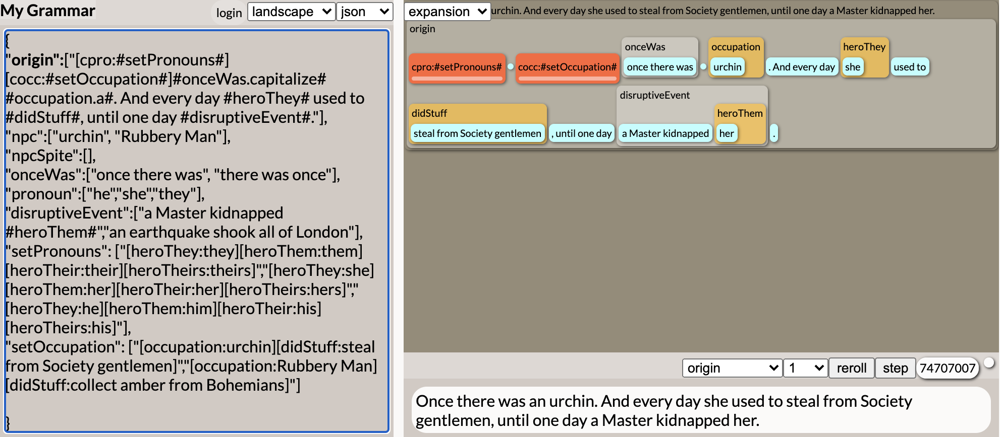
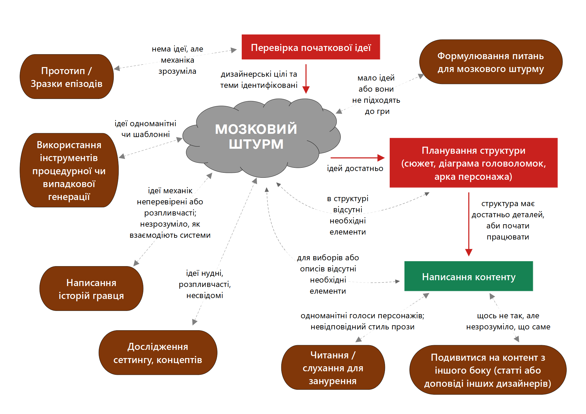

Ця стаття почалася з запитання від читача мого Твіттера:

> Як ви переходите від загальної ідеї гри до конкретної її реалізації?

<!-- cut -->

Колись давно я написала статтю “[Від ідеї до реалізації](https://emshort.blog/2009/08/23/idea-to-implementation/)”, в якій розмірковувала про перехід від ідеї до завершеного проєкту, виходячи зі свого аматорського досвіду. Якби я писала ці поради зараз, то використала б досвід і практики роботи в студії: пре-продакшен, коли ти намагаєшся зробити, аби у проекті не залишалося невизначеностей; [вертикальні зрізи](https://en.wikipedia.org/wiki/Vertical_slice), коли ти будуєш фрагмент своєї гри в повній якості. Стюарт Янг, продюсер “Mask of the Rose”, нашого нинішнього проекту в Failbetter, нещодавно написав як в ньому [виглядає пре-продакшен](https://www.failbettergames.com/leaving-pre-production-on-mask-of-the-rose/).

Я порекомендувала читачеві “Від ідеї до реалізації”, на що він відповів:

> Мене також цікавлять дрібніші деталі: поради щодо створення конкретних [сюжетних бітів](https://en.wikipedia.org/wiki/Beat_(filmmaking)), персонажів, головоломок, предметів, описів. Гадаю, що відповідь буде “довгий мозковий штурм” чи навіть “співпраця з тими, хто добре генерує ідеї”

Я бачу цей процес так:
- Перевірка загальної, неконкретної ідеї
- Створення дрібних її елементів за допомогою мозкового штурму та дослідження
- Складання цих елементів до структури, перевірка її якості; виявлення, чого саме бракує
 
## Перевірка ідеї

> Продуктивна системна механіка, на мою думку,
> - пропонує багато цікавих комбінацій (наприклад, різні типи зв’язків у всесвіті Лаворі, інструменти для видалення та вставки в “Monkey”), які можна поступово вводити в гру
> - може бути реалізована за допомогою правил, загальних для моделі ігрового світу, а не купи виключень
> - має чіткі і зрозумілі наслідки помилок: якщо гравець намагається зробити щось в рамках правил, але не може, чи можемо ми доступно і послідовно пояснити, чому?
>
> *[Створення “Counterfeit Monkey”: паззли та іграшки](https://emshort.blog/2013/01/24/making-of-counterfeit-monkey-puzzles-and-toys/)*

Перед тим, як переходити до деталей, мені потрібно перевірити загальну ідею і впевнитися, що вона не веде мене в хибному напрямку.

*Чи розумію я ідею гри достатньо, аби сформулювати геймдизайнерські цілі для неї?*

Якщо я працюю в команді -- чи згодна команда з цими геймдизайнерськими цілями? Сумісне обговорення геймдизайнерських цілей [надзвичайно корисне для вирішення творчих суперечок в команді](https://www.youtube.com/watch?v=igPKym-Imso), і буде корисним навіть якщо ви працюєте самі.

*Чи уявляю я собі ігрову механіку хоча б приблизно? Чи знаю я на загальному рівні, за якою системою працює ця конкретна частина механіки?*

*Чи розумію я, про що взагалі ця гра? Це може змінюватися під час написання -- зазвичай так і буває -- але чи є у мене загальна тема та посил?*

*Чи перевірила я основні припущення, закладені в геймдизайнерські цілі, ігрову систему на загальному рівні, тему та ідеї, що в ній присутні?*

Наприклад, якщо моя геймдизайнерська ціль включає використання конкретної технології або механіки головоломок, чи зробила я достатньо бета-тестів, аби впевнитися в її потенціалі?

## Мозковий штурм для компонентів
### Обираємо питання, які збуджують уяву

> Торкніться наступної парти. Запишіть ім’я на ній і зверніться до іншого гравця. “Отже, чому персонаж Тодда такий ненадійний?”. Задавайте різним гравцям питання, які допомагають виявити суперечки, невпевненість, таланти, стосунки. Задайте по два питання про кожного персонажа різним гравцям. Використайте цю можливість, аби створити суперечки між персонажами та конфлікти інтересів.
>
> *Евері Алдер, “Керівництво для створення неігрових персонажів в [Monsterhearts 2](https://buriedwithoutceremony.com/monsterhearts)”*

У багатьох посібниках по створенню світу [радять задавати собі питання](https://emshort.blog/2018/03/06/books-on-worldbuilding/) про історію вашого світу, його культуру, економіку, релігію, лінвістику, моду, етікет, кухню, сільське господарство, архітектуру та інші аспекти суспільства, які потрібно винайти.

Посібники по створенню персонажів також іноді пропонують вам [заповнювати анкету кожного персонажа](https://writingcooperative.com/why-a-character-bible-might-be-the-key-to-your-character-creation-24650823ae99), в якій є все від кольору волосся до рівня освіти та навіть [ієрархічної моделі особистості](https://uk.wikipedia.org/wiki/%D0%92%D0%B5%D0%BB%D0%B8%D0%BA%D0%B0_%D0%BF'%D1%8F%D1%82%D1%96%D1%80%D0%BA%D0%B0_(%D0%BF%D1%81%D0%B8%D1%85%D0%BE%D0%BB%D0%BE%D0%B3%D1%96%D1%8F)).

Іноді такі переліки питань розпалюють мою уяву, але здебільшого їх заповнення відчувається рутинною справою. Буває і так, що в них відсутні пункти, які можуть вдихнути життя в мій проект. Я не просто хочу знати, яка улюблена страва персонажа -- я хочу знати, за якою стравою з дитинства він сумує, але не може більше її їсти.

Тому замість стандартного шаблону я починаю з ядра проекту -- механіки, яка керує грою, чи теми, [яка оживляє історію](https://emshort.blog/2018/01/02/the-art-of-dramatic-writing-lajos-egri-and-games/) -- і створюю набір питань спеціально для цієї гри, який призначений для виявлення емоцій, стосунків та конфліктів. Потім я задаю собі ці питання і поступово на них відповідаю, персонаж за персонажем і фрагмент за фрагментом історії.

Мета тут дуже схожа до тої, що стоїть за питаннями, [що визначають персонажа для настільної RPG](https://twitter.com/emshort/status/1429402713482276865), із подібними параметрами, які роблять питання ефективними.

> Правила лише такі:
> - Одна Відносина між кожною парою гравців, що є сусідами за столом.
> - В кожній відносині є одна Деталь.
> - Є хоча б одна Потреба, одне Місце і один Об’єкт.
> - Останній кубік є джокером, на ньому може бути будь-яке число.
>
> Перше правило забезпечує наявність кола персонажів, пов’язаних один з одним. Друге правило забезпечує, що кожен гравець пов’язаний з чимось крутим та яскравим (ймовірно, ви все одно так і зробите). Третє правило забезпечує вашу мотивацію для поганої поведінки в цікавих місцях і з чимось цікавим.
>
> *Ясон Морнінгстар, [правила Фіаско](https://bullypulpitgames.com/games/fiasco/)*

Принцип полягає у тому, що ви створююте персонажів, сюжетні біти та елементи сеттинга, які *мають відношення* до посилу або вашої початкової ідеї.

Наприклад, я знаю, що [спонукальним інцидентом](https://tvtropes.org/pmwiki/pmwiki.php/Main/IncitingIncident) історії є серйозна катастрофа, яка змінила життя. Тоді я можу задати, наприклад, такі питання:

- *За чим із минулого життя цей персонаж сумує найбільше, і що він віддасть, аби це повернути?*
- *Кого цей персонаж звинувачує у катастрофі, і як він виражає це звинувачення?*
- *Що саме цей персонаж бреше собі, думаючи, що б сталося, якби катастрофа не змінила його життя?*
- *Яке найбезпечніше місце для цього персонажа зараз, і що загрожує його безпеці?*

Ці питання не тільки *зв’язують* персонажа зі спонукальним інцидентом, вони також *надають імпульс* історії, оскільки ці питання про нестабільний порядок речей. Брехня та секрети мають бути розкриті. Очікування, злість та страх підштовхують до дії.

Коли у вас є декілька персонажів, ви можете почати створювати відносини між ними:

- *Кому цей персонаж найбільш довіряє, і чому це нерозумно?*
 
Після того, як я відповіла на одне-два питання про кожного персонажа, я дивлюся на структуру і запитую себе: кого не вистачає? Які реакції і точки зору поки не представлені? Яких взаємовідносин не вистачає? Які персонажі мають мало відношення до інших?

Ви можете використовувати подібні навідні питання для інших елементів сюжету, подій або деталей сеттингу:

- *Яка група людей несподівано отримала користь від катастрофи, і як вони використовують ці нові можливості?*
- *Яка подія дала людям недовгу, але марну надію, що катастрофі можна було б запобігти?*

### Обираємо структурні питання

Зазвичай вам потрібно відповісти лише на декілька різних питань для кожного персонажа, щоб придати йому форму та потенціальну траєкторію розвитку.

Але є і обов’язкові питання, на які ви маєте відповісти для кожного персонажа, чи кожного сюжетного біта, чи кожного предмета в грі. Ці питання узгоджують вашу історію з вашими механіками.

Я писала про використання цього методу в дії при роботі над [Savoir-Faire та Counterfeit Monkey](https://emshort.blog/2018/03/13/not-exactly-mailbag-worldbuilding-from-a-mechanic/), а також над [“Mask of the Rose”](https://www.failbettergames.com/designing-characters-for-mask-of-the-rose/).
 
### Історії, щоб знайти механіки

> Речення “відкласти яйця” несе багато сенсів… Як це відбувається? Чи є якась процедура спарювання? А потім мокриці кудись ідуть у якесь місце відкладати яйця?
>
> Мокриці взагалі так не роблять! Мокриці мають виводковий мішок, де вони зберігають яйця!
>
> Мило, чи не так? Отже, ми це додаємо. Додаємо. Ми маємо додати це в гру. В грі має бути якась родзинка. І тепер у нас є механіка виводкового мішка…
>
> *Тарн Адамс [розмірковує про механіки Dwarf Fortress](https://www.youtube.com/watch?v=L67Xb4tgVv8&t=1103s)*

Іноді, замість мозкового штурму сюжетних елементів, ми робимо мозковий штурм ігрових механік: ми будемо робити симуляцію рідин та вогню, чи диму буде достатньо? Які емоції ми будемо моделювати у NPC? І так далі. Стоун Лібранд в своїй доповіді “[One Page Design](https://www.youtube.com/watch?v=GXmsxYm0Mk0)” розповідає, як розпланувати таблицю пов’язаних структурних елементів (і ще багато іншого).

Інший підхід - відштовхуватись від цікавих моментів та історій гравців, які ви хотіли б генерувати у грі. Тарн Адамс [докладно розповідає про цей процес на конкретному прикладі на конференції “Progression Mechanics”](https://www.youtube.com/watch?v=L67Xb4tgVv8&t=1103s).

### Використання процедурних інструментів для творчості

Деякі інструменти для процедурної генерації можуть вам допомогти в роботі над проектом. Одним з моїх улюблених є [Vulgar](https://www.vulgarlang.com/), генератор мов, який дозволяє вам налаштувати вражаючу кількість лінгвістичних параметрів або згенерувати все випадковим чином.

*Заповнення елементів стандартної піксаровської структури сюжету*

Іноді я створюю свій інструмент для мозкового штурму за допомогою [Tracery](https://tracery.io/) чи [іншого інструменту для розширення граматичних систем](https://emshort.blog/2019/01/29/iterating-san-tilapian-studies/).

Я вважаю цей метод найбільш корисним у випадку, коли сеттинг чи механіка пропонують багато можливих ідей, але мій власний розум застряг у полоні декількох стандартних шаблонів -- введення певної випадковості та реміксування ідей можуть допомогти вибратися з цієї пастки.

Зазвичай генератор створює багато жахливих ідей і трохи цікавих. Але якщо він видає декілька спалахів ідей, до яких я б не додумалася сама, використання генератора було того варте.

## Дослідження

Аби поповнювати свій запас ідей, я чергую мозковий штурм з дослідженням. Іноді за допомогою дослідження я намагаюсь знайти відповідь на конкретне запитання -- але часто я просто ненадовго відкладаю мозковий штурм чи написання тексту та занурююсь в книжки, статті чи інші джерела, і спостерігаю, що з цього виходить.

Наприклад, коли я робила дослідження для “Counterfeit Monkey”, мені були потрібні подробиці щодо досліджень Алекса, тому я читала книжки про штучні мови. Я не знала, які саме подробиці мені були потрібні, але я впізнала їх щойно як побачила: штучні мови, за якими стояла особливо утопічна історія; штучні мови, побудовані на незвичайних мотивах; штучні мови з дивними особливостями, які було б добре згадати.

Читаючи, я виписую все цікаве у блокнот і так працюю з джерелом, поки у мене не буде достатньо класних деталей чи поки не вирішу, що з цього джерела більше нема чого взяти.

### Спостереження

Дуже добре, якщо у вас є можливість організувати отримання практичного досвіду, пов’язаного з сеттингом чи процесом. (Денний тур в майстерню мармурових скульптур суттєво вплинув на створення “Galatea”, хоча це не було основною метою поїздки.)

Коли я свідомо планую такую діяльність, як дослідження, то заздалегідь готую декілька питань, проте не обмежуюсь лише ними. Я намагаюся робити нотатки під час події або відразу після неї, бажано до того, як піду спати, оскільки багато деталей втрачається за ніч.

Якщо написане відчувається сухим, може бути цікавим написати про досвід від особи персонажа, або неначе ви пишете листа персонажеві. Іноді це допомагає визначити аспекти досвіду, які були б особливо значущими чи емоційно зарядженими з точки зору цього персонажа.

### Джерела досліджень для письменників і консультації

Деякі ресурси створені спеціально для письменників. [Книга Стівена Гіллетта про планетні системи](https://emshort.blog/2018/03/06/books-on-worldbuilding/) є дуже гарним прикладом: вона описує різні види світів, які могли б існувати, з багатьма подробицями щодо того, яким могло б бути життя в цих світах.

Є багато подібних книг, переважно для популярних жанрів, як історичний роман та детективи. Якщо пошукати в інтернеті “writer’s guide to \[тема\]”, неодмінно щось знайдеться -- хоч про [отруту](https://www.goodreads.com/book/show/799698.Deadly_Doses), хоч про [коней](https://www.scribd.com/book/477243835/The-Writer-s-Guide-to-Horses).

Сайт [Writing the Other](https://writingtheother.com/) пропонує книги, ресурси та курси, які допомагають письменникам писати про соціальні групи та народи, до яких вони самі не належать.

Якщо ви працюєте в студії або маєте достатньо ресурсів, то є ще один шлях отримати експертну допомогу -- [найняти консультанта](https://www.failbettergames.com/rachel-david-and-the-tentergrounds-synagogue/), який допоможе вам своїми знаннями у створенні вашої гри. Використовуючи альфа-версію вашого ігрового контенту і перелік питань, відповіді на які вам потрібні, консультант може не тільки визначити проблеми, що вже є у вашому контенті, але й надати широкий спектр цікавих фактів та елементів, які, можливо, ви не знайшли б самостійно.

### Ресурси для спеціалістів

Якщо події гри розгортаються у сьогоденні, для такого сеттингу я люблю шукати каталоги спеціалістів, обзорні та любительські журнали, а також описи курсів. Я шукаю в інтернеті “[товари для \[будь-яка індустрія\]](https://www.restaurantsupplystore.co.uk/)” або “курси \[будь-чого\]” і звертаю увагу на те, що здалося мені найбільш [тривожним](https://www.restaurantsupplystore.co.uk/pest-control) або [вражаючим](https://www.restaurantsupplystore.co.uk/blast-chillers).

Такий пошук, коли мене веде цікавість, зазвичай відкриває такі деталі оточення, які я могла б не помітити, взаємодіючи з сеттингом самостійно.

### Читання чи слухання для занурення

Цей спосіб дослідження не стільки для пошуку фактів чи ідей, скільки для занурення в тему, аби передати стиль прози чи голосу персонажа, використовуючи довідкові матеріали. Це письменницький аналог замальовок з фотографій чи натури. [Майстер-клас Анни Ніклін](https://gutefabrik.com/craft-writing-better-dialogue-a-2-day-workshop/) слугує гарним керівництвом.

Я приділяю час на довідкове читання чи слухання безпосередньо перед написанням тексту, щоб засвоїти ритм та словниковий запас.

Іноді, якщо мені потрібно асимілювати конкретний стиль, я переписую або передруковую фрагмент тексту. Це потребує багато зусиль, але добре допомагає, якщо інші засоби не дають результату.

## Структура: сценарій та діаграми головоломок

Процес мозкового штурму та дослідження можна застосувати до будь-якого компонента історії, від описів об’єктів до бажань персонажів.

Коли у вас є достатній набір елементів для роботи, час розробити структуру вашого твору -- [сюжет](https://emshort.blog/2021/08/10/mailbag-plot-its-a-problem/) вашої історії, [діаграму головоломок](https://grumpygamer.com/puzzle_dependency_charts) квестової частини, [ланцюжок навичок](https://www.gamedeveloper.com/design/the-chemistry-of-game-design), які має здобути гравець, географію вашої гри та конкретні [рівні](https://emshort.blog/2016/05/18/plot-shaped-level-design/).

Під розробкою сценарію при роботі над телесеріалами зазвичай мається на увазі [розбивка історії](https://scriptmag.com/features/writers-room-101-beats-breaking-blending), і цей підхід все більше набуває популярності в ігрових студіях з колективами письменників. Іноді це просто [конспектування](http://terribleminds.com/ramble/2014/01/07/interactive-fiction-and-how-i-learned-to-stop-grumbling-and-for-gods-sake-outline-once-in-a-while-by-max-gladstone/), з меншим рівнем деталізації. Також ви можете застосувати цей підхід при продумуванні інших частин структури, наприклад, коли обираєте перешкоду, що стоїть між персонажем та його ціллю.

Дуже часто цей процесс виявляє структурну потребу в речах, про які ви не думали під час мозкового штурму, таким чином підказуючи нові напрямки для розробки.

## Інші ресурси

Декілька статей про генерацію невеликих ідей для проєкту:
- [Політеістичний пантеон для вигаданого світу](https://emshort.blog/2020/01/28/so-you-want-a-pantheon-for-your-game/)

Також ці обидві книги будут помічними у побудуванні конфліктів для сюжету під час мозкового штурму:
- [Пишіть персонажів, яких ваші читачі не забудуть](https://emshort.blog/2019/01/01/write-characters-your-readers-wont-forget-stant-litore/)
- [Пишіть слова, які ваші читачі не забудуть](https://emshort.blog/2018/10/02/write-worlds-that-readers-wont-forget-stant-litore/)
