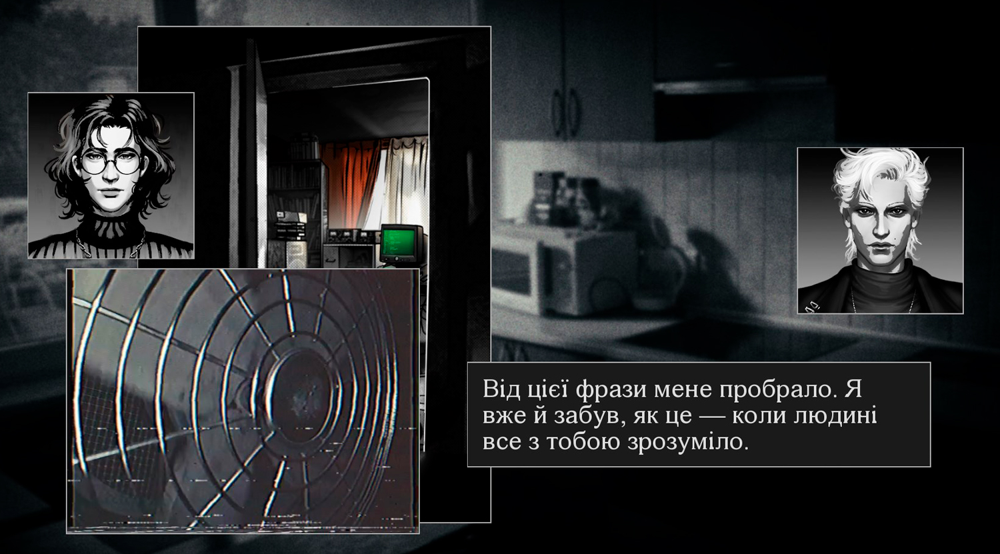
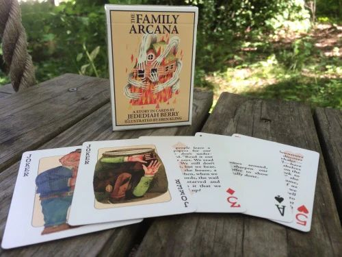
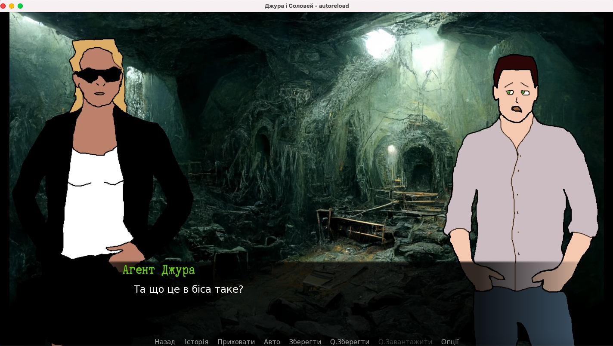

Скорочений та відредагований транскрипт першого епізоду бесід про інтерактивну літературу на [дискорд-сервері](https://discord.gg/dWdySHUJKV) нашої спільноти. Ми розмовляли про старі ігри, український джем візуальних новел, детективи, діалоги, а також обговорювали творчі плани.

<!-- cut -->

```toc
#
```

---
## Білль про права гравця

---
**techniX**

Я нарешті прочитав "IF Theory Reader", знайшов нормальну версію для Kindle - це така підбірка статей про класичні текстові ігри. Там і про теорію, і про практику, і про історію. Але, як на мене, більша частина їх досить застаріла. Хоча "Crimes Against Mimesis" - "Злочини проти мімезису", мабуть, єдина що не втратила своєї актуальності.

А ще на форумі intfiction з подачі Браяна Раштона розгорнулася вельми цікава дискусія про вплив "Біллю про права гравця" Грема Нельсона на очікування від текстових квестів - я про це писав в каналі "[Сад переплетених стежок](https://t.me/garden_of_forking_paths/65)".

Як на мене, білль не стільки про ігри як такі, скільки про паззли. Але зараз "паззлфестів" майже не роблять, особливо таких як в 80-90 роки. І олдскульні ігри, як правильно там підмітили, здебільшого порушують як мінімум одне правило з біллю.

---
**goraph**

Дійсно, білль застарів. Фактично, ігри змінилися. От наприклад миттєва смерть без попередження - це ще актуально? Думаю, ні.

---
**techniX**

Мене дуже засмучує, коли автори-початківці користуються цим прийомом. Обрав випадково не той варіант - все, геймовер, давай спочатку.

---
**goraph**

Правило написане про старі британські ігри для спектруму в великим чином, де ти 5 хвилин грузиш гру з касети чи три хвилини робиш сейв. А потім він не записався, бо в тебе касету зажувало. Ну, зумери не зрозуміють, але я з таким стикався.

---
**techniX**

Про це я навіть не подумав. Це ще жорсткіше ніж здавалося.

---
**goraph**

От, а зараз ми живемо в світі де є ундо, квіксейви, автосейви і так далі.

Це все в принципі більш менш справедливо для всього біллю. Як на мене, він не актуальний і не потрібний взагалі. Але начебто автори-початківці і не знають про нього?

Фактично, зараз текстові ігри не відрізняються вже від інших жанрів так сильно, щоб їм був потрібен якийсь особливий білль.

---
**techniX**

Тож нехай залишається як пам'ятка історії.

До того ж, сучасні текстові ігри взагалі не схожі на ті, про які білль було написано.

---
## Ukrainian Visual Novel Jam

---
**techniX**

Грав в декілька ігор з Ukrainian Visual Novels Jam. Хоча скоріше читав, бо здебільшого це були кінетичні новели. До кінетичних новел я раніше ставився досить скептично. Проте роботи з джему мене переконали, що цей жанр може бути дуже цікавим!

---
**goraph**

Я спочатку хотів взяти участь. Пограв в одну гру лише - "[Кайзер сингулярності](https://dramatheurgist.itch.io/kaiser)", яка перемогла у джемі. Дуже круто.

Взагалі все з джемом дуже круто - 60 ігор, уяви тільки!

---
**techniX**

Такого навіть організатор не очікував, мабуть.

---
**goraph**

Я, навпаки, дуже добре ставився до кінетичних новелл з самого початку. Я знав що вони часто кращі. І це не особливість джему, це так само і в великобюджетних новеллах. Якщо подивитися топ на [VNDB](https://vndb.org/), там купа кінетичних новел.

---
**techniX**

Скоріш за все саме тому що гравець - читач - ніяк не впливає на сюжет, і автор може розповідати історію як задумав. А чим більше даєш вибір гравцеві, тим більше сюжет виходить з-під контролю.

---
**goraph**

Це так. Один цікавий спосіб розвитку подій і те придумати не так просто. 

Розумієш, кінетичні новели це найцікавіша історія що є у автора. А якщо в нього 200 варіацій, то не всі будуть такі ж гарні.

---
**techniX**

А, і ще оформлення. В "Кайзері" воно більш схоже на графічні романи, ніж на типовий для ВН стиль "спрайти персонажів на фоні та текст знизу". Відеовставки та музика також додають атмосфери. Епізод з чатом хакерів взагалі просто неймовірний.

---
**goraph**

Мені дуже сподобалося. Я дуже-дуже рекомендую в нього пограти.




---
## Візуальна новела Goraph'a

---
**goraph**

Я, до речі, почав робити візуальну новеллу сам. І от коли я побачив "Кайзера", я прям подумав, "а шо, так можна було?". Буду мабуть переробляти схожим чином тепер.

---
**techniX**

А що за новела буде? Ти так і мене вмовиш ВН робити.

---
**goraph**

Я хочу зробити детективну гру про розслідування з паранормальним: агенти надсекретного відділу СБУ проти ктулхів.

---
**techniX**

Ну тобто таки гру, а не кінетичну новелу? Де у гравця буде якийсь вибір?

---
**goraph**

Ну от тут я ще остаточно не вирішив. Зараз план такий: це буде гра, де події розвиваються не хронологічно. У нас будуть по черзі глави з минулого та майбутнього, від лиця різних персонажів. І я хочу, щоб у гравця був вибір, в якому порядку читати цю історію.
Таким чином вона буде і не кінетична і не класична, а щось посередині. 

Це мій давній план зробити щось таке.

---
**techniX**

Як "[Хазарський словник](https://uk.wikipedia.org/wiki/%D0%A5%D0%BE%D0%B7%D0%B0%D1%80%D1%81%D1%8C%D0%BA%D0%B8%D0%B9_%D1%81%D0%BB%D0%BE%D0%B2%D0%BD%D0%B8%D0%BA)" чи "[Гра в класики](https://en.wikipedia.org/wiki/Hopscotch_(Cort%C3%A1zar_novel))"?

---
**goraph**

Так, "Хазарський словник" - гарне порівняння. І взагалі весь Павич. Я великий фанат Мілорада Павича, якщо що.

Тобто можливо будуть деякі відмінності в історії в залежності від вибору, але, як і у "Хазарському словнику", не окремі гілки, а декілька абзаців.

---
**techniX**

Тобто єдиний вибір - це порядок глав? Але ж буде якийсь загальний фінал?

---
**goraph**

Спочатку ще репліку про Павича, про фінал. В нього є твір, я забув назву, де від порядку глав повністю міняється сенс прочитаного. Це насправді дуже важливо.

Давай я наведу простий приклад. Хай маємо "зійшлись" і "розвелись". Якщо спочатку зійшлись, а потім розвелись, це одна історія.Якщо спочатку розвелись, а потім зійшлись, інша. Це примітивно, але приблизно так це працює.

---
**techniX**

[Ефект Кулєшова](https://uk.wikipedia.org/wiki/%D0%95%D1%84%D0%B5%D0%BA%D1%82_%D0%9A%D1%83%D0%BB%D1%94%D1%88%D0%BE%D0%B2%D0%B0), але в тексті.

Я бачив цей ефект в дії в [The Family Arcana](https://ninepinpress.com/products/the-family-arcana-a-story-in-cards). Це колода карт, на якій написані фрагменти оповідання. Ти її перетасовуєш та читаєш.



---
**Enola**
Тобто це нелінійна література, як тут: "[Книги-ігри проти нелінійної прози](https://dialas.ru/2022/08/13/%d0%ba%d0%bd%d0%b8%d0%b3%d0%b8-%d0%b8%d0%b3%d1%80%d1%8b-%d0%bf%d1%80%d0%be%d1%82%d0%b8%d0%b2-%d0%bd%d0%b5%d0%bb%d0%b8%d0%bd%d0%b5%d0%b9%d0%bd%d0%be%d0%b9-%d0%bf%d1%80%d0%be%d0%b7%d1%8b/)".

---
**techniX**

Нещодавно читав про ще один цікавий приклад нелінійної літератури - "[Cain's Jawbone](https://bluerenga.blog/tag/cains-jawbone/)". Це роман-загадка, де ціль читача - скласти картину в одне ціле. Проте глави розкидані в довільному порядку і написані так, що не відразу зрозуміло, що відбувається і про кого йдеться. До речі, книжка вийшла у 1934 році, а повністю розгадали загадку лише двоє людей.

---
**goraph**

Ну в принципі я так і хочу робити.

---
## Детективні ігри

---
**goraph**

Є ще друга ідея яку я хочу реалізувати, хоча я зараз вже починаю розуміти, що це частина першої.

Пам'ятаєш, ми нещодавно говорили про детективні ігри? Що з ними в цілому не так і чому вони не працюють. І в мене є ідея, що з цим робити.

---
**techniX**

Так, ми обговорювали пост "[Тягар доведення в детективних іграх](https://t.me/garden_of_forking_paths/59)".

---
**goraph**

Отже, ідея полягає у тому, що **відповідь в грі не потрібна**. Ми завалюємо гравця матеріалами - дос'є, протоколи допросів і таке інше, проте відповідь не буде частиною гри. Тобто в грі не буде сцени, де Холмс скаже "Вбивця садовник, не це вказує це і це, він зробив це так і так". До того, хто, що і як зробив, гравець має дійти сам, аналізуючи матеріали поза грою.

---
**techniX**

Але ж тоді у нас не буде фіналу? Бо фінал детективу - це завжди розкриття загадки.

---
**goraph**

Ну от тому я і вибрав ктулхів :)

---
**techniX**

Бо вони незбагненні?

---
**goraph**

Бо в детективі це обмане очікування. А в ктулхах можна зробити незбагненний фінал, і це типово для жанру. Ніхто не скаже: "мені продали детектив без розгадки".

---
**techniX**

Ну, у Лавкрафта все закінчується *страшним відкриттям головного героя, що написане курсивом* :)

---
**goraph**

Не завжди. Є купа оповідань, де ГГ так і не зрозумів, що з ним сталося. 

Ну і для "курсивів" є форуми, де фанати мають будувати теорії.

---
**techniX**

Це перспективний підхід. Якщо по твоїй грі фанати будують теорії - все вдалося.

Але мене в цьому підході бентежить те, що ми завалюємо гравця купою інформації, в якій важко орієнтуватися.

---
**goraph**

Ну гравець не повинен цього робити. А якщо фанати не будують теорії, яка різниця, чи зрозуміли вони фінал? Не сподобалось -- значить, не вийшло, напишу щось ще.

---
**techniX**

А знаєш, може і спрацює. Я бачив настільну гру "[Детективні історії: Пожежа в місті Адлерштайн](https://boardgamegeek.com/boardgame/261145/murder-mystery-party-case-files-fire-adlerstein)", побудовану схожим чином. Там в коробці лише матеріали справи. Дос'є, фото, газети... А гравці мають з них скласти картину злочину. Хоча там скоріш за все є розгадка у конверті.

---
**goraph**

Насправді я до цього дійшов після роману [Едогави Рампо](https://uk.wikipedia.org/wiki/%D0%95%D0%B4%D0%BE%D0%B3%D0%B0%D0%B2%D0%B0_%D0%A0%D0%B0%D0%BC%D0%BF%D0%BE) "Тварюка на горищі". Там автор тупо вбиває в фіналі останнього підозрюваного і каже: "ніхто не знає що тут сталося".

І все, це фінал детектива. Мені дуже сподобалось :)

Ну і в настолки детективні я останнім часом багато грав теж, так там є відповідь у конверті. Але якщо ти до неї здогадався, вона не потрібна.

---
**techniX**

Але як перевірити, чи правильна твоя здогадка?

---
**goraph**

Ну факти, газети, все очевидно. Ти бачив десь, щоб Холмс перевіряв? Ні, він з вумним видом вивалює і всі йому вірять :)

---
**techniX**

Холмсу ми довіряємо, бо автор розповідає нам розгадку через нього. А от вже автору ми довіряємо на 100 відсотків.

---
**goraph**

А гравець що, сам собі не довіряє?

---
**techniX**

Він може бути не впевнений, що здогадався правильно.

---
**goraph**

Піде тоді на фанатські форуми, почитає теорії. Це привід обсудити гру з іншими гравцями, що робить ігри більш соціальними. Це велика частина популярності старих квестів, бо сам не пройдеш, а разом з друзями - так. І з друзями цікавіше грати.

---
**techniX**

Взагалі, спільнота навколо ігор дуже важлива. Хтось буде грати, хтось обговорювати, хтось створить ремейк чи фанфік-гру.

---
**goraph**

Так і має бути, і якщо гра до цього спонукає, це тільки плюс.

---
## Що робити, коли малювати не вмієш

---
**goraph**

От ще, зараз нас мабуть читають люди і думають: "Я міг би зробити візуальну новелу, але не вмію малювати, як Гораф, не знаю, де знайти художника, тому буду робити текстові ігри". 

Я теж не вмію малювати. Але є... АI-генератори. І вони генерують чудові фони.



Оце фон з AI-генератора, зроблений за хвилину. Персонажів я сам малював, це видно. І ніхто тепер не скаже, що я збрехав і вмію малювати :)

Для персонажів я буду шукати художника, але потім, коли все зроблю.

---
**techniX**

А для прототипу цього більш ніж достатньо! До речі, портрети персонажів може допомогти нагенерувати "[This Person Does Not Exist](https://www.thispersondoesnotexist.com/)".

---
**goraph**
Тобто ви теж можете зробити візуальну новеллу! Якщо ви хочете, звісно. Це доступно в 2022 році.

На скріншоті те, як я хотів робити, поки не побачив "Кайзера сінгулярності". Зараз я вже хочу компонувати картинку як там, зі шматочків.

---
## Детективна гра techniX'а

---
**techniX**

У мене теж є ідея детективної гри, над якою я вже декілька років працюю. Проте ідея стосується здебільшого геймплею, сюжет поки що дуже приблизний.

Мені стало цікаво, які ігри можуть бути лише текстовими. Навіть не так -- в яких іграх текст матиме переваги над іншими медіа. І я прийшов до роботи з документами. У гравця є документи, пов'язані з якоюсь загадковою подією у минулому. Але оскільки це загадкова та таємна подія, документи цензуровані, в них не вистачає окремих слів.

---
**goraph**

І де гравець ці документи бере?

---
**techniX**

Ну, це поки слабка частина. Скажімо, гравець журналіст, а йому їх приносить якийсь співробітник спецслужб.

Так от, геймплейна ідея полягає у тому, що гравець копіює слова з одних документів та вставляє їх в інші, таким чином відновлюючи зміст документів і поступово приходячи до розгадки таємниці.

---
**Enola**

Як в "[Orwell](https://www.fellowtraveller.games/orwell-ignorance-is-strength)" чи "[Вырезано цензурой](https://ifwiki.ru/%D0%92%D1%8B%D1%80%D0%B5%D0%B7%D0%B0%D0%BD%D0%BE_%D1%86%D0%B5%D0%BD%D0%B7%D1%83%D1%80%D0%BE%D0%B9)"?

---
**techniX**

Не грав. Але схоже.

Єдине слабке місце зараз - це сюжет, бо його немає. Є сеттинг та загальні ідеї. А загадка має бути достатньо цікавою, аби гравець хотів її розгадати.

---
**goraph**

Я ніколи не вважав, що сюжет -- це важлива частина гри.

---
**techniX**

Але в детективі так і є, і тим більше в кінетичній новелі, бо геймплею ж там нема.

---
**goraph**

Будь-який детектив доволі простий, якщо ти опишеш його сюжет.

---
**techniX**

Це в ретроспективі. А спочатку є Загадка. Що сталося? Хто вбив? Чому саме так?

---
**goraph**

Чувак намазав собаці фосфором очі, щоб вона перелякала насмерть господаря і він отримав спадок. Це весь сюжет "Собаки Баскервілів". Все інше - це персонажі, шутки Конан-Дойля і злобний вой над болотами.

---
**techniX**

Але ж для читача це виглядає інакше! Він не знає з самого початку про розгадку. Для нього існують таємничі обставини загибелі лорда Баскервіля, і саме тому він читає книгу - бо загадка виглядає досить цікавою.

---
**goraph**

Ну да. Так загадка в тебе є?

---
**techniX**

У мене вона поки що виглядає як "після якогось інциденту будівлю компанії знесли, залили все бетоном та побудували там торговельний центр", і це якось пов'язано з самогубством людини, яка розслідувала інцидент.

Як на мене, найскладніша проблема в створенні детективів ось яка: тобі потрібно якось розділити інформацію "що насправді сталося" таким чином і на такі фрагменти, щоб вони мали сенс, лише якщо їх правильно поєднати. І щоб у гравця були проміжні "ага-моменти", тобто декілька менших загадок, з відповідей на які складеться розуміння основної.

---
**goraph**

Ти перебільшуєш. Я от останнім часом багато грав в настільні детективи, а того ж "[Холмса](https://boardgamegeek.com/boardgame/2511/sherlock-holmes-consulting-detective-thames-murder)". І що я помітив: у відповіді в конверті Холмс знаходить все за два параграфа, і ці параграфи ми побачили чи не першими. А ми просиділи 8 годин і три рази починали спочатку. 

Ти можеш відразу дати відповідь гравцю, і він її не помітить. А якщо помітить - не повірить.

---
## Діалоги в іграх

---
**Enola**
Є які-небудь статті про ігрові діалоги?

---
**techniX**
Про ігрові це відео просто супер, рекомендую: "[AdvX 2018 - Jon Ingold - Sparkling Dialogue: A Masterclass](https://www.youtube.com/watch?v=_vRfNtvFVRo)". Є мій [текстовий переклад російською](https://dtf.ru/gamedev/265620-blestyashchie-dialogi-v-igrah-master-klass). Українською теж скоро буде :)

---
**goraph**

Ну моя відповідь тут така ж - найкраще це кінетичні новели. Бо якщо за 40 років активної історії ігор ніхто не придумав нічого, то може відповіді нема?

---
**techniX**

Або ще не знайшли?

---
**Enola**

Ви тікаєте від проблем, замість того щоб їх вирішувати)

---
**goraph**

Я по натурі не є новатор. Це не моє, придумувати щось, чого ще до цього не було. Моє це взяти щось там щось там і зкомбінувати. Працюючих діалогів не існує, я їх ніколи не бачив :)

---
**techniX**

Тут головне питання - нащо потрібен діалог?

1) Справочний автомат. Питаєш NPC "розкажи мені про місто" - він розповідає.
2) Частина квеста. "Принеси мені 10 мертвих щурів з підвалу".

Але і 1 і 2 - нецікаві та неживі, бо ми спілкуємося з людьми не для цього :)

В [Kentucky Route Zero](http://kentuckyroutezero.com/) прекрасні діалоги, проте там своя специфіка, бо це скоріш інтерактивний театр, ніж гра, і ти просто підказуєш репліки акторам.

---
**goraph**

Да, от нащо -- це гарне питання. Діалог -- це ж не самоціль. А 1) ще й незручно для гравця.

---
**Enola**

Який жах :) 

Мені потрібні діалоги, щоб відвернути від лінійності гри і зробити нешаблонних NPC, які не просто квести видають.

---
**HronoStranger**

Мабуть, потрібно розділити "діалогову вставку", де нам показують діалог (як в кінетичних новеллах), та діалог - як активну частину геймплею.

---
**goraph**

Ну ми зараз про діалог як частину геймплею.

Перше питання діалогів -- це інтерфейс. Якщо це парсер, це не дуже зручно для сучасного гравця. Якщо меню, то багато кнопок не наробиш. Зараз всі з телефонів грають, скроліти незручно, шукати теж, ну скільки можна кнопок? 5?

---
**techniX**

Якщо це частина геймплея, то і моделювати діалог потрібно відповідним чином. Гравець може хотіти щось дізнатися, або в чомусь переконати NPC. І по суті діалог це міні-гра, де тобі треба підібрати правильні аргументи.

Є ще незвичний підхід в [Signs of the Sojourner](https://www.echodoggames.com/), там діалог - це карткова гра, і від карт, які ти розігруєш, залежить тон діалогу та його напрямок.

Але ж все одно має бути якась мета. Нащо гравцю з ними розмовляти?

---
**Enola**

Тому що вони дають завдання за сюжетом.

---
**HronoStranger**

Місце дії та її обставини. Можливо, потрібно врахувати і їх. А також об'єкти у персонажів. Наприклад, птах чи пес. Так можливо створити діалог, який буде змінюватись. Основна проблема: діалог не може бути в відриві від ігрового всесвіту. І це скоріше питання: "Як подати світ через очі персонажа?" і "Яку частину світу подавати?". 

---
**techniX**

Насправді я не бачив кращого підходу, ніж той, про який Джон Інгольд розповідає. Я не кажу що це єдиний підхід, але це підхід, який **працює**.

---
**goraph**

Я не зовсім розумію, що той підхід дає.

---
**techniX**

Щоб діалог був цікавим для гравця? Щоб він **грав** у діалог? Насправді там основна думка ось яка: у сцени з діалогом є наративна ціль, і діалог має її виконувати. Тобто діалог має ще і підтекст.

---
**goraph**

Це те саме що "кінетичні новели версус ні". В мене є одна найкраща версія діалогу і 20 варіацій, які гірші, ніж найкраща. Нащо міняти найкращу версію? Заради інтерактивності? Це самоціль?

---
**Enola**

Навіщо варіанти відповіді в "[Walking dead](https://uk.wikipedia.org/wiki/The_Walking_Dead_(%D0%B3%D1%80%D0%B0))" наприклад?

---
**goraph**

Діалоги в фільмах у Тарантіно чудово виконують нарративні цілі. Варіанти відповіді у "Walking dead", до речі, теж.

Ох, я це скажу )))

"[Клуб романтики](https://romanceclub.fandom.com/ru/wiki/%D0%9A%D0%BB%D1%83%D0%B1_%D0%A0%D0%BE%D0%BC%D0%B0%D0%BD%D1%82%D0%B8%D0%BA%D0%B8_%D0%B2%D0%B8%D0%BA%D0%B8)"!!! Чому "Клуб романтики" працює? А "Walking dead" -- ні? Хоча вони наче роблять те саме?

Тому що "Клуб романтики" рахує якісь там поінти, і в кінці гри героїня буде з Джоном чи з Фінном в залежності від цього. Все, цього достатньо. Гравець знає, що кожен його вибір має значення, незважаючи на те, що від нього нічого не міняється, окрім одного абзацу в кінці. Але це найважливіший абзац.

---
**techniX**

І у діалога знову-таки залишається виключно наративна ціль -- це частина побудови сюжету.

---
**HronoStranger**

"Walking dead" працював, поки ти не знаєш довжину впливу. Це є імпульс, де більше значення давалось короткій цілі. Свого часу це створювало свій ефект. 

---
**goraph**

Саме так, а клуб романтики робить те саме, і працює навіть коли ти знаєш довжину впливу.

---
**techniX**

Бо там діалог як такий взагалі не є важливим. 

Я більше скажу, зацікавленість гравця є найважливішим фактором. Якщо гравцю цікаво, йому взагалі пофіг які там діалоги.
Знову-таки повернуся до Kentucky Route Zero. Там діалог **взагалі** не впливає ні на що, сюжет виключно лінійний. Проте... він впливає на розкриття деяких персонажів. Тобто в KRZ я не "граю" в діалог, я підбираю "що б сказав герой в цей момент", і це теж працює.

---
**HronoStranger**

Ну взагалі "значущість" вибору в діалогах трохи перебільшена. Більше має значення те, як ця "значущість" нагадує про себе. 

Доволі цікавий приклад з Тарантіно. Ці діалоги надавали життя персонажам. І якщо це діалог між двух NPC - це має своє значення. Бо гравець не впливає на неігрові персонажі. Але коли вони закінчать діалог - ми будемо сприймати іх тишу не як промах. Ми будемо вірити, що вони про щось думають. І це створює атмосферу.

---
**techniX**

Подивись ще діалоги в іграх [Choice of Games](https://www.choiceofgames.com/), там можна безкоштовно пограти в демо-фрагмент.

---
**Enola**

Пояснення. Лінійний квест з діалогами, не кінетична новела. Не cyoa, адвенчура. Неігрові персонажі дають за сюжетом квести. Плюс паралельний сюжет розкривають. Коротше, щоб не виглядало все як: прийняти завдання - здати завдання. Замаскувати треба.

---
**goraph**

А чому треба замаскувати?

Добре, новий приклад, "Diablo". Там є якісь діалоги, які щось розкривають. Їх не читає ніхто! Бо я граю не для цього? Я взяв квест і пішов робити.

---
**Enola**

Тому що інакше буде виглядати занадто примітивно і нудно: як квест "вбити десять вовків".

---
**goraph**
Квест "вбити 10 вовків" нудний, тому що квест поганий. А не тому, що його видає NPC з поганим діалогом.

---
## Ілюзія вибору 

**techniX**

ілюзія вибору працює, поки гравець в неї вірить :)

---
**goraph**

"Walking Dead" обманює гравця, і раніше чи пізніше гравець це починає розуміти.

І їх перша гра прекрасно спрацювала, коли це було нове. Але це не працює далі. Коли ти знаєш секрет фокусу, нецікаво дивитись на фокусника. Тому після "Walking Dead" почалась критика. Це несистемний підхід, це підхід який працює один раз.

---
**techniX**

В іграх типу Walking Dead дуже дорого зробити справжній вибір, бо це додаткові анімації та озвучка. В тексті це простіше :)

---
**goraph**

В будь-якій грі дуже дорого зробити справжній вибір.

---
**techniX**

А це справді потрібно? Якщо ти не будеш грати в цю гру багато разів - як ти дізнаєшся, що справжнього вибору не було?

---
**goraph**

Ну, я тут розказую, як треба робити кінетичні новели, бо вони краще))) Як, ти вважаєш, я відповім?

---
## Сейв-лоад

**techniX**

О, а давайте про сейви поговоримо.

---
**goraph та Enola разом**

А що з ними не так? :)

---
**techniX**

Ось у нас є гра, де я роблю якісь важливі сюжетні вибори. А потім я натискаю "undo" і обираю щось інше. Або починаю з якогось сейва. Чи не знецінює це важливість виборів? 

---
**goraph**

Знецінює.

---
**techniX**

То що ж робити? Звісно, можна зробити лише автосейв актуального стану, але що робити, якщо у мене настав геймовер і я хочу переграти цей момент?

---
**goraph**

Ну, це частина договору між гравцем і автором. Гравець звик, що всюди є сейви. А якщо гра на 8 годин і я не туди натиснув?
Я ж звик що є сейви, не треба бути уважним.


---
**techniX**

Насправді undo і save є по суті магічними властивостями гравця. В [Sorcery!](https://www.inklestudios.com/sorcery/), до речі, цей момент цікаво обіграний. Там у тебе є undo до будь-якого моменту (бо це магічна властивість), але в останній частині гри, коли ти заходиш в магічну цитадель, яка блокує твою магію, undo більше не працює :)

---
**Enola**

Не робити геймовер або roguelike, і проблеми не буде :)

Або є undo, або ні. Два різні підходи.

---
**goraph**

Сучасний гравець не здатен грати без сейвів, це факт. Ти можеш їх відключити, але... Можна на початку гри дати вибір, але, як показують всякі дьябло, 90 відсотків не хоче харкору цього.

---
**techniX**

Я б використовував підхід автосейв + чекпоінти, тобто ти продовжуєш гру завжди з того місця де закінчив, але можеш повернутися до будь-якого чекпоінту і переграти.

---
**HronoStranger**

Ну, проблема така є. Є і вирішення - вибір має віддавати наслідок через значний проміжок часу. Щоб undo не вистачило. Або було практично перегравання (по часу).

---
**techniX**

Насправді це все "на подумати", це питання, які не мають однозначної відповіді.

Я грав нещодавно в "[Bury Me My Love](https://burymemylove.arte.tv/)", там лише автосейв. Тобто, з одного боку, я відчуваю важливість виборів, це все ж таки типу реальне життя. А з іншого боку, я повинен грати з самого початку, щоб дізнатися інші варіанти розвитку подій. І тому я грав лише двічі, бо перечитувати той самий текст знову і знову вже не хочеться.

---
**goraph**

Я тебе розумію прекрасно)) я граю лише на хардкорі і не користуюсь сейвами де це можливо. Це сильно міняє гру іноді в кращий бік (залежить від гри). Але сучасні гравці не такі.

---
**techniX**

Цікаво, як одне обмеження змінює гру кардинально. Є про що подумати.

---
**goraph**

Грати уважніше цікавіше. Ти перестаєш жати "далі" не читаючи, бо раптом потім знадобиться. Але ти в розпачі можеш і закрити гру. Тобто це таке саме казіно і для автора. Якщо ти хочеш популярності, мабуть не варто так робити.

---
## Реіграбельність та соціалізація

**goraph**

Якщо в тебе геймплей це перечттування того самого 8 годин... чи можеш ти запропонувати кожен раз унікальний ігровий досвід?

---
**techniX**

В текстовій грі - навряд чи. В квесті - точно ні, бо якщо ти знаєш рішення паззлу, тобі вже не цікаво.

---
**goraph**

Але ж ми дивимось фільми Тарантіно по 8 разів?

---
**Enola**

Я не дивлюся твір більше одного разу. В одну річку неможливо увійти двічі. 

---
**techniX**

Мені взагалі здається, що реіграбельність переоцінена. "[To the moon](https://freebirdgames.com/games/to-the-moon/)" я не буду грати ще раз, але вона справила на мене сильне враження.

---
**goraph**

І тут я знову згадаю Павича і "Покемонів" :) Що спільного між Павичем і покемонами? Дві версії "гри".

У Павича є дві версії "Хазарського словника" - чоловіча і жіноча. А у "Покемонів" дві версії кожної гри. Тобто в тебе нема всього тексту і всіх покемонів (якщо ти не купив обидві книги). І ти маєш зустрітися з кимось (жах) в реальному житті, щоб зібрати докупи всю історію або всіх покемонів. Соціалізація!

---
**HronoStranger**

Скільки разів ти будеш проходити їх спочатку :)

---
**goraph**

Один, я ж кажу. Щоб дізнатися, що в інших версіях, ти соціалізуєшся.

---
**techniX**
Читав колись про парсерну гру "[Alkemstone](https://bluerenga.blog/tag/alkemstone/)". Там була загадка, за яку пропонували нагороду. І вона пов'язана з реальним світом, тобто це якась локація, як вважається, в Вашингтоні. Але цю загадку схоже поки ніхто не розгадав.

