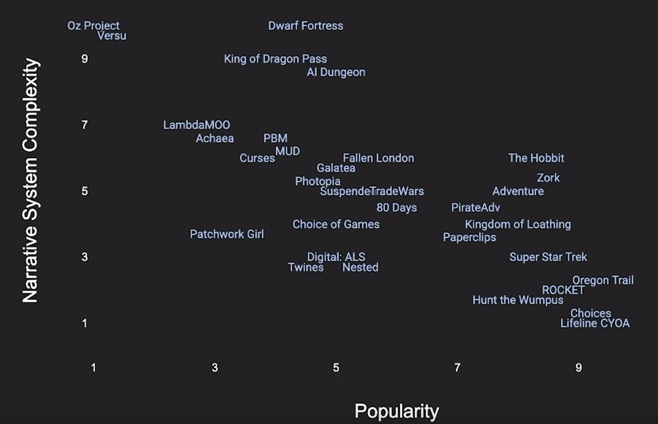

Другий епізод бесід про інтерактивну літературу на [дискорд-сервері](https://discord.gg/dWdySHUJKV) нашої спільноти. Ми розмовляли про минуле текстових ігор, парсери, мобільні платформи, співавторів та порівнювали ігри з кінематографом.

<!-- cut -->

```toc
#
```

---
## Минуле текстових ігор

---
**techniX**

Отже, нещодавно я передивився відео "[NarraScope 2022: 5 Lessons From 50 Years of Text Games](https://www.youtube.com/watch?v=aFUFhf-Y4eg)". Аарон Рід розповідав, про що він дізнався під час роботи над своїм проектом "[50 років історії текстових ігор](https://if50.substack.com/)". Дуже цікаві статті, рекомендую. А ще і [книга](https://www.kickstarter.com/projects/aaronareed/50-years-of-text-games) буде!

---
**goraph**

Я дуже багато дізнався з цього циклу статей :)

---
**techniX**

Що мене зацікавило -- в минулому, виявляється, було дуже багато крутих ігор про які зараз майже ніхто не пам'ятає. Тобто буквально -- бери круту гру з минулого, роби ремейк -- і люди подумають, що це щось нове і оригінальне.

От був такий MUD -- [LambdaMoo](https://if50.substack.com/p/1990-lambdamoo), де гравці могли створювати власні кімнати та об'єкти з досить складною поведінкою. То гравці створили там гелікоптер, яким можна було керувати, і який було видно з "землі" -- і все це в текстовій грі. За десятки років до, скажімо, Roblox.

---
**goraph**

Ну такі ремейки, до речі, роблять.

Я, коли робив стріми текстових ігор і грав в "[Хоббіта](https://if50.substack.com/p/1982-the-hobbit)" 84-го року, то це був мій найпопулярніший стрім. Люди коментували, радили щось, було видно що їм цікавіше, ніж все що було до цього :)

---
**techniX**

Також він наголошує, що ком'юніті дуже важливе. Саме йому ми завдячуємо розвитку текстових ігор, коли одні люди беруть ідею однієї гри та створюють власну гру, але кращу... і так до нескінченності :)

---
**goraph**

Звичайно. Так ми і прийшли туди, де ми зараз є.

---
**techniX**

І ще він помітив цікавий "паттерн" в цьому процесі. Зараз принесу скрін :)



З нього можна зробити багато висновків. Наприклад, "популярні ігри зовсім не складні всередині", "технічно складні ігри здебільшого малопопулярні".

---
**goraph**

Чим простіша гра, тим вона популярніша. Так ми знов повернемось до кінетичних новел :)

---
**techniX**

І ще одне. Ідеї на цьому графіку рухаються по колу:
- спочатку з'являється проста та популярна гра. Наприклад, [Hunt The Wumpus](https://if50.substack.com/p/1973-hunt-the-wumpus)
- потім автори починають ускладнювати гру, але вона ще популярна: [Adventure](https://if50.substack.com/p/1976-adventure), [Zork](https://if50.substack.com/p/1977-zork), [The Hobbit](https://if50.substack.com/p/1982-the-hobbit)
- потім вони ускладнюють її настільки, що вона стає цікава лише фанатам: [Curses](https://if50.substack.com/p/1993-curses)
- а потім починається зворотній процес, автори роблять гру більш зрозумілою для пересічних людей: [Photopia](https://if50.substack.com/p/1998-photopia)

Тобто є "майстерня" -- верхній куточок ліворуч, де створюються складні та цікаві ідеї, і є "виставкова зала" -- нижній куточок праворуч, де ці ідеї виражені в простій та популярній формі. Як на мене, цікава аналогія.

---
**goraph**

В принципі, це притаманно будь якому виду мистецтв. В кіно є арт-хаус і його не дуже в звичайних кінотеатрах показують, він може існувати лише на фестивалях, ніякої надії на прибуток нема ще на етапі планування, та й не треба. А є мейнстрім. І вони запозичують ідеї один в одного :)

---
**techniX**

Артхаус ще і не дуже зрозумілий пересічному глядачеві. Влучна аналогія.

---
## Складність та наратив

---
**HronoStranger**

Технічна складність і складність вираження ідеї все ж таки розрізняються.

---
**techniX**

В тому-то і справа, що одне та інше пов'язане між собою.

Подивися на найбільш популярні ігри типу [Choices](https://if50.substack.com/p/2016-the-freshman). Технічно вони дуже прості всередині, як книги-ігри. І гравець інтуітивно розуміє, як вони реагуватимуть на твої дії, бо там нема ніякої складної наративної системи під капотом.

---
**goraph**

Вони звичайно розрізняються, але насправді потрібують він глядача/гравця одного і того ж: попередньої підготовки.

---
**techniX**

До речі, раніше це вважалося частиною ігрового досвіду. Тобто гравці знали, що треба спочатку прочитати посібник гравця, а потім вже за гру сідати.

Є чудове есе "[Unplayable](https://www.brainygamer.com/the_brainy_gamer/2010/09/unplayable.html)" про те, як викладач пропонував студентам пограти в Ultima IV -- колись культову RPG. Змогли не всі :)

> Один із студентів сказав:
>
> -- Я думав, вони [посібники] просто були в коробці з грою.
>
> -- Так, -- відповів я, -- їх туди поклали, оскільки гравець мав їх спочатку прочитати.
>
> -- Вау, -- відповів студент.

---
**goraph**

Я читав схожу статтю про це, де блоггер заставив свою дівчину, яка до цього не грала в ігри взагалі, грати в різні мейнстрімні ігри, дарк соулс там, скайрім, і які в неї були проблеми. Вона не користувалася правим стіком взагалі, через це не бачила що коїться навколо неї. І моменти, які він взагалі не помічав, в неї викликали неабиякі складнощі.

Бо насправді є "мова" -- набір паттернів, до яких ми звикли, і які вже не помічаємо, але незнайомій з ними людині це все дуже важко дається. Це так само є і в текстових іграх, і в арт-хаусному кіно, і в мейнстрімних іграх, які думають, що ти більш менш здатен користуватись геймпадом.

---
**HronoStranger**

Але ж складність гри збільшує наратив? Чи ні? Якщо вважати, що наратив -- це інструмент поглиблення історії, то чому так стається?

---
**goraph**

Складність гри, навпаки, зменшує нарратив. Давайте про це подискутуємо?

---
**techniX**

Спочатку давайте про терміни. Бо "наратив" -- це досвід гравця від гри, який складається з його вражень від сюжету та геймплею.
А під "наративною складністю" мається на увазі те, що сюжет та/або геймплей є складними. Тобто, наприклад, в [Versu](https://if50.substack.com/p/2013-a-family-supper) -- рушієві для ігор з високою наративною складністю -- реалізована система поведінки персонажів, їхні емоції та зміна настрою в залежності від дій гравця. І тут виникає проблема -- як дати гравцеві зрозуміти, що ця система дійсно існує?

---
**goraph**

Я грав в Versu мільйон років тому, коли це можливо було зробити. Мої враження, якщо одною фразою -- від мене нічого не залежить :)

---
**techniX**

От. а насправді залежало, і дуже багато. В тому, як на мене, і полягає проблема ігор з високою наративною складністю.

---
**goraph**

Я знаю, я читав статтю :)

Я роздивлявся сукню героїні, але вони посварилися, щось розбили. Іншим разом я випив вина і подивився на пляшку, вони помирилися і все було добре. Тобто так, щось залежить, але я не зрозумів як само, наслідок моїх дій був настільки складним, що я не міг його передбачити. Це було як еффект метелика, де метеликом був я :) 

І розуміння, чому і як це сталося, не було. Гра жила своїм життям, де я, як гравець, був зайвим. Цікаво було читати статті про Versu, але грати було нецікаво.

---
**techniX**

Коли гравець не розуміє, що від нього залежить, для нього це виглядає так само, як і "від мене нічого не залежить".

До речі, саме тому в іграх так гарно працюють "payoff"-моменти, коли гра нагадує про вибір гравця. На нас напали розбійники, яких -- пам'ятаєш? -- ти випустив з в'язниці, коли сам звідти тікав. І гравець такий -- вау, гра дійсно реагує на мої події! Хоча технічно це проста умова, один оператор if.

Ну і гра може про це нагадати, якщо гравець забув. "Розбійник грізно дивився на мене. Це був той самий чолов'яга, що сидів в сусідній камері зі мною".

---
**HronoStranger**

Тобто, лінійний наслідок краще сприймається, бо він більш зрозуміло зрежисований?

---
**goraph**

Звичайно. Все, що зрозуміло, краще сприймається, ніж те що незрозуміло. Те, що незрозуміло, сприймається так само, як і рандом.

Фактично, для гравця нема ніякої різниці, зустрів він розбійників тому, що вони йому випали з таблиці випадкових зустрічей, чи в результаті складної точно змодельованої системи подій, яка виникла через те що він вбив хозяйку борделя, через що повії перестали покупати дорогі сукні, а купці їх возити, у купців без грошей стало нічого їсти, і вони стали розбійниками.

---
**techniX**

Бо ці змодельовані події гравець не бачив. А те, чого гравець не бачить, для нього не існує.

---
**goraph**

І тут постає питання -- а нащо тоді це треба?

---
**HronoStranger**

Тоді б ми не мали це порівняння технічної складності та простоти.

---
**goraph**

А знаєш чому ми його маємо? Тому що таблиця працює не так само, як модель, а краще.

Дивись, в мене таблиця -- я зустрів розбійників, вони мене вбили, я загрузився з сейва. Прийшов туди знову, а там хлопчик загубив свого коника і потрібує допомоги. Новий енкаунтер, цікаво, круто!

А якщо це змодельовано? Знову розбійники, фу, гра заскриптована, все одне і те саме, нащо це? Навіть випадкових зустрічів не зробили,суцільні розбійники і все.

---
**techniX**

Авторам взагалі цікаво робити складне, а от гравцям в таке не дуже цікаво грати.

---
## Що робити з парсером?

---
**techniX**

Давайте ще про складність, але в іншому аспекті :)

Ті ж самі Choose Your Own Adventure, які з'явилися ще у 1979 році в вигляді книги-гри, існують і досі в вигляді різноманітних комп'ютерних ігор. А парсерні ігри, які з'явилися приблизно в той самий час, практично зійшли зі сцени. Чи є шанс їх повернення?

---
**goraph**

Ну як тобі сказати, вони існують приблизно в одному й тому ж вигляді останні років 30. Кількість гравців з часом не міняється, тобто вмирають і приходять новачки приблизно з однаковою частотою. Я думаю, там принципово нічого не зміниться і далі.

---
**Enola**

Ні. Точно не в їх класичному вигляді. Може хіба що в якомусь іншому форматі.

---
**Roguelike Lab**

Ні, бо поява парсерів була зумовлена технічними умовами і зараз вони, на відміну від тих же книг-ігор, занадто застаріли.

---
**goraph**

Ну основна проблема парсерів в тому, що в них треба грати з клавіатури, а зараз основні методи гри -- це тицяти пальцем або геймпад. Інтерфейси зумовлюють зміну жанрів і смерті деяких з них.

---
**Enola**

Це не проблема, враховуючи, скільки зараз переписуються зі смартфонів.

---
**HronoStranger**

Зважаючи на кількість месенджерів -- вони нікуди не зникли. Просто не в форматі ігор.

---
**techniX**

У мене є, звісно, думки, чому парсери непопулярні:
- командна строка вже не є основним способом роботи з комп'ютером, ця метафора інтерфейсу незрозуміла гравцям.
- для того, щоб грати в парсер, потрібно читати мануал -- тобто розуміти, які команди він в принципі здатен обробляти.

Але все одно цікаво, чи можна якось адаптувати парсер під сучасність. Навіть не парсер -- ідею парсера "гравець може сам здогадатися, що робити, та передати цю команду грі", бо вибір з запропонованих варіантів цього відчуття не дає.

---
**goraph**

Переписка зі смартфона це натуральна мова, а парсер -- мова командного рядка. Парсер досі є натуральним для лінуксоїдів, тому зовсім він не зникне. Популярним він теж не може бути.

---
**HronoStranger**

Технічно, але не зі сторони користувача.

---
**techniX**

Тут ще одна проблема -- на смартфоні клавіатура пів-екрана займає, на гру залишається теж пів екрана. Якось не дуже красиво.

---
**goraph**

Розмір екрана смартфона з часом все росте і росте.

---
**HronoStranger**

Але виявляється, проблема не в інтерфейсі. Тоді в чому?

---
**techniX**

Бо, як goraph правильно сказав -- парсер це не природна мова. Це спеціально створений діалект мови. Тобто ти не можеш ввести будь-що, якесь довільне речення -- ти маєш ввести команду.

---
**goraph**

Проблема в "мові", яку треба знати і вивчати, вона схожа на командну строку. Тому там всілякі сісадміни можуть дуже швидко його опанувати, для них це природньо, вони знайомі з цією мовою, всі інші не дуже.

---
**Enola**

Я і кажу, що це буде інший формат парсерів. Natural language і AI, припустимо. У форматі чату. Щось таке.

---
**techniX**

Але воно все одно буде зводитися до команд :)

---
**Enola**

Гравець цього не побачить, як не бачить подій, що не відбулися. А зовні все абсолютно інше.

---
**techniX**

Я мав на увазі те, що кількість дій все одно обмежена. Але є різниця. У графічній грі ти швидко розумієш, що ти можеш, а що ні. А в парсерній це буде складніше.

---
**HronoStranger**

Та гравець вміє адаптуватись. Як з патернами для дарк соул, приведеними goraph. Тобто, ознайомленний гравець -- буде вводити тільки їх.

---
**goraph**

Існують парсери з природньою мовою. З ними є проблеми, які як на мене, неможливо вирішити.

Людська мова враховує контекст, наші знання про ті чи інші речі, а не тількі ситуацію. Я зараз в чаті скажу "І шо?", і всі зрозуміють, шо я мав на увазі.

---
**Enola**

Хіба це не можна реалізувати?

---
**goraph**

Реалізувати можна. Питання -- чи можна зробити з цього цікаву гру?

---
**techniX**

Насправді там куча підводних каменів, якщо це почати реалізовувати. Але головне -- навіщо? Якщо графічні ігри дають ті самі можливості, тільки ще й зрозуміліші для гравця.

Я ж правильно розумію, що парсерні ігри здебільшого про взаємодію гравця з середовищем та предметами?

---
**goraph**

Парсерні ігри різні, але здебільшого так.

Після того як ми зробимо парсер, який розуміє все, нам треба гра, де можливо все. Інакше такий парсер не потрібен.

---
**HronoStranger**

А це складна реалізація і низький рейтинг?

---
**techniX**

Бінго!

---
**goraph**

Такий парсер буде цікавий так само як Verse -- в наукових колах. Можна статті про нього писати. Грати навряд чи буде цікаво.

---
**techniX**

[Dungeon AI](https://play.aidungeon.io/)! Як іграшка він дуже цікавий. Але це забавка, а не гра.

---
**goraph**

Так, дуже гарний приклад, і цей ось помацати можна.

---
**techniX**

Можливо, з цього виросте щось цікаве. А можливо і ні.

---
**Enola**

З класичних парсерів точно не виросте.

---
**goraph**

Ну, можливо, якось світова криза вплине, і ми повернемось до command-line інтерфейсів. Інакше ніяк.

---
## Зустріч любителів ВН в Києві

---
**goraph**

Я знаю, ти, techniX, був на сходці ВНщиків у Києві. Розкажи нам все :)

Я не поїхав, бо складно у війну мандрувати.

---
**techniX**

От же ж. Був :)

По-перше, було круто, бо вийшло зустрітися. І прийшли люди не з тусовки, що вдвічі приємніше. Спочатку поговорили про те, кому які жанри подобаються і в якому жанрі хотіли б ВН робити. Потім подивилися презентацію про історію ВН як жанра, та про джем українських візуальних новел. Про історію було цікаво, я навіть не знав що були парсери японською. З командами теж японською.

А потім читали три новели з top10 джему по ролях -- перші 15 хвилин, щоб не спойлерити. Навіть адміністратор клубу зацікавилася, попросила посилання скинути. Одну з ВНок робила письменниця зі Львова, і текст, і ілюстрації. А "[Кайзер сингулярності](https://dramatheurgist.itch.io/kaiser)" озвучував автор.

Сподіваюся, ще будуть такі зібрання :)

---
**goraph**

Ого.

Ну те, що сучасність української інтерактивної літератури -- це ВН, мабуть, зрозуміло :) Майбутнє -- також вони?

---
**techniX**

Ну, те, що вони найпопулярніші -- це точно.

---
## Графіка в текстових іграх

---
**goraph**

Тут ще один фактор, на джемі (де було 60 новелл українською) було дуже багато пропозицій від художників. Їх було, мабуть, більше ніж сценаристів.

---
**techniX**

Тобто, якщо і робити гру, то з графікою :)

Взагалі я вважаю, що чисто текстові ігри не дуже цікаві. Є, звісно, виключення, але там інші Unique Selling Points -- тобто свої фішки.

---
**goraph**

Я б і за парсери сказав, що вони краще з графікою. Більш того, парсер з графікою це гарна ігра для стріма.

Є така категорія ігор, наприклад, всі стратегії реального часу, які цікавіше дивитися, ніж в них грати. І от парсер з графікою, де фактично вміти грати треба лише стрімеру, підходить під цю категорію.

---
## Мобільні платформи

---
**techniX**

Ну і, як вже підмітили в цьому чаті, смартфони є дуже перспективною платформою для ІЛ, оскільки пересічна людина здебільшого зараз читає зі смартфона :)

---
**goraph**

Я не зовсім згоден. Стім дек смартфони вб'є.

У смартфонів є одна невеличка проблема, вона як раз в "мові" ігор. Ігри на андроїді, вони, ну не для людей трохи створені, в них неприємно грати. Лутбокси, реклама, реклама, лутбокси, і мільйон пропозицій купити ігрову валюту зі знижкою тільки в перший день.

---
**techniX**

Не згоден. Я всю серію [Sorcery!](https://www.inklestudios.com/sorcery/) переграв на смартфоні і залишився дуже задоволеним.

---
**goraph**

Це тому, що в тебе нема стімдек чи нінтендо світч. Якщо купиш, ти на телефоні більше взагалі не будеш грати.

---
**techniX**

Ну, все одно це мобільні платформи. Тобто це не стаціонарний комп чи ноутбук, з клавіатурою та мишкою, а мобільний пристрій з тачпадом або геймпадом.

---
**goraph**

Тут я згоден. Просто не тачпадом єдиним, геймпад це важливо. Багато хто, хто грає на смартфоні має геймпад.

---
## Текстові ігри -- це кіно?

---
**goraph**

Хотів поговорити про те, чому текстові ігри -- це кіно.

От всі ці американці і британці пишуть, читайте як робити кіно, і робіть так ігри. А от чому так? Чому ігри -- це кіно, а не література? Текстова гра -- це текст, це читання.

---
**techniX**

Я теж схиляюся до цієї думки -- кіношна драматургія більше підходить для ігор, ніж літературна.

Література дуже добре справляється з описом думок, настроїв... але в грі найважливішим є екшен, бо гравець має щось робити!

---
**goraph**

Саме так, от в нас є сцена де є рушниця і вікно. Герой бере рушницю і стріляє по комусь у вікні. 

В літературі автор пояснює текстом, чому він це зробив, що він думав в цей момент. В грі ми по суті теж дивимось на дії героя, навіть якщо самі цей варіант обрали. Чому він це зробив -- відповідь може бути різною для різних гравців. Її нема в грі, її нема в кіно, вона можливо є в контексті (на вулиці шумно грали діти), в якихось деталях. Але насправді вона є лише у нас в голові, от як ми це собі пояснили, так воно і є.

---
**techniX**

- в літературі ми читаємо це речення
- в кіно ми дивимось на дії героя
- а в грі гравець має сам це зробити

Якщо вже і брати за приклад літературу -- беріть п'єси, вони ближчі до ігор. І описи дій є!

---
**goraph**

П'єси чудовий приклад, вони всі по одному сценарію, де майже нічого нема, окрім тексту. І якщо ми подивимось дві п'єси різних труп, це будуть дві різні п'єси. Дії такі самі, слова такі самі -- п'єси різні, і враження різне. Ми змінимо одного актора -- цей схожий на злочинця, а цей викликає довіру, і от вже різне враження.

---
**techniX**

Я перечитав пару книг по кіношній драматургії. Багато з прийомів можна використати -- та і вже використовують -- в іграх. Але, звісно, треба робити поправку на інтерактивність. Бо в грі головний герой -- це не авторський персонаж, а гравець.

---
**goraph**

Ну, набір його дій обмежений автором -- то чому ж це не авторський персонаж?)

---
**techniX**

Бо у автора нема повного над ним контролю. Тобто автор лише пропонує гравцеві дії, які він може виконати. Але гравець обирає з них сам, а не за авторською примхою (а якщо автор не пропонує гравцеві дій, виходить... кінетична новела)

---
**HronoStranger**

І це дуже сумно.

---
**techniX**

Ну а як інакше? у кожної гри мають бути правила. "Це можна, це в принципі можливо, а це -- ні".

---
**HronoStranger**

Саме так. Але не зведення до QTE в повністю зрежисованному фільмі. Якось все більше здається, що сюжет приділяється персонажу гравця, замість гравця на місці персонажу.

---
**techniX**

Персонаж гравця теж буває різний. Є повністю прописані персонажі, з передісторією та мотивацією (Відьмак, наприклад). А є персонажі типу Гордона Фрімена, про яких ми знаємо лише ім'я, і гравець може робити що вважає за потрібне.

---
**goraph**

По-перше, персонаж гравця це частний випадок. В грі може не бути персонажа гравця, або бути декілька.

---
**techniX**

Можна сказати, що автор за допомогою геймплею створює обмежений простір для дій гравця. Яка б нелінійна гра не була, всі події в ній повністю продумані автором.

---
## Архітектори, садівники, співавтори та Вонг Кар-Вай

---
**goraph**

От ви мене минулого тижня питали, чи будуть в мене в ВН вибори, чи вона буде кінетичною. І от до чого я дійшов.

В грі умовно є два типу сцен -- важливі або вдалі, і я не хочу, щоб гравець їх пропустив. І філлєри чи сайд сторі, тут я буду робити вибір.

---
**techniX**

Оці важливі сцени звуться story beats, сюжетні біти. Одне з головних понять кіносценаристики.

---
**goraph**

Як нам довела французська нова хвиля в кіно, не треба навчатися робити кіно, достатньо просто його любити і читати критику.

Ще одна цікава історія, коли я робив ВН, я зрозумів, що я деякою мірою обмежений. Я не можу створити фон, як мені потрібно, бо фонів по ліцензії CC0 недостатньо. Я не можу знайти будь-яку музику, бо як би сильно нам би не допомогав [Kevin Macleod](https://incompetech.com/), музики по ліцензії CC0 теж обмаль. Я не дуже гарно малюю (щоб я там не говорив), і персонажі в мене будуть можливо не такі, як я хочу, а такі, як вийдуть. Якщо знайти художника, буде те саме, буде як бачить художник. 

І як працювати в умовах, де ти не знаєш який в тебе буде фон, музика, і персонажі в наступній сцені?

---
**techniX**

Імпровізувати! :)

---
**goraph**

Саме так, і тут я згадав як знімає [Вонг Кар-Вай](https://uk.wikipedia.org/wiki/%D0%92%D0%BE%D0%BD%D0%B3_%D0%9A%D0%B0%D1%80%D0%B2%D0%B0%D0%B9). Він, от чесно, каже, що не любить писати, і в нього є лише дуже приблизний план, а все інше він придумує на ходу, знімаючи вдень сцени, які він придумав вночі, не дуже знаючи куде це його заведе.

В мене вийшло так, що я спочатку намалював своїх персонажів, і лише потім зрозумів, як їх будуть звати, і який в них буде характер.

---
**techniX**

В книзі "[Wonderbook](https://wonderbooknow.com/)" я прочитав про два типи авторів.

Одні -- архітектори -- спочатку створюють план своєї історії від початку до кінця, всіх персонажів та всі сюжетні повороти, а вже потім починають писати.

Інші -- садівники -- починають писати від якогось образу чи ситуації та "вирощують" історію з них, поступово додаючи інші події та персонажів.

Тож ти, схоже, "садівник". А я скоріше "архітектор".

---
**goraph**

І тут я згадав одну цікаву річ. До цього я багато разів пробував робити щось в співвторстві, он і з техніксом також. І всіх моїх співавторів можна умовно розділити на дві категорії -- ті, що нічого не роблять (ми не про них), і ті, що роблять плани.

Тобто робота завжди (хто б це не був) виглядала так: спочатку ми багато обговорювали план, потім мій співавтор писав аркушів 30 (іноді більше) плану. Він був недосконалий і неповний, треба було ще 10 разів по стільки, і все переробляти. Я не писав в цей план нічого. Потім мені набридало і я просто починав писати не по плану :) Мій співавтор дивився на це і нічого не робив.

Я підходжу до історії як знаєш до чого? От є настільні рольові ігри. Я не знаю куди далі підуть гравці/герої, і це насправді не є важливо, щоб розповісти гарну історію.

---
**techniX**

Але ж у настільній рольовці майстер гри знає, куди вони мають прийти?

---
**goraph**

Знає, але герої можуть вирішити піти в інший бік :)

---
**HronoStranger**

Бо головне -- це персонажі історії?

---
**goraph**

Для мене головне -- це персонажі, так. Як і в настільній рольовій грі, там одним персонажем рулить окрема людина, так само, як і усією історією.

---
**techniX**

Ну тобто ти "вирощуєш" історію з персонажів, їхніх характерів та дій. Знаєш, хто ще так робить? Стівен Кінг :)

---
**goraph**

Ну я от не люблю книжні приклади, бо ігри -- це фільми, а не книги, тому Вонг Кар-Вай :)

---
**techniX**

Я от так не можу. Коли я починаю "вирощувати" історію, вона вщухає десь на п'ятій-шостій сцені. А от коли розпланую, можу окремі сцени писати.

---
**goraph**

Чесно кажучи, я просто не люблю робити план. Це якось... нудно? :)

---
**Enola**

Нудно його реалізовувати :)

---
**techniX**

Але з іншого боку, якщо працювати над грою командою, план допомагає більше, бо можна якось розділити написання окремих частин. А коли лише ти знаєш, куди поверне сюжет, то інші не зможуть нічого додати.

---
**HronoStranger**

З "легкої руки" добре починати, але потім все одно виходить план. З того що є. Це як огляд проекту.

---
**goraph**

В мене теж є план, я ж не кажу що нема плану, план є :) 

Просто він інший. Він десь в голові, займає пів аркуша, і там все може змінитися в будь-який момент. Наприклад, персонаж раптом пристрелив собаку (бо це було в його характері і сцена крута виходила) і зараз через це все треба міняти, бо постріл чуло пів міста і поліція вже їде. І що ви пропонуєте? Не робити круту сцену, бо в мене є план? :)

---
**HronoStranger**

Потрібно ділити план з співавтором. Тоді все вийде.

---
**goraph**

Ну добре, от з іншого боку. Як працює джаз? Музиканти, які до цього ніколи один одного не бачили, збираються разом і грають разом, імпровізуючи по черзі.

---
**Enola**

Для великої гри це навряд чи вдало буде.

---
**goraph**

В більшості випадків у великих іграх один автор.

---
**techniX**

Якщо в команді такий підхід всім ОК, все вийде. Наприклад, сісти разом в кімнаті та видумувати різні сюжетні ідеї. Мозковий штурм!

В статті "[Від загальної ідеї до дрібних деталей](https://intfiction.org.ua/article/2022/05/macro-to-micro-ideas/)" класно описаний цей процес, коли ти сам собі задаєш питання про персонажів та події і таким чином формуєш ідеї для сюжету.

---
**HronoStranger**

Але що, якщо план закінчується на третині? Коли дедлайн і ти не встигаєш? У когось таке було?

Мабуть, імпровізація необхідна завжди.

---
**techniX**

Ріжеш зайве та випускаєш як є. Одна з моїх ігор саме так і вийшла. Коли від задуму залишилося ядро в одне речення.

---
**goraph**

Ніколи так не було.

---
**Enola**

Бо не було плану?

---
**goraph**

План не може закінчуватись на третині, я знаю, де кінець і яким він приблизно буде. І я уявлення не маю, де там та третина, навіть приблизно.

Є початок і кінець, просто середини немає. Що там буде -- я дізнаюсь в процесі.

---
**techniX**

От середина для мене поки що найскладніша. Але я тренуюся! :)

Найкращу пораду щодо планування я прочитав в книзі Блейка Снайдера "Врятуйте кицьку". Він пропонує взяти картки і писати сцени на них, а потім розташувати у потрібному порядку. Для фільма потрібно приблизно 40 карток, для гри... не знаю, залежить від її тривалості. Не подобається сцена? Викинув картку, вставив іншу.

---
**goraph**

Хіба залежить? У нас точно така триактова схема, як будь-де, акти так само діляться.

---
**techniX**

У Блейка там досить жорстка багатоактова структура, мені здається, що для ігор вона не повністю підходить

---
**goraph**

Чому? Якщо ми зараз говоримо про гру, яка саме розповідає історію...

---
**techniX**

Бо Блейк пропонує "голівудську формулу" типу "на 10й хвилині має відбутися оце, в середині фільму має бути отака подія" і таке інше. Але ж не обов'язково слідувати цій формулі :)

---
**goraph**

Актова формула голівудського фільму майже не відрізняється від, не знаю, формули української казки. Чому формула гри має бути якоюсь іншою? Звичайно, можна порушувати будь які правила і придумувати нові.

---
**techniX**

Загальна "формула історії" дійсно дуже схожа.

І взагалі, якщо рекомендувати якусь книгу по драматургії, я б рекомендував "Врятуйте кицьку". По-перше, вона невелика, по-друге, написана легкою мовою, і по-третє, в ній не так багато води. Я читав декілька інших, але вони скоріше як підручники.

---
## Порада дня

---
**goraph**

Я щиро захоплююсь людьми, здатними зробити великий точний план, але чомусь вони дуже мало чого пишуть.

---
**techniX**

Ну як мало? Вони пишуть плани! А це вже багато.

---
**goraph**

Ну, ці плани вони самі лише бачать, тому бажання наслідувати цей підхід не викликає. їм треба мабуть публікувати плани :)

---
**techniX**

Краще зробити та випустити маленьку гру, ніж великий план. Ось така порада дня :)

> *Транскрипт було скорочено та відредаговано для зручності читання.*