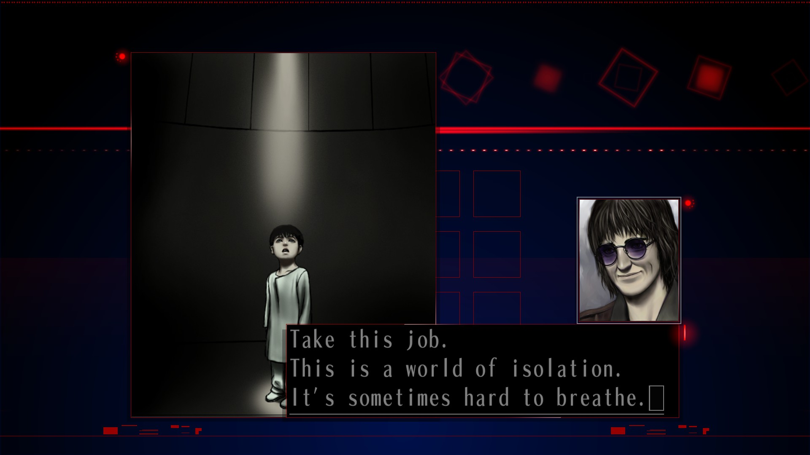
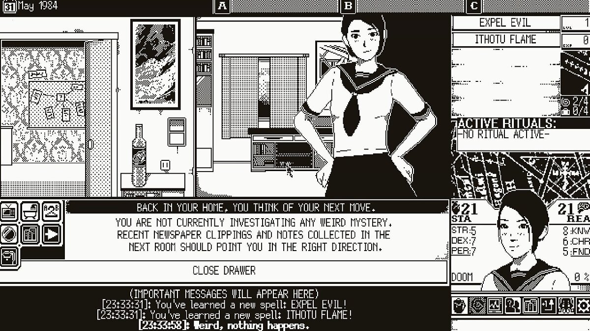
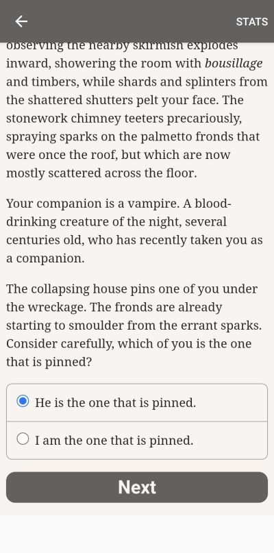

Третій епізод бесід про інтерактивну літературу на [дискорд-сервері](https://discord.gg/dWdySHUJKV) нашої спільноти. Ми розмовляли з автором "Кайзера сингулярності" про візуальні новели, різноманітні механіки в текстових іграх, а також порівнювали західний та східний підходи до ігор, комерційну та аматорську ІЛ, і американську та британську моделі ігор.

<!-- cut -->

```toc
#
```

## "Кайзер сингулярності" та його автор

---
**techniX**

Сьогодні ми запросили прийняти участь в наших бесідах **@Drama[Theurgist] ♠** -- автора сценарію та тексту в візуальній новелі "[Кайзер сингулярності](https://dramatheurgist.itch.io/kaiser)", про яку ми згадували в попередніх бесідах.

Отже, розкажи трохи про себе та свої вподобання :)

---
**Drama[Theurgist] ♠**

Я взагалі цікавлюсь дуже різними жанрами ігор. Люблю JRPG, ритм-ігри, файтинги. Але особливо люблю ігри з гарними історіями. Тому останні кілька років приділяю багато часу візуальним новелам. І от нещодавно навіть написав свою :) Раніше цікавився психологією, тому люблю й сюжети такого типу.

---
**Roguelike Lab**

Агнст?)

---
**Drama[Theurgist] ♠**

Ну не тільки :)

---
**techniX**

Сюжет доволі загадковий, після першого прочитання не все зрозуміло. Тобто натяки є, але прямим текстом ніде не розповідається, що реальне, а що ні.

---
**Drama[Theurgist] ♠**

Так, це частина ідеї :)

---
**Roguelike Lab**

В чаті ВН збирали паті на його подолання)) [ну майже] 

---
**Dramа[Theurgist] ♠**

Я дуже хотів написати історію у жанрах, які мені цікаві, але були забуті в останні роки. І ще я люблю загадкові історії, які треба "розплутувати", збирати по дрібницям. Тому я намагався створити щось, що винагородить саме уважного читача.

Але, якщо хочете, я можу відповісти на ті питання, що у вас залишились після читання :)

---
**techniX**

Я так зрозумів, що сцени подані не в хронологічному порядку? Бо на це є натяк в сюжеті.

---
**Drama[Theurgist] ♠**

Там є два флешбеки. Все інше хронологічно.

Коли ми обговорювали сюжет у команді, ми жартували, що можна ще більш все заплутати і поміняти сцени місцями. І я люблю такі штуки. Але ми вирішили, що не потрібно. Можливо, щось таке зробимо наступного разу :)

---
**techniX**

Або взагалі подати у зворотному порядку :)

---
**Drama[Theurgist] ♠**

Я не такий талановитий як Джонатан Нолан :)

Цей сценарій був моєю першою спробою написати сюжет для ВН. 

---
**techniX**

О, то це ще й дебют! Дуже крутий дебют, як на мене :)

---
### Незвичайний інтерфейс

---
**techniX**

У відгуках на новелу багато хто звертав увагу на інтерфейс. Як взагалі виникла ідея відійти від класичної для ВН організації інтерфейсу "сцена зверху, текст у віконечку знизу"? 

---
**goraph**

Інтерфейс -- це було яскраве враження. Перше, що я подумав, це "ого, треба робити як в Кайзері".

---
**Drama[Theurgist] ♠**

Натхнення прийшло зі старої новели Гоічі Суди -- [The Silver Case](https://en.wikipedia.org/wiki/The_Silver_Case). Там теж досить заплутана історія :) Мені вона дуже подобається і мені жаль, що ніхто більше такого не робив і навіть сам [Суда51](https://en.wikipedia.org/wiki/Goichi_Suda) пішов в іншому напрямку. 

"The Silver Case" вийшла у 1999 році, і тоді вона взагалі була супер-авангардною. Як бачите, 23 роки пройшло, а це все ще виглядає як щось дивне :) Бо жанр пішов в іншому напрямку. І не з'явилось ніші для, так би мовити, "артхаусу в ВН".

Сам Суда надихався фільмами французської нової хвилі. Тоді був такий zeitgeist у Японії -- давали зелене світло різним дивним та темним проектам. 

Я буду дуже радий, якщо Кайзер стане початком для "нової хвилі" українських ВН. І хтось ще зробить свою новелу у такому стилі та настрої :) 



---
### Розробка

---
**techniX**

Скільки вас було в команді "Кайзера", хто чим займався? 

---
**Drama[Theurgist] ♠**

У команді Кайзера було 6 людей: 

1. Художниця, що малювала персонажів.
2. Художниця, що малювала локації та предмети.
3. Фотограф та монтажер відео.
4. Саунд-дизайнер.
5. Програміст, що також займався компоновкою сцен. 
6. Сценарист та координатор.

Також ми залучили наших друзів фотографів, що надали нам кілька додаткових світлин, справжнього войс-актора, що озвучив нам сцену з чатом, музикантів з одеських стоунер гуртів [Rudnic Ore](https://rudnicore.bandcamp.com/) та [Mist Tower](https://misttower.bandcamp.com/), що надали нам свою музику.

---
**techniX**

Сцену з чатом озвучувала одна людина? У мене було враження, що там різні люди... :)

---
**Drama[Theurgist] ♠**

А це вже магія нашого саунд-дизайнера :)

---
**HronoStranger**

Ось цікаво, чи побачить "Кайзер" західний ринок? Чи будуть переклади та на які мови?

---
**Drama[Theurgist] ♠**

Так, зараз ми робимо переклад на англійську та японську.

---
**Roguelike Lab**

О, а як ви перекладаєтесь на японську, якщо не секрет?)

---
**Drama[Theurgist] ♠**

Найняли перекладача :)

---
### Загадкове Місто

---
**Drama[Theurgist] ♠**

Чи здогадались ви, у якому місті насправді відбуваються події "Кайзера"?

---
**techniX**

Я був певен що це Київ :) Вгадав? 

---
**Drama[Theurgist] ♠**

Ні :) Тоді б й таємниці не було :)

---
**goraph**

Я думав це десь на сході або півдні, але певної відповіді не маю.

---
**Drama[Theurgist] ♠**

Так, це місто на сході.

---
**techniX**

Для мене єдиним впізнаваним символом була телевежа, але ж це київська? :)

---
**Drama[Theurgist] ♠**

Фото там з різних міст. Є з Кривого Рогу, Маріуполя, Києва. Але сама історія про інше місто. Це найглибша частина лору. Якщо вам цікаво, можете пошукати натяки у тексті.

---
**techniX**

В тексті є якісь підказки? Якщо був в цьому місті, можна здогадатися?

---
**Drama[Theurgist] ♠**

Звісно є. Де нема підказок -- нема і таємниці :). 

---
**techniX**

Буде привід перечитати "Кайзера", щоб їх знайти :)

---
**Drama[Theurgist] ♠**

Я можу вам сказати, але давайте залишимо таємницю для наших читачів.

Така гра між автором і читачем -- саме те, чому я полюбив творчість [Рюкіші07](https://en.wikipedia.org/wiki/Ryukishi07). Тому ВН навіть не потрібні механіки.

---
## Тенденції світу візуальних новел

---
**techniX**

А який стан ВН-світу зараз? Які тенденції, на які проєкти останніх років варто звернути увагу?

---
**Drama[Theurgist] ♠**

Хм, з чого б почати... Багато років вже йдуть постійні стогнання, що індустрія новел вже всьо, що усі талановиті автори пішли, що нічого гарного більше не буде.

---
**techniX**

Ой, як знайомо :)

---
**Drama[Theurgist] ♠**

Це, звичайно, ностальгічне мислення. Нові проекти постійно виходять. Питання лише у тому, коли вони дістаються Заходу. Бо японці все ще чомусь перебувають в ілюзіях, що їх ігри нікому не потрібні. І не хочуть вкладатись в локалізацію.

---
**techniX**

То переклади ВН англійською -- здебільшого справа рук фанатів? 

---
**Drama[Theurgist] ♠**

Ні, зараз і фанатські переклади теж не таке активне явище, як то було у нульових чи десятих. Є кілька видавництв, які видають новели на Заході. На них все і тримається.

Але надія є. Ми всі бачимо підйом кітайської ігрової індустрії. Багато японських гейм-девелоперів переїжджають до Китаю. Це може все змінити як у кращу, так і у гіршу сторону.

Тренд який цікавить саме мене -- це повільно зростаюча популярність саме сюжетних новел. Зазвичай ВН асоціюються з еротичним контентом. Простіше кажучі, дуже довгий час це буле порно-ігри. І зараз це теж так. Але, на мою думку, найбільш цікаві візуальні новели це так звані *plotge* (plot games).

---
**techniX**

А, тобто "сюжетні новели" -- це не ті, де нема геймплею як такого (як я спочатку подумав), а ті, де є цікавий сюжет?

---
**Drama[Theurgist] ♠**

Так, це суто ніша всередені ніші. Геймплей може бути.

Цього року, наприклад, вийшла нова частина серії [Ai: Somnium Files](https://en.wikipedia.org/wiki/AI:_The_Somnium_Files). В минулому році, PC-геймери нарешті змогли пограти у [Great Ace Attorney Chronicles](https://www.ace-attorney.com/great1-2/us/). Кілька років тому дуже популярною була серія [Danganronpa](https://uk.wikipedia.org/wiki/Danganronpa:_Trigger_Happy_Havoc). Це все ігри з детективним геймплеєм, і саме вони -- лице сучасних ВН на заході. 

Так, справжні поціновувачі новел будуть розказувати вам про [SubaHibi](https://en.wikipedia.org/wiki/Wonderful_Everyday), але вона -- скоріш частина більш глибинного і маргінального контексту ВН. А ці детективні ігри справді задають тон сьогодні. 

---
**techniX**

Тобто "законодавцем мод" у ВН є саме Японія та японські геймдизайнери? 

---
**Drama[Theurgist] ♠**

Так, це жанр переважно японський. Є деякі приклади успішних неяпонських новел, але це краплини в океані. Наприклад, [Va-11 Hall-A](https://en.wikipedia.org/wiki/VA-11_Hall-A) -- це цікава новела від розробника з Венесуели. Але конвенції і методи, якими він користується -- вони японські.

---
**techniX**

З неяпонських ВН -- у мене є надія на "[Mask of the Rose](https://www.failbettergames.com/games/mask-of-the-rose)" від Failbetter Games, там були задіяні відомі автори з світу ІЛ :) 

---
**Drama[Theurgist]**

Так, я теж чекаю на цю гру. Це ж [Алексіс Кенеді](https://en.wikipedia.org/wiki/Alexis_Kennedy)? 

---
**techniX**

Алексіс був співзасновником студії, проте зараз він там вже не працює.

---
**techniX**

Я дуже багато чув про [Хігураші](https://en.wikipedia.org/wiki/Higurashi_When_They_Cry) (Higurashi no Naku Koro ni, "Коли плачуть цикади"), в [телеграм-чаті любителів ВН](https://t.me/ua_visual_novels) заклики "читати цикад" стали місцевим мемом. Чи дійсно вона настільки гарна, і якщо так, то чому?

---
**Drama[Theurgist]**

Так, Хігураші це класика. Це серія, що почалась у 2002 році і зараз залишається дуже популярною. Дуже талановито написана новела, що користується багатьма тропами психологічних хорорів, але використовує їх щоб розказати не лише містичну, а й дуже людяну історію. 

Не знаю що тут ще додати :) Почитайте, вас не обманюють, це дуже хороша новела.

---
**techniX**

Як ти бачиш майбутнє ВН? Є щось таке, чого ще ніхто не робив, або щось таке, що ти хотів би побачити?

---
**Drama[Theurgist] ♠**

Якщо ми говоримо про гарне майбутнє, то це:

1. Одночасні глобальні релізи. Я вірю, що ми це побачимо. Це створить і нову кон'юнктуру і залучить більше гравців.
2. Дійсно якісний еротичний контент. Це звучатиме дивно, враховуючи сучасні тренди західної культури з її підозрілим ставленням до сексуальності. Але я вірю, що ми ще побачимо західні новели, що будуть дійсно про романтичну любов і стосунки. Не нудне порно і не жуйку для літніх кумерів, як зараз в ероге, а по-справжньому чуттєві твори.
3. Переклади усіх кращих ВН українською. Це нам, шановні, роботи років так на 15. Починати потрібно вже зараз, бо кількість українських перекладів зараз близька до нуля. 
4. ВН-адаптації для кращих літературних творів. Це взагалі мрія, але чому б не помріяти. Взаємодія між медіумами піде дуже на користь і сприятиме загальному "дорослішанню" індустрії, що вже зараз поступово відходить від того, щоб бути просто порно-іграми. Я мрію побачити у ВН історії на рівні хоча б з кіно, не кажучі вже про вершини літератури. 

---
**goraph**

А які перспективи саме в українських ВН? З огляду на роботи [джему](https://itch.io/jam/visualnovel-jam-ua/) хоча б, як виглядає і як може виглядати (чи як би ти хотів щоб виглядала) та новелла української нової хвилі?

---
**Drama[Theurgist] ♠**

Нажаль, про це говорити зарано. Подивимось після нашої перемоги. Якщо на Заході все ще буде інтерес до української культури, буде й можливість людям створювати комерційні проекти. 

Зараз я, на жаль, бачу лише ефемерну, малесеньку можливість людям робити щось на чистому ентузіазмі й лише заради любові до жанру.

---
**techniX**

Це теж вже немало!

---
## Західний та східний підхід до ігор

---
**goraph**

Чому нема успішних ВН поза Японією? З чим це пов'язано? 

---
**Drama[Theurgist] ♠**

Нудна відповідь: так склався ринок. Історично багато розробників ігор в Японії починали саме з порно новел. У них не було бюджету і вони рухались шляхом "використовуємо те що працює". Виявилося, що простіше написати текст. І гравцям ті еро-фантазії подобались. І так йшло 10 років. Ринок сформував цей жанр. 

---
**goraph**

Тобто річ в гравцях? Японці готові в це грати, а на Заході ні?

---
**Drama[Theurgist] ♠**

Вийшла кумедна ситуація, абсолютно неможлива для західного ринку. У сюжетну гру спеціально додавали хентай, щоб вона краще продавалася і щоб взагалі схвалили її розробку.

Типовий приклад -- [Yu-No](https://en.wikipedia.org/wiki/YU-NO:_A_Girl_Who_Chants_Love_at_the_Bound_of_this_World). Це класична новела 96 року. Зараз її знають як одну з перших дійсно сюжетних новел. Але для того часу вона була лише одною з безлічі ероге.

Це таке порочне коло. Треба щоб хтось започаткував моду. І потім воно вже крутиться.

На мою думку, так, західні гравці більш люблять механіки в играх. А японські гравці більш люблять історії. Західні гравці вважають історію додатком до геймплею. Серед японських гравців достатньо тих, хто вважає геймплей інструментом для історії. Звичайно, це якщо дуже спрощувати. Але якщо подивитись на різницю між японськими та західними RPG, ви теж це побачите.

---
**techniX**

Так, західний підхід був сформований книгами-іграми, в яких саме екшен, а не сюжет, був на першому місці. Взяти ту ж серію [Fighting Fantasy](https://en.wikipedia.org/wiki/Fighting_Fantasy) -- досить промовиста назва.

---
**Drama[Theurgist] ♠**

Це не означає, що японці не люблять механіки. Наприклад, [соулзи](https://uk.wikipedia.org/wiki/Dark_Souls) -- сучасний тріумф механічного геймплею, це теж японські ігри. Але, як то кажуть, маємо що маємо. Кон'юнктура склалася таким чином, що ВН -- це переважно японський жанр.

---
## Як роблять ВН

---
**techniX**

Наскільки взагалі складно створити візуальну новелу самостійно?

---
**Drama[Theurgist] ♠**

Це можливо і це не надто складно. На джемі було кілька дуже цікавих проектів, зроблених однією людиною. Та що там, навіть моя улюблена новела з джему, "[Деміург прагне втечі](https://lunadalarus.itch.io/demiurg-wants-to-escape)" -- саме така.

---
**goraph**

Ну ті ж "Цикади" фактично зроблені однією людиною.

---
**Drama[Theurgist] ♠**

Так, це правда. Багато кого зупиняє невміння малювати. [Рюкіші07](https://en.wikipedia.org/wiki/Ryukishi07) от не зупинило :) І його оригінальні арти зараз навіть вважаються особливо душевними. Але це тому, що історія дійсно захопила серця людей. Якщо у вас є цікава історія, все інше не так вже складно.

---
**goraph**

Зараз набагато простіше зробити новеллу самостійно, ніж в 2002, коли це зробив Рюкіші. У нас безліч [cc0](https://creativecommons.org/publicdomain/zero/1.0/deed.uk) контенту, AI-генератори врешті-решт, гарні платформи, той же ж [RenPy](https://www.renpy.org/).

---
**techniX**

Платформа, до речі -- це дуже важливо. Коли не треба створювати рушій з нуля, більше часу та зусиль можна віддати сюжету та контенту :)

---
## Механіки в текстових іграх

---
**Drama[Theurgist] ♠**

Найкраща механіка -- це механіка самої історії. А гра йде у читача в голові :)

---
**techniX**

Насправді в кожній грі так, найголовніше відбувається у гравця в голові. А ігрові механіки -- скоріше засіб передати грі, що ти розумієш що відбувається :)

І так ми плавно перейшли до нашої наступної теми про ігрові механіки. Точніше, про те, які взагалі механіки можуть бути в текстовій грі.

---
**Drama[Theurgist] ♠**

Можуть бути будь-які, а от які дійсно гарно працюють -- це вже дуже складне питання. ВН з цим все ще не визначились :)

---
**techniX**

Взагалі у нас є, так би мовити, базова механіка. Ми читаємо текст :) А далі залежить від типу гри -- або ми команди вводимо, або обираємо варіанти дій, або за гіперпосиланнями переходимо. Це, так би мовити, база :)

Але питання в тому, як зробити гру цікавішою :) Я взагалі цікаві механіки підглядаю в настольних іграх.

---
**Drama[Theurgist] ♠**

А які найкращі механікі, що ви бачили у ІЛ? От просто такі, що прям вогонь 🔥 

---
**techniX**

Ну мені на думку приходить "[All things devours](https://ifdb.org/viewgame?id=5e23lnq25gon9tp3)" з машиною часу. Або "[With Those We Love Alive](https://ifdb.org/viewgame?id=445d989vuwlh4cvz)", де гравець має на собі (фізично) малювати символи.

---
**Drama[Theurgist]**

Що, прям на лобі?

---
**techniX**

На руці можна :)


---
**goraph**

Ох, це складне питання :) Ну от стандартна відповідь -- лабіринт в [Фотопії](https://ifdb.org/viewgame?id=ju778uv5xaswnlpl).

Але це складно пояснити без спойлерів... Я спробую. Це парсер, де ти бродиш по лабіринту, з якого нема виходу. В якийсь момент гравець вводить сам в нього нестандартну команду, на яку не було жодного натяку :) 

Звучить жахливо, мабуть. Але не так жахливо, як малювати на руці.

---
**techniX**

Ну там натяк насправді є, але дуже легкий.

---
**Drama[Theurgist] ♠**

Не зрозумів, а у чому механіка? Команда якось сама народжується із суми дій гравця?

---
**goraph**

Ні, вона одна й та сама. Це дуже класичний вау-момент.

---
**techniX**

Ну це приблизно як "ти граєш в ВН, але в якийсь момент розумієш, що сцена перед тобою в 3D і ти можеш по ній ходити"

---
**goraph**

Це вже трохи спойлер :)

---
**techniX**

Це спойлер для тих, хто вже знає :)

---
**Drama[Theurgist] ♠**

Якщо говорити про настільні ігри, то я чекаю, коли хтось зробить ідейного послідовника [Sherlock Holmes: Consulting Detective](https://boardgamegeek.com/boardgame/2511/sherlock-holmes-consulting-detective-thames-murder) у форматі ІЛ, ВН чи просто відеогри. 

---
**techniX**

Адаптація у відеогру, до речі, [існує](https://www.filfre.net/2017/10/a-full-motion-video-consulting-detective/).

---
**Drama[Theurgist] ♠**

Про цю я в курсі. Я хочу нову гру. Таку, але нову.

---
**techniX**

Отже, я підглядаю цікаві механіки в настолках, але є одна проблема. В настільній грі нема прихованих частин, вся механіка очевидна гравцеві. І, відповідно, не виникає питання "на що я впливаю своїми діями"

---
### "World of Horror"

---
**Drama[Theurgist] ♠**

О, це до речі, цікаве питання. Ви грали в [World of Horror](https://en.wikipedia.org/wiki/World_of_Horror)? Оце гра, яка мені дуже сподобалася, але якій не вистачає прозорості у механіках.

Вона вимушує гравця вести нотатки, але робить це без поваги. Це теж гра, побудована на настільних механіках. Конкретно у цьому кейсі вона натхнена грою [Arkham Horror](https://boardgamegeek.com/boardgame/15987/arkham-horror).



---
**goraph**

Мені завжди подобалося малювати карту :)

---
**techniX**

Олдскульні ігри взагалі примушували гравця вести нотатки та малювати карту. Зараз це звісно вважається моветоном :)

А от у настільний Arkham Horror я грав! І, мабуть, для тих, хто в нього грав, вона зрозуміліша?

---
**Drama[Theurgist] ♠**

Можливо, але мені так не здалося. 

Ідея там така. Гравцю треба пережити 5 рандомних енкаунтерів. Це невеличкі хорор-історії. Усередині кожної теж є невеличка варіативність. Але інтенція геймплею полягає у тому, що гравцю потрібно прийти в енкаунтер з певним предметами, що покращать його шанси.

У Arkham Horror предмети здебільшого універсальні. І гравцям потрібно не йти на зайвий ризик.

У WoH схожа ідея, але перетворена на справжній роглайт-"соулс". У гравця дуже мало шансів пережити енкаунтер без знання як він працює та підготовки.

---
**techniX**

Можливо, автор розраховував на те, що гравець буде "вчитися через загибель".

---
**Drama[Theurgist] ♠**

Так, єдиний спосіб -- це грати, вмирати й робити нотатки, коли знайшов те, що працює. Справжній олдскульний підхід.

---
**techniX**

Цей підхід зараз теж вважають застарілим. Тобто, гравець має мати можливість пройти гру без тих знань, які він може отримати виключно загинувши.

---
**Drama[Theurgist] ♠**

От і я подумав, що якщо б механіка була більш прозорою, то можливо, грати було б цікавіше. Але з іншого боку, саме в цьому "дослідженні" й полягає сенс гри. Коли все відомо, це перетворюється лише на битву з рандомом. Що теж можна зробити цікавим, але це вже буде інша гра, що вимагатиме іншої прогресії. 

Я б зробив усі нотатки, якщо б WoH був насправді наративною грою. Якщо б на мене чекала якась цікава таємниця. Якщо від смерті до смерті я б повільно наближався до правди. Якщо б грі вдалося створити це відчуття, це могла б бути одна з моїх улюблених ігор. 

---
**goraph**

Ну я от граю в картковий [Жах Аркгему](https://boardgamegeek.com/boardgame/205637/arkham-horror-card-game) багато, там фактично обидва ці підходи одночасно -- спочатку ти нічого не знаєш, і тому цікаво, потім ти все знаєш (так, в колоді залишилося два прадавніх зла, тому йдемо ближче до виходу) і це теж цікаво, але це вже інша гра.

---
### Парсерні ігри

---
**techniX**

А, і ще з прикладів цікавих механік -- "[Counterfeit Monkey](https://ifdb.org/viewgame?id=aearuuxv83plclpl)", де гравець має перетворювати слова, аби отримати потрібні дієслова для подальшого проходження.

---
**Drama[Theurgist] ♠**

Звучить досить складно.

---
**goraph**

Якщо ми вже про [Emily Short](https://emshort.blog/), то є ще чудова [Savoir-Faire](https://ifdb.org/viewgame?id=p0cizeb3kiwzlm2p), ти там з'єднуєш предмети магією -- наприклад чашку і колодязь, набрав в чашку води, вона набралась в колодязь, якось так. Розбив чашку -- колодязь навпіл. І вся гра -- це така серія паззлів з дуже нестандартної маніпуляції предметами.

---
**Drama[Theurgist] ♠**

Якщо говорити про парсерні механіки, то мені подобається, як це робив Сем Барлоу у [HER STORY](https://en.wikipedia.org/wiki/Her_Story_(video_game)) і [Telling Lies](https://en.wikipedia.org/wiki/Telling_Lies_(video_game)). Там я дійсно відчував, що я розслідую щось.

---
**goraph**

У парсера є така властивість, бо там кожне рішення -- це твоє рішення.

---
**Drama[Theurgist] ♠**

Але, наприклад, пересуватись по локаціям парсером мені не цікаво. Чи шукати можливі дії.

---
**goraph**

Це багато для кого так, тому жанр там, де він є, на жаль.

---
**techniX**

Тому класичний парсер зараз тримається виключно на ентузіазмі :) Є мабуть штук п'ять комерційних парсерів, та й ті здебільшого зроблені "фанатами для фанатів".

---
## Комерційна та аматорська ІЛ

---
**Drama[Theurgist] ♠**

А що зараз більш у моді в світі ІЛ? Вибір гілки чи поінт-системи? 

---
**goraph**

Я б сказав, і те і те одночасно.

---
**techniX**

Десь 50 на 50. Серед ентузіастів популярний [Twine](https://twinery.org/), на ньому дуже багато ігор виходить. А комерційна ІЛ -- це здебільшого ігри з вибором варіантів.

---
**Drama[Theurgist] ♠**

От ми говорили, що б я хотів бачити у світі ВН. Я тут ще одну річ згадав.

Я хочу, щоб повернулись жанри тайм-менеджмент та *raising sim*. Підстави для цього є -- великий успіх останніх трьох чаcтей серії [Persona](https://en.wikipedia.org/wiki/Persona_(series)). Але там це лише база для RPG-гри.

---
**techniX**
А *raising sim* -- це що? Не чув такий термін.

---
**Drama[Theurgist] ♠**

Це коли через багато івентів покращуєш стати персонажа. "Persona" поєднує риси обох цих жанрів. І от я б хотів, що б це було у центрі гри, а не філлером. Гарний приклад -- новела [Little Witch Romanesque](https://littlewitch.us/).

---
**techniX**

Багато ігор [Choice of Games](https://www.choiceofgames.com/) використовують цей підхід. Це, мабуть, одна з ключових фішок ігор цієї компанії, а ігри у них досить популярні. Хоча виглядають отак:



У правому верхньому кутку якраз кнопка, щоб стати дивитися :)

---
**Drama[Theurgist] ♠**

А любителі експериментують з подібними системами?

---
**goraph**

В чойсах не всі ігри комерційні, але взагалі любителі мало експериментують з таким.

---
**Drama[Theurgist] ♠**

Мені здається, що це цікава ніша. Я б хотів колись зробити щось таке. 

Лайтові RPG-елементи можуть прикрасити навіть досить лінійну історію. Наприклад, той же [Disco Elysium](https://uk.wikipedia.org/wiki/Disco_Elysium) створює гарну ілюзію нелінійності саме за рахунок простого підлаштування дрібних частей історії під конкретні стати гравця. Але насправді там все досить лінійно. І за межами двох білдів нічого не існує.

---
**goraph**

Мені здається, у аматорів є два основні підходи -- в мене є якась історія, або в мене є якась механіка. І дуже мало хто замислюється над тим, як цю історію подати або прикрасити. А в комерційній ІЛ знають, що це працює, і вимагають від своїх авторів.

---
**Drama[Theurgist] ♠**

Цікаво, а я думав, що аматорські ІЛ йдуть попереду комерційних :)

---
**goraph**

В чомусь :) Це складне питання. Аматорські ігри повинні відрізнятись, для них це необхідність. Якщо аматорські ігри повторюють комерційні, вони роблять те саме, але гірше. Тому навіть працюючі речі не дуже експлойтяться, коли вони вже активно використовуються комерційними іграми -- відрізнятися життєво необхідно.

---
**techniX**

В аматорській ІЛ є два підходи -- "спробувати зробити так, як не робив ніхто" (що важко, враховуючи довгу історію текстових ігор) або "зробити так само, як сотні людей до мене" (і тоді лише цікавий сюжет може врятувати гру)

---
**Drama[Theurgist] ♠**

А були приклади аматорських ІЛ з гарним продакшн велью на рівні з комерційними проектами?

---
**techniX**

Мені на думку спадають хіба що [Anchorhead](https://www.anchorhead-game.com/) та [Hadean Lands](https://hadeanlands.com/).

---
**goraph**

Hadean lands -- це хіба аматорський проект?

---
**techniX**

Його ж [Плоткін](https://en.wikipedia.org/wiki/Andrew_Plotkin) робив сам :) Хоча Плоткіна, звісно, аматором не назвеш :)

---
## Американська та британська моделі

---
**goraph**

Тут така справа, перемогла американська, а не британська модель ігор, так історично склалося. А вона не передбачає продакшена взагалі.

---
**Drama[Theurgist] ♠**

А у чому полягають ці моделі?

---
**goraph**

У британців були малюнки, жертвуючи всім. Це було важливо, бо коли був "[Cпектрум](https://uk.wikipedia.org/wiki/ZX_Spectrum)" наприклад, гру треба було втиснути в 48кб. Вони жертвували текстом, але в кожній локації був свій малюнок. Була анімація, візуал.


---
**Drama[Theurgist] ♠**

То ж це були ВН :)

---
**goraph**

Ну, якоюсь мірою. Це був ВН з парсером чи з вибором після кожного абзацу.

---
**Drama[Theurgist] ♠**

А амеріканська модель -- це саме про текст? Чи про механіки дослідження локації?

---
**goraph**

Американська модель -- це просто текст. Продакшена не було, малюнків не було.

---
**Drama[Theurgist] ♠**

Бо я дивлюсь що :abbr[обидві ці ігри]{title="Anchorhead та Hadean Lands"} -- вони про дослідження локації. Я так розумію, це взагалі глобальний тренд для ІЛ. І мені це не дуже зрозуміло. 

---
**techniX**

Це як почалося ще з "Colossal Cave Adventure", так і продовжується :) Але вже згадувана тут "Photopia" була грою, яка зламала цю традицію. І ІЛ від ходіння по кімнатах і маніпуляції предметами перейшла на інший рівень, де сюжету приділяють більше уваги.

---
**goraph**

Я завжди вважав, що британські ігри краще. Зараз вже нема обмежень по розміру, але ігри не змінились фактично. Ті ж чойси комерційні, і успішні, але це просто текст.

---
**Drama[Theurgist] ♠**

Я правильно розумію, що "американські" ігри не пішли шляхом покращення якості тексту, а зосередились саме на відчутті "знаходження всередині"?

---
**techniX**

Ну, вони намагалися покращувати текст (навіть заохочували відомих письменників типу Дугласа Адамса), проте основою гри були ті самі кімнати та предмети.

---
**HronoStranger**

Ви маєте на увазі статичний опис кімнати? Для зрозумілості.

---
**techniX**

Ні, мається на увазі сама структура гри. Є локації (кімнати), між якими ти переміщуєшся. В цих локаціях є предмети, з якими ти можеш взаємодіяти. Є твій інвентар, в якому теж є предмети.

---
**HronoStranger**

Ем... і ці кімнати мають переважно, статичний стиль опису.

Я мав на увазі, що змінюється лише при дії гравця, а не в послідовному ході розповіді.

---
**techniX**

Ну, це вже не має значення :) Опис може і змінювати, проте сутність залишається. 

І для порівняння спробуй пограти в "Photopia", де технічно теж є кімнати і предмети, проте сам текст та геймплей дуже сильно відрізняється від традиційних парсерних ігор.

---
**Drama[Theurgist] ♠**

Якщо порівнювати CRPG і JRPG, то легко побачити, що для CRPG важливіша саме імерсія у всесвіт. Це важливіше за саму історію, тому вони багато експерементували з механіками та бойовими системами.

Чи можна сказати подібне про "амеріканські" ІЛ? Сказати, що для них важлива саме пригода, саме ігровий аспект "занурення", а не літературні якості?

---
**techniX**

Так, схоже на це. Проте були експерименти зробити [більш "літературну" ІЛ](https://if50.substack.com/p/1981-his-majestys-ship-impetuous).

---
**goraph**

Це явище вже проходить, я б сказав. Десь наприкінці 90х з'явились ігри, які почали розказувати історію замість знаходження всередині. І в нульових це був основний напрямок жанру. Зараз, я б сказав, ми повертаємось назад.

---
**Drama[Theurgist] ♠**

Цікаво, а чому повертаємось? І чи варто повертатись до цього?

---
**goraph**

Мода ціклична. Коли ми розповідаємо історію, ми спрощуємо гру, чим далі -- тим більше. Настає момент, коли вже занадто, коли це починає бути схожим на кінетичну новеллу і люди кажуть: "гей, де тут гра, нащо це, чому це не книга?". І починають йти в зворотньому напрямку.

Тенденція останніх років в парсері -- це лімітований парсер, де ми скорочуємо сам парсер до 10 дієслів, наприклад. Але загадки знову стають доволі складні. 

Була пару років тому чудова гра про свиню, [The Wizard Sniffer](https://ifdb.org/viewgame?id=uq18rw9gt8j58da). Там головний герой -- свиня, яка може ходити, нюхати, брати в зуби один предмет і кидати його, а ще верещати. І ось все в грі з цим набором дій. Але це цікава складна паззлова гра, а не "введи то що написано і просто читай мою історію".

Тому як на мене, повертатися варто, і еволюціонувати кудись варто, бо ігри дійсно стали нецікаві. Ідеальна гра знаходиться десь посередині, невідомо, де саме.

---
**techniX**

Але це, мабуть, вже тема для наступної бесіди? :)

---
**Drama[Theurgist] ♠**

Гарно потеревеніли :) Дякую, що запросили.

---
**goraph**

Дякуємо, що прийшов. Було цікаво.

> *Транскрипт було скорочено та відредаговано для зручності читання.*