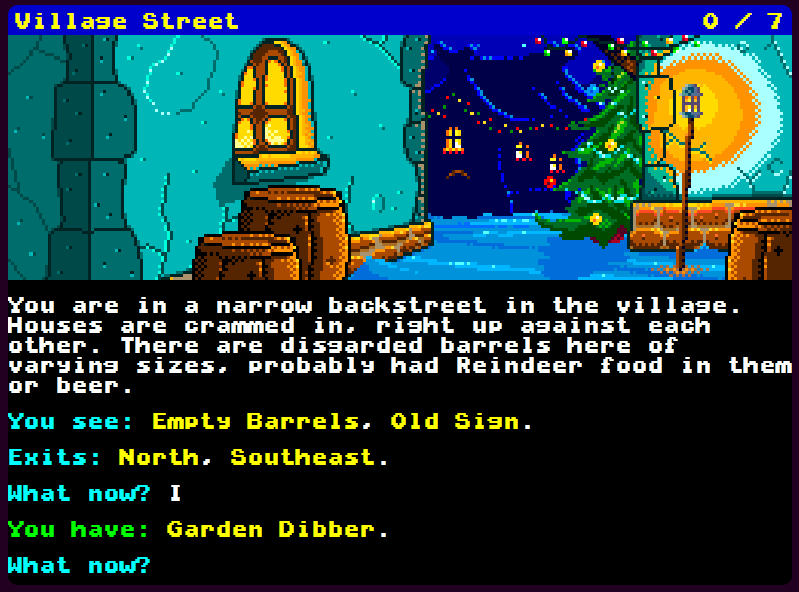
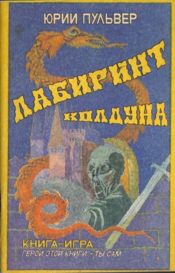
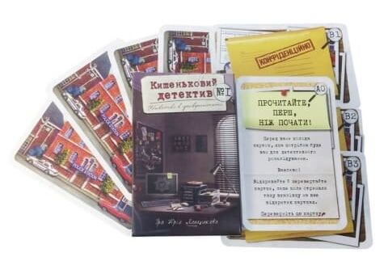
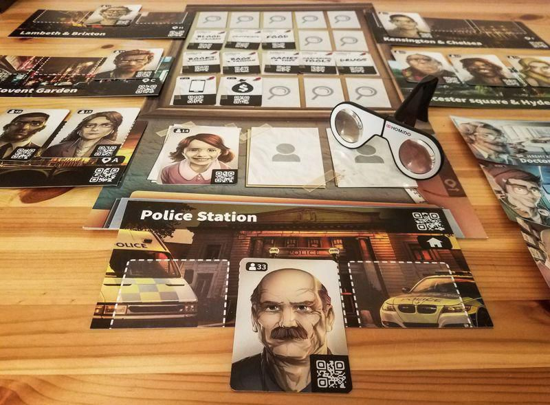
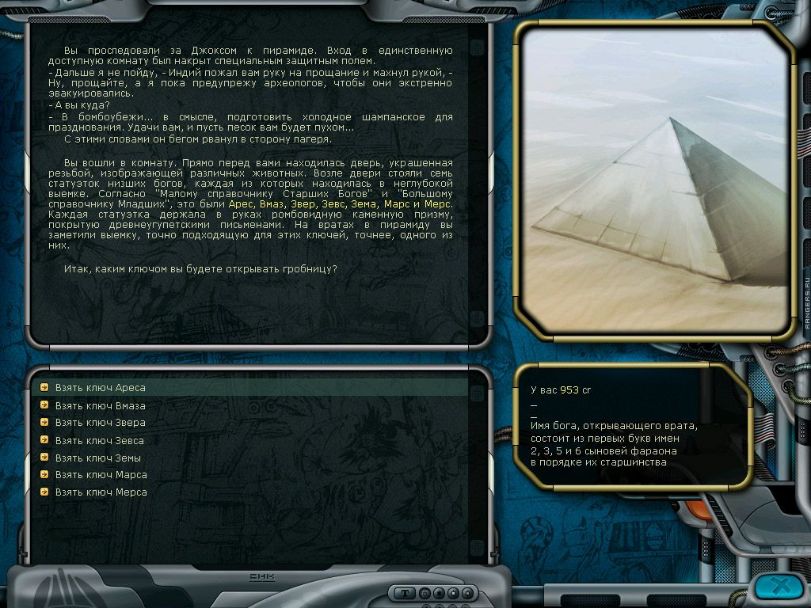

Четвертий епізод бесід про інтерактивну літературу на [дискорд-сервері](https://discord.gg/dWdySHUJKV) нашої спільноти. Ми розмовляли про історію, графіку, настільні ігри, різні форми та розміри ІЛ, а також ділилися творчими планами.

<!-- cut -->

```toc
#
```

## Чи потрібна зараз "чиста ІЛ"?

---
**techniX**

У мене було бажання написати статтю про "що робити далі", але я так цього і не зробив... Отже, що робити для розвитку спільноти далі? У нас є [сайт](https://intfiction.org.ua/), є [дискорд](https://discord.gg/dWdySHUJKV), є [телеграм-канал про ІЛ](https://t.me/garden_of_forking_paths). Лише ігор не дуже багато, але це ненадовго, сподіваюся. Але чи є сенс створювати "чисту ІЛ"? Чи потрібно це взагалі у ХХІ сторіччі?

---
**goraph**

Давай спочатку розберемось, що таке "чиста ІЛ"?

---
**techniX**

Суто текстові ігри -- без графіки, без нетекстових геймплейних елементів.

---
**goraph**

За великим рахунком, є дві причина створювати чисту ІЛ. Історично в ранніх іграх просто не було ресурсів і на текст і на графіку, чимось доводилось жертвувати. Якщо ми створюємо ретро гру, це має сенс.

---
**techniX**

Текст був єдиним способом створити цікавий ігровий досвід в умовах обмеженості ресурсів.

---
**goraph**

Друга причина - це економія ресурсів. Дешевше і швидше не робити малюнки, ніж робити.

Інших причин я не бачу, є ще якісь?

---
**HronoStranger**

Є ще одна - бачив парсерний джем на ітчі пару місяців тому. Зараз, що правда, його не знайду. В звичайній консолі.

---
**techniX**

Ну тобто "ретро" :) Бо насправді зараз дуже багато популярних текстових ігор... проте вони не вважаються "інтерактивною літературою".

---
**Roguelike Lab**

Так, є таке. Кожен просто вигадує ІЛ заново.

---
**goraph**

Ну парсерний джем в консолі це і є ретро геймінг, ми копіюємо ретро стілистику. Це завжди має сенс.

---
**techniX**

Особисто для мене текстові ігри цікаві тим, що в них досить багато уваги приділяється сюжету. Тому я бачу нашу спільноту здебільшого як спільноту геймдизайнерів-сценаристів, якщо можна так сказати :)

Немає різниці, хто яку гру робить і в якому жанрі - але підходи до сюжетів, розгалужень історії, виборів приблизно однакові усюди.

---
**HronoStranger**

Чи є сенс створювати чисту (ну ось на всі 100%) ІЛ? Не знаю. Але вона буде погано "продаватися", на мою думку.

---
**techniX**

ІЛ -- це не жанр-гетто, вона досить популярна у світі. Це ігри, які використовують на повну можливості тексту як творчого засобу. Тож є сенс передивитися своє відношення до неї.

Який сенс обмежувати авторів рамками якихось платформ? Хтось може на Unity хоче гру робити -- то хай робить.

---
**Roguelike**

Ні, нема. Це просто пережиток минулого, треба додавати щось нове і рухати жанр вперед.

---
**Таро**

Ви хочете зробити як на сайті іфні? Текстові ігри різних форматів?

---
**goraph**

Я поки не розібрався, чого ми всі разом хочемо :) Я б не хотів особисто, щоб це були текстові ігри різних форматів. Але як піде :)

---
**Таро**

Ця тема вже обговорювалась 1000 разів на різних сайтах (іфні, Квестбука та ін.). І всі відповіді вже були сказані багато років тому.

---
**techniX**

Та немає відповіді насправді. Є два типи людей -- одним просто в кайф створювати ігри як такі, чисто по фану, а інші хочуть розвивати ІЛ як жанр і як явище. І ті і інші по своєму праві. Кого буде більше у нас в спільноті -- покаже час.

---
**goraph**

Так що має сенс -- однозначно має ретро геймінг це явище, є люди які хочуть робити як в 80-ті, грати як в 80-ті, і це нормально!
Це мейнстрім? Теж однозначно ні, бо масовий гравець не дуже читає і любить малюнки, ми це знаємо.

---
**techniX**

Наприклад, [Adventuron](https://adventuron.io/) явно копіює модель британської парсерної ІЛ-сцени.



---
**Таро**

Все просто іде по Життю і Природі, а не так, як нам заманеться. Ті автори, що вміють писати художні тексти -- пишуть ІЛ (і їм не потрібні малюнки та механіка), а ті автори, що не вміють писати гарні тексти -- роблять багато малюнків, щоб компенсувати свій лаконізм тексту. А інші автори пишуть ігру з механікою, щоб компенсувати недоліки свого художнього тексту. Більшість авторів **не вміють писати**!!!!!

---
**techniX**

То, може, треба вчитися писати? Або хоча б зрозуміти, що потрібно вчитися? :) 

---
**Таро**

Люди дорослі не будуть вчитись писати, бо ІЛ для них -- це просто хобі. В них багато іншої роботи.

---
**techniX**

Але ж і примушувати їх ніхто не стане. Це не наш метод! :)

---
**Roguelike Lab**

Особисто я поділяю іл-ігри на 4 типи:
1. Тексто-орієнтовані (ставка на сюжет і текст взагалі)
2. Візуально-орієнтовані (ставка на візуальну частину)
3. Механічно-орієнтовані (ставка на цікавий геймплей)
4. Технічно-орієнтовані (ставка на незвичайне використання максимальних можливостей рушія)
І для початку треба вирішити, які саме ігри нам потрібні.

---
## Роль графіки в ІЛ

---
**goraph**

Сюжету малюнки не заважають.

---
**HronoStranger**

Але людська уява може відтворити малюнки і не гірше, чи ні? Коли ми, як автори (в перспективі чи ні), надаємо малюнок -- він один для всіх. Але картина в голові гравця-читача буде своя, особиста.

---
**techniX**

Графіка -- це не обов'язково ілюстрації. Це і, наприклад, мапа місцевості.

---
**HronoStranger**

І навіть UI, так.

---
**goraph**

Я аргумент про "уява краще графіки" не дуже розумію, якщо чесно, бо можна зробити малюнки, які можна відключити. Якщо вони тобі не подобаються, наприклад.

---
**techniX**

А це вже питання авдиторії, на яку ти орієнтуєшся.

Є наприклад такі собі [Spiderweb Software](https://www.spiderwebsoftware.com/), які створюють олдскульні RPG з доволі посередньою графікою... але у них багато фанатів, оскільки таких ігор, як вони, ніхто більше не робить.

---
**goraph**

Реально існують люди, яких в книгах дратують малюнки? Бо я це часто чую, але ну, я ігнорую просто малюнки, які мені не подобаються.

І ще, в книзі в нас просто текст, в грі купа UI елементів, і це фактично малюнки?

---
**Roguelike Lab**

О, це я :) Але книг-ігор це не стосується. Там якраз навпаки.

---
**goraph**

У малюнків є й позитивні риси -- малюнки можуть візуально передавати частину інформації, і це скорочує кількість необхідного тексту, іноді значно. А це плюс.

---
**techniX**

Наприклад, навігація по мапі набагато простіше та зрозуміліше, ніж текстовий опис напрямків.

---
**goraph**

А навігація -- це зазвичай половина опису локації в парсері.

---
**Таро**

Як ви вважаєте, якщо у ВН вирізати всі малюнки -- вона буде цікавою по сюжету?

---
**techniX**

Це приблизно як "якщо з фільму вирізати все відео, залишивши лише аудіо -- чи буде фільм цікавим?"

---
**goraph**

Якщо там відрізати всі малюнки, я буду писати її інакше, це некоректне питання.

---
**goraph**

Я от подумав чим ВН відрізняється від ІЛ текстово -- насправді сильно, і справа тут не в малюнках. В ІЛ 80% гри це пейзаж, опис того, що герой бачить. В ВН 80% гри це діалог і репліки персонажів.

---
**techniX**

Бо пейзаж та персонажі вже намальовані, гравець їх і так бачить, навіщо про них писати :)


---
## Історичні корені ІЛ

---
**techniX**

ІЛ не може бути масовою, принаймні зараз. ІЛ має свою нішу, свою авдиторію, і має сенс працювати саме з нею для початку. Зараз не 80-ті роки, коли (голосом ведучого передачі про тварин) парсерні ігри домінували на ринку, а [Zork](https://if50.substack.com/p/1977-zork) був бестселером. Цей час вже не повернути.

---
**HronoStranger**

Є один нюанс. Важливий, маленький, всього один - історія ІЛ в Україні.

Ми беремо зачастіше історію ІЛ в Британії чи на території Сполучених Штатів Америки. Там, насправді, ІЛ -- це частина ринку відеоігор. Ну трохи не так, але воно пов'язано. А ми... ми більше вчимось на їх історії. Але наскільки вона актуальна для нас?

---
**Roguelike Lab**

Очевидно, не дуже. Тож треба шукати свій шлях.

---
**HronoStranger**

Тобто, ми беремо розвиток жанру, його популярність там. Та, однозначно, ми бажаємо його популяризувати. Ну хоча б трохи.

---
**techniX**

Слушне питання. То давайте подивимось на сучасність замість історії? Які текстові ігри популярні ось прямо зараз, а не 20 років тому. 

І це будуть [Choice of Games](https://www.choiceofgames.com/), [Sorcery](https://www.inklestudios.com/sorcery/), [80 days](https://www.inklestudios.com/80days/), всякі там [Choices](https://www.pixelberrystudios.com/games) (романтичні пригоди для молоді)... Тобто здебільшого 1) ігри для мобільних платформ, 2) з ілюстраціями та оформленням, 3) дуже прості з точки зору механік.

---
**Таро**

Додаток "[Квестоманьяк](https://play.google.com/store/apps/details?id=com.mbgl.QuestoManiac)" популярний. Текстові клікери популярні з простими малюнками. Казки ІЛ можуть бути популярні.

---
**techniX**

Так, дитяча ІЛ в цілому виглядає досить перспективно.

---
**Roguelike Lab**

Її у нас, до речі, офіційно видають:
- 1000 пригод у замку з привидами
- 1000 пригод на морі
- 1000 пригод з динозаврами
- 1000 пригод на піратському кораблі
- Битва за Дарк Даґалур
- Втеча із занедбаного заводу
- Комікс-квест Полонянка
- Комікс-квест Шерлок Голмс
- Комікс-квест Фокус і Покус
- Комікс-квест Лицарі
- Комікс-квест Храм пікселя
- Комікс-квест Останнє пограбування
- Комікс-квест Затоплена вежа
- Комікс-квест Заручники ярмарку (?)
- Комікс-квест Місце призначення: Земля
Ось список виданої у нас дитячої ІЛ, яку я знаю) 

---
**goraph**

Майже вся ця ІЛ (чи вся) це комікси. Тобто з малюнками.

---
**techniX**

Практично паперові ВН :) 

---
**Roguelike Lab**

Ні, не вся. 6 з них - книги-ігри :)

---
**goraph**

Насправді історія для нас актуальна. Мені 42 роки, я можу порасказувати про прадавні часи. **Таро** може й більше за мене, просто історія у нас трохи інша. До нас десь наприкінці 80-х -- початку 90-х прийшла вся ігросцена одночасно. І книги-ігри, в які грали ті, в кого нема комп'ютера. Весь Чернігів грав в "Лабіринт колдуна", він був у кожного. А про [Браславського](https://ru.wikipedia.org/wiki/%D0%91%D1%80%D0%B0%D1%81%D0%BB%D0%B0%D0%B2%D1%81%D0%BA%D0%B8%D0%B9,_%D0%94%D0%BC%D0%B8%D1%82%D1%80%D0%B8%D0%B9_%D0%AE%D1%80%D1%8C%D0%B5%D0%B2%D0%B8%D1%87) я навіть не чув.



---
**techniX**

Так, **goraph** правий, у нас немає цього "В дитинстві я читав книги Choose Your Own Adventure та грав з друзями в DnD, а потім на комп'ютері грав у парсерний Zork".

---
**techniX**

Як би то не було, сенсу оглядатися на минуле особисто я не бачу :) В іграх минулого є цікаві ідеї, які варті сучасного переосмислення та втілення. Але точно немає сенсу робити такі само ігри, як у минулому. 

---
## Настільні ігри як ІЛ

---
**Таро**

ІЛ дуже гарно підходить під жанр детективів. Я 2 такі ігри і сам написав на Квестбуці.

---
**Roguelike Lab**

Вже є кілька серій таких карткових ігор, здається, «[Елементарно](https://boardgamegeek.com/boardgame/250780/sherlock-last-call)» і «[Кишеньковий детектив](https://boardgamegeek.com/boardgame/275589/pocket-detective)». Це, доречі, чиста ІЛ для дорослих.

---
**techniX**

"Кишеньковий детектив" прикольний, до речі. Схоже на CYOA-гру, але у тебе в кожен момент є куча варіантів, що зробити.



---
**Таро**

Доречі механіка/логіка гри "Елементарно" дуже проста, і навіть школяр може взяти який завгодно детектив і перетворити їого у ІЛ-квест. Я так і зробив. Подивився в ютубі фільм і зробив з нього детектив по механіці "Елементарно".

---
**techniX**

Я нещодавно дивився цікаве відео про "[ІЛ в фізичному світі](https://www.youtube.com/watch?v=9Wu2y7THxs0)", про ігри-загадки. Вони використовують прийоми ІЛ, але по новому.

---
**goraph**

А до речі, хтось грав в настолку "[Місце злочину](https://boardgamegeek.com/boardgame/239188/chronicles-crime)"? 

Це в принципі ІЛ. І ти можеш створити сам свою справу і теж залити їм на сайт.

---
**techniX**

Це та, де треба QR-коди сканувати для вибору дій? Я грав.

---
**goraph**

Так, саме вона. Ти скануєш картку, бачиш в телефоні текст і робиш там вибори. 100% ІЛ.



---
**techniX**

Так, у мене були саме такі відчуття, тільки вибір я роблю фізично за допомогою карток.

---
**goraph**

Тобто там гра так працює: у тебе є картка пістолета, і картка персонажа, свідка, ти скануєш одну, скануєш іншу. Тобі видається параграф, де свідок показує, що це пістолет сусіда, і це ще з виборами.

---
**techniX**

І ця гра досить успішна, вийшло вже три доповнення, здається. В різних сеттингах -- вісімдесяті, нуар, середньовіччя...

---
**Таро**

"Місце злочину" -- там суть гри не в тексті і сюжеті, а в модній графикі на девайсі мобіли. Там фішка в технології гри.

---
**goraph**

Це в офіційних справах, до неї куча справ що фанати написали, де графіки взагалі нема.


---
**techniX**

На мобілці там суто текст, параграфи як в книзі-грі. Вся графіка на паперових картках. Просто воно винесено на мобілку, бо там є події по таймеру та події в залежності від дій гравця. Але ти фізично викладаєш на столі картки персонажів, зачіпок, речових доказів, локацій і таке інше.

---
**goraph**

Це не зовсім настолка, це більше гра на телефоні, як на мене. Щось середнє.

---
**Roguelike Lab**

Любителі настолок таке не дуже люблять, до речі. Бачив досить багато критики в сторону таких гібридних ігор.

---
## Що можна змінити в ІЛ?

---
**Roguelike Lab**

Як я вже казав, треба брати саму ІЛ і робити з неї щось нове.

---
**techniX**

Залишилося тільки зрозуміти, що саме та під яку авдиторію.

---
**HronoStranger**

А що можливо змінити в ІЛ?

---
**goraph**

Все що завгодно? Питання -- навіщо і якого ефекту ти хочеш досягти.

---
**HronoStranger**

Наприклад? У нас є текст і варіант вибору. З картинкою чи без. Тут, здається, нічого не змінити. Тоді в чому? В деталях? Сюжет і так і так різний.

---
**techniX**

А можна ж відмовитися від варіантів вибору взагалі. Наприклад, ти своїми діями "збираєш" сюжет. Як варіант "що після ІЛ" це досить непогано.

---
**Таро**

Сьогодні я придумав таку механіку ІЛ: гравцеві дають 5-7 текстових речень (описів), і йому треба у правильному порядку їх пристосувати, щоб получити сюжетну ситуацію, і тоді гравцеві виводяться на екран варіанти виборів по цій ситуації.

Нагадаю ще формат ІЛ у вигляді смс, як гра [Lifeline](https://en.wikipedia.org/wiki/Lifeline_(2015_video_game)).

Популярні ще у молоді *серіали* ІЛ квестів.

---
**Roguelike Lab**

Ну, це не дуже популярна фішка за межами квестбуку.

Краще дитячу мангу-гру зробити, як японці.

---
**Таро**

А якщо зробити на сайті прогу-плеєр, на якій автор може робити різні ігри у стилі "смс-гри"?

---
**HronoStranger**

Може, в цьому і проблема? В конвеєрі? Ми ж маємо працювати на якість, і кожна гра -- особлива?

---
**techniX**

Хіба маємо? Це ж хобі, ніхто нікому нічого не повинен.

---
**Таро**

На Квестоманьяці було пару серій квестів з одним героєм. Якщо ЦА зачепилась за героя та сюжет, то далі хотіла продовження...

---
**Roguelike Lab**

ІМХО, вже краще одразу бота в мессенджері типу телеграму робити.

---
**techniX**

Так, серії ігор -- дуже гарна ідея, шкода, що не всі інді-автори користуються нагодою створити серію по грі, яка сподобалась людям.

---
**HronoStranger**

Кхем... ну так, але тепер потрібно більше думати, що саме ти створюєш. На мою думку. Я так і роблю, тому поки нічого не написав :)

---
**Roguelike Lab**

Тому ІЛ і в такому жахливому стані :)

---
**techniX**

Чому відразу в жахливому? Навпаки, є дуже популярні серії ІЛ-ігор. Те, що нам, олдскульним гравцям, вони не подобаються, ніяк не зменшує їхньої популярності :)

---
**HronoStranger**

Ну і емоції. В ВН вони більш виражені, тоді як в ІЛ може бути дуже сухий опис. 

---
**techniX**

То, може, саме час принести емоції в ІЛ? :) Драму якусь. Бо поки драма здебільшого в чатах :)

---
**goraph**

ІЛ -- це реально безкінечні описи. Сюжет -- це мала частина текста.

---
**techniX**

Ближче до книг, там теж описам багато місця приділяється.

---
**Таро**

А що ви шукаєте? Форму сучасного ІЛ чи що?

---
**techniX**

Розмірковуємо про те, якою вона могла би бути.

---
**Таро**

Форма залежить від вибраної технології для подачи гри (тексту та малюнків). 

---
**Roguelike Lab**

Підіб’ю міні-підсумки:
1. Дитячі книги-ігри
2. Дитячі комікси-ігри (манга-ігри)
3. Карткові детективи для дорослих
4. Казуальні мобільні додатки

---
**Таро**

Форми технології ІЛ: 
1. друковані книжки/комікси 
2. мобільні додатки 
3. настолки з сюжетом

---
**goraph**

Тобто "ІЛ як гра для компа" ви взагалі не сприймаєте? :)

---
**Таро**

ПК чи мобіла -- не важливо.

---
**techniX**

Навпаки, важливо! На мобільних пристроях люди читають більше. А на компах чи ноутах -- навпаки.

---
**Таро**

На мобілах шрифт дрібний, там багато не почитаеш. Лише смс. На мобілах грають у казуалки, або новини коротко, або ютуб і тікток.

---
**techniX**

Але люди читають. Найбільш популярні текстові ігри -- саме для мобілок.

---
**goraph**

Я в бібліотеку взагалі ходжу і книжки беру :) Ну, ходив, поки її москалі не розбомбили.

Якщо ми вже про ІЛ для мобіл, текст буде відрізнятись від текста в грі для компа, бо там менше місця на екрані. Ти ж не будеш робити скроллінг на 4 сторінки. І виходить, це різні ігри, і це важливо.

---
**Roguelike Lab**

Приклади можливої (успішної) реалізації:
1. Дитяча книга-гра по популярній грі (Наприклад, книга-гра про Майнкрафт. Такий собі CYOA Робінзон)
2. Дитяча манга-гра по популярному тайтлі (Наприклад, по Наруто)
3. Картковий детектив з елементами містики (Наприклад, зі слов’янською міфологією)
4. Простий додаток з можливістю робити свої ігри прямо з телефона (Наприклад, [Сторігейми](https://quest-book.ru/)+[Швабра](https://play.google.com/store/apps/details?id=com.gm_shaber.story))


---
## Кількість фану на одиницю розміру

---
**Таро**

Практика на Квестбуці показала, що великі ІЛ-сторі читають набагато менше, ніж короткі сторі. Бо прочитати сторі -- це получити свій *фан*. Можна прочитати *одну* велику сторі і получити один *фан*, або прочитати 3-4 коротких сторі и получити аж 3-4 *фана*!!!

У гравця сьогодні є 20 хвилин на розвагу в один захід!!! Тому ігрові сесії в ПК-іграх роблять короткі.

Казки теж короткі і не зважаючи на це -- дають свій фан.

---
**Roguelike Lab**

О, я, коли був дитиною, любив інтерактивні казки. Серйозно.

---
**Таро**

Анекдот -- ось вам ще приклад короткого сторі і фана.

Ще є японські хокку, які зовсім короткі але це не заважає їм бути навіть *шедеврами*.

---
**Dēmētrius ille**

Я раніше думав, що короткі вірші -- це прерогатива японців. А потім я довідався про епіграми. Правда, у нас жанр епіграм трошки занепав, але латинських багато є.

---
**Таро**

Жанр квестів (класична механіка -- вихід з кімнати) -- це максимально вдалий формат для текстових ігр і при тому невеликий і дає *дуже* багато фану гравцям!

Тому квести в ПК-грі "Космичні рейнджери" так подобались.

---
**goraph**

Я не знаю, Таро, це якась дивна статистика, такого ніде більше нема, ні в якому мистецтві більше. Серіали популярніші за фільми, романи популярніші за оповідання (оповідання взагалі ніхто не видає) і так далі. ВН на 50+ годин точно популярніші за ВН на півгодини.

---
**Dēmētrius ille**

Зато короткі вірші популярніші за поеми.

І пісні ще, до речі. Пісні на 3 хвилини популярніше пісень на 10 хвилин. А опери так взагалі мало хто слухає -- і їх часто розбирають на окремі пісні і слухають по кусках.


---
**Таро**

Нарешті ми знайшли формат! Короткі квести.

Гарна гра має формулу -- кількість *фана* на одиницю часу!

---
**goraph**

Ок, а з чим це пов'язано? Якщо це навіть так, я досі не впевнений :)

Чому для ВН і книжки -- чим більше тим краще, а для квеста і вірша -- чим менше?

---
**techniX**

Скоріш за все це пов'язано з кліповим мисленням.

---
**goraph**

Блін, невже ти правий, якщо це так, це переверне мій світ зараз :)

---
**Таро**

*Фан* = виклик гравцеві (ситуація текстова) + пошук рішення (послідовно вірний варіант вибору з списку). Все!

---
**Dēmētrius ille**

Я не згоден з цією ідеєю. Мені здається, і для коротких, я для довгих творів є своя аудиторія.

---
**goraph**

Ну то, що справа в фані, то точно ні.

---
**Dēmētrius ille**

Я не думаю, що фан можна поміряти.

---
**goraph**

Може, справа в тому, що ВН -- це персонажі і діалоги, які розкриваються з часом і за цим цікаво слідкувати? Чим довше, тим цікавіше.

---
**Таро**

Так довга чи коротка гра (сюжет) -- це для різних ЦА. Але *більшість* ЦА любить короткі.

---
**Dēmētrius ille**

Звідки взагалі ця ідея, що довші ВН кращі? Я он в довгі ВН давно не грав, а в короткі час від часу граю.

---
**HronoStranger**

Фан у кожного свій. І ЦА бувають як змішані, так і різні. 

---
**goraph**

А квест -- це ситуація, яка не дуже дінамічна, і те цікаво відразу. А чим довше ми в ній затримуємось, тим нудніше стає, ГГ Мері Сью і немає розвитку?

---
**goraph**

Рейтинги. Подивись VNDB, там в топі коротких ВН нема.

---
**techniX**

Квест -- це загадка, яку ми намагаємося вирішити. Тут нема ніякої драми та розвитку персонажів. Це простіше з точки зору письменника.

---
**HronoStranger**

В квесті є ціль.

---
**Таро**

Ресторан -- сидіти довго і їсти. Фастфуд -- швидко і весело!
Ресторан (довга гра) та фастфуд (коротка гра) -- різні ЦА.

---
**Roguelike Lab**

Як колишній аналітик мобільних ігор, відповідально заявляю, що не його не тільки *можна* виміряти, а його й треба вимірювати для аналізу.

---
**HronoStranger**

Чим? Цікаво. Гугл-аналітикою переглядів і проведеного часу?

---
**Таро**

*Фан* вже давно міряють аналітики мобильних ігор (я просто не пам'ятаю, як англійською зветься цей показник).

---
**Roguelike Lab**

Ну, це трішки не так називається. Але, загалом, залежить від жанру. Якщо це, наприклад, гра-розмальовка, то виміряти можна швидкість проходження івенту (наприклад, дейлік з 3х картинок), картинки чи кольору. Знаючи це, можна розрахувати, коли і скільки задоволення отримає гравець. Ну, це якщо супер стисло і без хоч найменшого заглиблення в нудні деталі.

---
**Dēmētrius ille**

Можливо, справа в тому, що довгих ВН банально менше? Тому шанувальники довгих ВН віддають голоси меншій кількості ВН, а шанувальники коротких розмазані по великій кількості всього?

До того ж для коротких ВН деякі платформи не підходять (в тому ж Стімі з його рефандами за ігри, в які грали менше 2 годин, немає сенсу публікувати короткі ВН).

---
**goraph**

Я думаю, справа в персонажах. У ВН ми маємо справу з персонажами і вони розкриваються, дізнаємось їхні таємниці, чим більше часу з улюбленими персонажами, тим краще. Це так само в серіалах і романах. А в квестах цього нема дійсно, у нас гра не про те. Це загадка, знайди відповідь, і 25-та загадка поспіль, ну, набридає.

---
**Dēmētrius ille**

До речі, варіант з цікавими персонажами можна реалізувати і в коротких іграх: просто серія ігор про одних і тих же персонажів.

---
**techniX**

В деяких серіалах саме так і роблять. Команда різноманітних персонажів, за пригодами яких цікаво стежити. Кожна серія - нова пригода, ніяк не пов'язана з попередньою. 

---
**Таро**

Все вже придумано до нас. Нагороди гравцеві по ходу сюжету гри - фан, фан, фан...

В сюжетних ІЛ нагорода гравцеві (фан) -- це коли він зміг вирішити ситуаційну загадку. Квести в ПК-грі "Космічні рейнджери" не набридають же! Хоча логіка/механіка квестів однакова.



---
**HronoStranger**

Ну тоді це помилка дизайна гри. Чомусь 140 рівнів гри "три-в-ряд" люди проходять. Але то -- механічні ігри. Але я впевнений: не тільки загадками варто користуватись :)

---
**goraph**

Логіка одна, ситуації принципово різні! Зробити з "Рейнджерів" один квест послідовний на 50 годин і буде гірше.

Я ніколи про це не замислювався, але, схоже ти правий.

---
**Таро**

Квести ПК-гри "Космічні рейнджери" не зовсім ІЛ, тому що в них закладена механіка циклічних ігрових ходів героя, де іде прокачка параметрів. Квести КР -- це скоріше текстові клікери.

---
**Roguelike Lab**

Ні, це чиста ІЛ + трішки логічних загадок) Можна пограти в них, як в окрему ІЛ, [тут](https://vasiliy0.gitlab.io/).

Я от якраз хочу зробити ІЛ-айдл сторігейм.

---
**Таро**

Більшість квестів в КР -- це клікери. Хоча там є трохи і головоломок, і сюжетних, і на обчислення чисел.

---
**Roguelike Lab**

А, клікери в Сторігейм-розумінні. Тоді так.

---
**HronoStranger**

Якщо повернутись до "гібридних" ігор... найкраще парсери себе відчували в іграх-тренерах для програмування та ігор про хакерів.
Менюшна реалізація використовувалась... майже всюди. Це буде ситуація в SimCity, Склеп в третіх Сімах, купа стратегій і т.д.
Але переважно, вони відірвані від основного геймплею чи історії.

---
**Таро**

Я на Квестбуці написав *серію* поліцейскіх розслідувань з дуже коротких квестів. Всім сподобалось.

---
**goraph**

Ну я тільки що зрозумів, дякуючи Таро, що мені треба робити ВН і забути про квести назавжди :)

---
**Roguelike Lab**

Але, ІМХО, клікери в сторігеймівському значенні теж різновид ІЛ. Писав про це вище. Це просто піджанр механічно-технічних ігор.

---
**Таро**

В текстових клікерах сюжет закладений в метагеймі.

---
**Roguelike Lab**

О, так... Пам’ятаю чудовий механ по сабжу в Vampire the Masquerade: Bloodlines.

Але я бачив і інші підходи.Наприклад, жанр "клікерів" часто має звичайний сюжет не в метагеймі. Та і той же сторігейм "Адміністратор" є гарним прикладом "клікера" з сюжетом.

---
**Таро**

Отже, маємо малі форми ІЛ = квест класичний, текстовий клікер, казку.

---
**goraph**

А велика форма ІЛ існує?

---
**Таро**

Велика ІЛ це [Чойси](https://www.choiceofgames.com/) наприклад, або ВН. Чойси -- це майже лінейний сюжет з параметрами, які зіграють лише на фіналі. А ВН -- це малюнки, характери НПС, взаемовідносини і трошки сюжета.

---
**HronoStranger**

Себто, в теорії -- це одне, але інколи, лише інколи -- помилки створюють унікальність. І наш шлях -- це шлях помилок, навчання, для нових помилок ще далі. І колись у нас буде по два-три шедеври, але за цей час... за цей час трохи більше людей дізнаються про Інтерактивну Літературу в Україні.

Думаю, це головний орієнтир для спільноти.

---
**techniX**

Залишилося лише створити ці шедеври.


---
## Хто що пише

---
**techniX**

А яку гру особисто ви хотіли б зробити? Або вже робите? З яким сюжетом чи геймплеєм?

---
**Dēmētrius ille**

Я роблю міні-квест на РПГ Мейкері на гейм-джем. Взагалі, я хочу спробувати щомісяця робити по маленькій грі. Хай кривій-косій, але робити. Щоб потренуватися.

---
**Таро**

Я роблю текстовий клікер про кар'єру римського патриція (аналог гри [Reigns](https://en.wikipedia.org/wiki/Reigns_(video_game))).

---
**goraph**

Я розповідаю кожен тексткаст, я роблю ВН про СБУшників і ктулхів :) У мене велика проблема з продакшеном, бо чим далі, тим краще в мене виходить, і тепер перші сцени виглядають значно гірше за останні. Сьогодні я усвідомив, що моя ВН має бути більшою за розміром, ніж я думав.

---
**Roguelike Lab**

Думаю неіронічно зробити: ІЛ-айдл, ІЛ-гачу і ІЛ-стратегію. Але не знаю скільки, там буде ІЛ частини.

---
**HronoStranger**

Ох. Не просте питання. Зараз займаюсь... хоча ні, не так.

Я б хотів зробити гру, яка б з зображень мала б тільки інтерфейс. В яку було б цікаво грати. Але поки, нажаль, займаюсь прототипуванням гри, рольовою системую, тестую і відкидаю. Вибачаюсь, але поки не можу відповісти конкретно. Я намагаюсь... усвідомити зараз жанр, і те, що саме я хочу від себе дати гравцю.

---
**Таро**

Тож які висновки? Побалакали і пішли робити своє?

---
**techniX**

Звісно! Або хтось може знайде собі однодумців :) 

---
**Dēmētrius ille**

А що, хтось планував щось більше?

---
**goraph**

Я довго думав що робити поки не усвідомив що в мене взагалі лише одна можлива тема, бо творчість це політика.

Висновки -- мені взагалі тут нема чого робити, і треба йти до ВНщиків в чатик. Але я залишусь на тексткасти :)

---
**HronoStranger**

Чуже робити навряд чи будемо.

---
**Таро**

Може, я не правий. Але мені здається, що автори жанру ВН -- це аутісти, яким цікаве лише те, що вони пишуть у своїй грі. А інші автори і інші ВН ім не цікаві.

---
**Dēmētrius ille**

Неправі, звичайно. І в характеризації авторів, і в розумінні аутистів.

---
**techniX та goraph**

Насправді всі автори такі. Авторам цікаві у першу чергу власні ідеї та власні ігри.

---
**Таро**

Ні, не зовсім. На Квестбуці авторам було цікаво, як інший автор зробив свою гру (якщо вона була гарною). Там механіка ігри була і мабудь це було цікаво -- як автор вдало поєднав сюжет та механіку.

---
## Війна

---
**Dēmētrius ille**

А якщо ви хочете щось разом зробити, то он у нас є проєкт «Історії про війну» — не хочете до нього приєднатися?

---
**Таро**

У мене син на фронті. Для мене війна -- це зараз не гра, а мої особисті трагедія та біль!

---
**Dēmētrius ille**

Сподіваюся, що з сином все буде добре... 

---
**techniX**

Мабуть, саме тому цей проєкт зараз скоріше "на паузі". Це дуже особиста тема, писати про це важко.

---
**Dēmētrius ille**

Хммм... А в мене все навпаки: мені здається, що я зі своєї Португалії недостатньо звідав війни, щоб про неї писати, тому й не думав приєднуватися.

---
**goraph**

Дуже важко писати про війну, поки вона продовжується.

---
**HronoStranger**

Хоча прочитати про війну "очима з Португалії" було б... цікаво. Не зараз, та загалом.

---
**HronoStranger**

Храни бог його, героїв та Україну. Да і всіх нас, чого там...


> *Транскрипт було скорочено та відредаговано для зручності читання.*