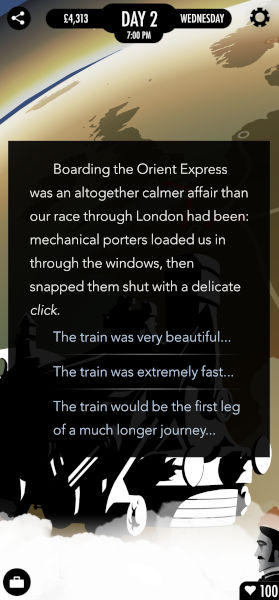

П'ятий епізод бесід про інтерактивну літературу на [дискорд-сервері](https://discord.gg/dWdySHUJKV) нашої спільноти. Ми розмовляли про гру "80 Days" -- чим цікава ця гра, які механіки та художні прийоми вона використовує, чи цікаво грати декілька разів, а також розмірковували над тим, як можна покращити цю гру.

<!-- cut -->

```toc
#
```

## Як виглядають "80 Days"

---
**techniX**

Всім привіт! Сьогодні ми вирішили відійти від обговорення різноманітних тем і поговорити про одну конкретну гру. Вибрали "[80 Days](https://www.inklestudios.com/80days/)", оскільки 1) ми обидва в неї грали, 2) там є про що поговорити.

---
**goraph**

З чого почнемо?

---
**techniX**

Давай я спочатку коротко розповім, що за гра, для тих, хто в неї не грав.


Отже, це гра за мотивами відомого роману Жуля Верна "Навколо світу за 80 днів". Ми граємо за Паспарту, який разом з ексцентричним англійцем Філеасом Фоггом вирушають у подорож навколо світу. 

Геймплей полягає у тому, що ми обираємо маршрут, куди будемо рухатися, та потрапляємо у різні пригоди під час подорожі та під час прогулянок містами. Самі пригоди зроблені як текстові вставки з виборами варіантів дії, і їх результатами може бути інформація про нові маршрути, покращення стосунків, отримання чи втрата грошей або просто нова сюжетна інформація.

Плюс у нас є елемент торгівлі -- ми можемо брати в дорогу різні речі, щоб вигідно продати в деяких локаціях, отримати нові маршрути (розклад пароплавів) та покращити умови подорожі (зимовий одяг не дасть змерзнути у подорожах на півночі.

І трохи статистики: в грі приблизно 500 тисяч слів і більше ніж 150 різних міст.

---
**goraph**

Ну, це фактично choose your own adventure, де ми відразу бачимо усі можливі параграфи, але ще не знаємо, як вони пов'язані.

---
**techniX**

Насправді не всі -- ти бачиш лише ключові локації, але по ходу гри дізнаєшся про нові.

---
**goraph**

Ну і все це ще й стімпанк. Ми не зовсім в світі 19 сторіччя, як його описував Жуль Верн.

---
**techniX**

Так, тут ми підходимо до першої відмінності гри від оповідання. Це стімпанковий світ, де технології розподілені більш-менш рівномірно.

---
## Чим цікава гра

---
**Таро**

А  в чому цікавість грі? Механіка звичайна, сюжет простий. Є багато ігор таких -- наприклад, "[Орегонська тропа](https://if50.substack.com/p/1971-the-oregon-trail)"

---
**techniX**

Насправді ні, сюжет не простий. Бо "об'їхати світ за 80 днів" -- це лише ціль гравця. Проте у кожному місті ми потрапляємо у цікаві пригоди, які ще і пов'язані між собою. Тут дійсно цікаво написаний текст, і кожну пригоду чекаєш.

І тут використані декілька цікавих прийомів.

По-перше, світ не обертається навколо головного героя. Ви лише мандрівник, головні герої -- це ті, з ким ви знайомитеся. Ви не сильно впливаєте на події, здебільшого спостерігаєте та висловлюєте свої думки та почуття щодо побаченого -- як турист :)

По-друге, через пригоди ми дізнаємося багато нового про світ гри, а він дійсно цікавий. Тобто кожна пригода -- це нагода щось дізнатися про місцеву культуру, політику, технології, або все відразу. Це відчувається вже в перші хвилини гри, коли ми перетинаємо Ла-Манш на потягу, що занурюється у воду.

---
**Таро**

А ти бачиш в цій грі якісь знахідки, яких не було в інших іграх?

---
**techniX**

Так, і деякі з них я щойно перерахував. Тобто це не квест і не перегони, це скоріше "щоденник мандрівника". Хоча і традиційні квести тут також присутні.

---
**Таро**

Герої в багатьох іграх часто мандрівники і мало впливають на події. І багато ігор, де герой мандрує кудись і по ходу дізнається про світ.

---
**techniX**

Наприклад, є епізод на трансатлантичному судні, де ми можемо підбурити команду на бунт проти капітана, і це дозволить нам дістатися до потрібного порту. І там треба використовувати інформацію, яку ми отримали під час спостережень за командою.

---
**Таро**

Ага. Ти бачиш тут форму подачі геймплею -- як щоденник? 

---
**techniX**

Ні. Основний геймплей взагалі ніяк не пов'язаний з "щоденником". Основний геймплей -- це вибір маршрутів та планування подорожі. Поїхати у місто А, бо там я зможу вигідно продати рушницю? Чи у місто Б, бо так я швидше приїду? А текстові епізоди є скоріш нагородою за подорож :)

---
**goraph**

Вона цікава тим, що вона гарно написана, там цікавий сеттинг, цікаві персонажи, і ти більш-менш усвідомлено обираєш те, що робиш.

---
**Таро**

В багатьох іграх є моменти, коли герой планує маршрут і у магазинах купує речі, які можуть бути у пригоді. Що тут нового? 

---
**techniX**

Все це у багатьох іграх є, але тут це все зроблено "як треба", так, що грати цікаво.

---
**goraph**

В цій грі нема нічого принципово нового, різниця в реалізації.

---
**Таро**

Я вважаю, що цю гру помітили ігроки тому що: 
1) Сетинг Жюль Верна експлуатується 
2) Стильна і мила графіка 
3) Простий геймплей 
4) Добре виписаний текст і його небагато 
Та ще реіграбельність.

---
**techniX**

500 тисяч слів -- це "небагато тексту"? Хоча, звісно, гравець бачить не всі 500 тисяч за одне проходження, а приблизно 20% контенту. Але у кожного гравця цей контент буде відрізнятися, у дрібницях чи навіть повністю.


---
## Вибір та планування

---
**goraph**

Я думаю, дуже важливо те, що наслідки виборів певною мірою відомі до того, як ти їх робиш. Це ключова відмінність від типової CYOA, де ти фактично робиш вибір наосліп -- праворуч або ліворуч.

---
**techniX**

Так, це важливий момент. Вибори прописані так, що наслідки зрозумілі. І насправді результат кожної пригоди є, так би мовити, сумою усіх зроблених тобою виборів.

---
**goraph**

Тут ти, обираючи маршрут, бачиш, на чому ти їдеш, скільки це займе часу, де ти опинився по карті, скільки коштує, скільки візьмеш з собою багажу, і так далі.

---
**techniX**

Тобто ти можеш планувати подорож. Це дуже важливо в будь-якій грі -- мати можливість планувати свої подальші дії.


---
**goraph**

Тому у гравця з'являється враження, що він впливає на те, що відбувається. Чого, чесно буду казати, в типовій CYOA просто нема, принаймні меншою мірою.

---
**techniX**

Ну, на подорож ти точно впливаєш :) На події в пригодах -- меншою мірою, бо ти просто турист. Якщо у місті відбувається революція, ти ніяк на неї не вплинеш. Лише, можливо, допоможеш одній людині або залишишся спостерігачем.  Але результати деяких виборів впливатимуть на подальші події.

Наприклад, якщо ти обрав для подорожі корабель работорговців, то після прибуття у порт місцеві не бажатимуть мати з тобою справу, бо вони бачили, що ти з ними. і єдине, що тобі залишається -- їхати з работорговцями далі.

---
**Таро**

Можливість *планувати* -- це дійсно важливо для гри. Не у всіх CYOA сліпі вибори. Є такі, де автор дає ігроку багато підказок.

---
**goraph**

Це не одне і те саме. Тут планується не один вибір, бо гравець бачить всю карту.

---
**techniX**

Ось приклад з гри. Ти не обираєш тут дії, ти обираєш лише, на що звернути увагу -- чи то потяг гарний, чи він швидкий, чи ти взагалі думаєш про те, що чекає попереду. І це непоганий прийом, бо такий вибір теж відчувається важливим для гравця: "мені дали можливість висловити свою думку!"



Про "текст як нагороду" я казав не просто так, це теж важливо. Гравець з перших рядків розуміє, що цей світ незвичайний, і кожна пригода -- це можливість його дослідити, дізнатися щось нове і незвичайне (власне, для цього ми і подорожуємо в реальному житті).

---
**goraph**

Ну я згоден. Світ дійсно цікавий, ми потрохи дізнаємось про різні таємні організації, технології й політику цього світу, війну, що була незадовго до цього. Ще в грі дуже велика реіграбельність. 

Ну і я ще раз скажу, що дуже круто зроблене планування. Через те, що ми бачимо карту, де потроху з'являються нові міста і маршрути, ми плануємо не просто наступний хід, а декілька наперед.

---
## Предмети та економіка

---
**HronoStranger**

Як використовуються предмети в грі? Здивувало, що їх можливо продати. Тобто, це незвично для текстової гри.

---
**techniX**

- Деякі з предметів -- це лише товар, спосіб заробити грошей. Наприклад, рушниця коштує 500, але у Мюнхені за неї дають 2500. Це непогана мотивація їхати через Мюнхен :)
- Деякі з них відкривають нові маршрути. Купив розклад потягів -- дізнався про маршрути потягами в цій частині світу.
- Деякі з них покращують подорож, особливо якщо забрати повний сет. Наприклад, купив дорожний сет, і подорож на автомобілі стає менш виснажливою.

---
**goraph**

І деякі, як в типовій текстовій грі. І деякі можна використати декількома з цих способів водночас.

---
**HronoStranger**

Ого, отже, і проста (спрощена) економічна система. Дякую за відповідь. 

---
**Таро**

Там ще міні-головоломка -- упакувати речі у скриню.

---
**goraph**

Так, це теж важливо, в залежності від маршруту можна брати з собою різну кількість скринь.

---
**techniX**

Там ще є банк, в якому можна гроші зняти з рахунку, але лише у місті. І кожна взаємодія з банком чи торгівля на ринку потребують часу і затримують твою подорож. А ще ж і потяг так пропустити можна :)

---
**goraph**

Я неодноразово пропускав :)

---
## Карта

---
**Таро**

Будь-яка гра, де є подорож, виграє у інших ігор. Навіть "Володар Перснів" -- це не стільки війна, як *подорож*.

---
**Roguelike Lab**

Та ні, це ж лише один з чотирьох сюжетних архетипів.

---
**techniX**

Насправді наявність карти має ще одну важливу функцію -- наочно показати гравцеві нелінійність гри. Гравець бачить, що є різні міста і шляхи, і що є контент, якого він не бачив, бо вибрав інший маршрут. В "[Sorcery!](https://www.inklestudios.com/sorcery/)" так само, але трохи менш ефективно.


---
**Таро**

Карта -- важливий єлемент геймплею. Але і в книгах-іграх є такі карти.

---
**techniX**

В книгах-іграх карта є здебільшого ілюстрацією, а в "80 Days" це скоріш ігрове поле.


---
## Робочий процес

---
**Roguelike Lab**

...але індюкам (на кшталт нас) до такого рівня, як до Києва пішки.

---
**techniX**

Весь текст написали два автори -- Мегінта Джаянт та Джон Інгольд.

---
**Roguelike Lab**

Невже чисто на голому ентузіазмі? Це ж мабудь була їхня фулл-тайм робота.

---
**techniX**

Звісно, бо розробка ігор -- це їх основний заробіток :)

---
**Roguelike Lab**

Тоді і не дивно, що вони змогли вивезти такий об’єм праці :)

---
**techniX**

Мегінта розповідала, як саме був влаштований робочий процес. Там одним з важливих етапів було попереднє дослідження, створення світу, і вже потім почали писати текст. Коли у тебе є фундамент, розуміння світу гри, писати легше, бо ти просто описуєш якусь його частину, тобі не потрібно заново щось видумувати чи переживати, щоб епізод не протирічив тому, що написано в іншому місці. Плюс вони використовували обмеження як фічі :)

---
**Таро**

Гра ця дуже *проста*, і ми з вами можемо таку гру зробити легко! А от на малюнки вже треба гроші. Ну и гроші на програмістів.

---
**goraph**

Я не згоден. Малюнки і програмування -- це значно простіше, ніж писати текст. Я, мабуть, так кажу, бо я програміст :)

---
**Таро**

Я написав схожу гру -- "Чорний континент" (19 сторіччя, Африка, подорож першопроходця) - там є все, що ми тут написали :)

---
**techniX**

Особливо складно писати динамічний текст, бо там він змінюється залежно від виборів. От приклад коду гри:

```
weave:neworleans
- I met Death in a smoke-wreathed red-lit bar in New Orleans, as the jazz band struck up another tune. He offered to buy me a bourbon.
  *"Holy mother of Heaven."," I blasphemed succinctly, -->
  *"Perhaps in twenty or thirty years?"[] I replied archly, -->
  *(wet)I threw my drink in his face[] in an automatic gesture of defence, -->
- as some of the other patrons snickered.
Death pulled off his mask to reveal handsome café-au-lait features and dark green eyes, and then extended a {-->wet:dripping} skeletal hand to me.
  *"A fine costume[."]," I remarked.
  "/Merci, mon cher/, -->
  *"You gave me a fright[."]," I admitted.
  "My deepest apologies, /mon cher/, -->
- I am Death at our neighborhood Mardi Gras, and I am practising my role." He took my proffered hand and brought the back of it to his lips for a gallant kiss; he flicked me a rather unmistakable look under his dark lashes.
  *I returned his look[] with one of my own, and he let my fingers slip slowly through his {raise(style)} -->
  *I pretended not to see [it] his look, or the sensuous tilt to his mouth, and he laughed. -->
  [...]
```

Добре видно, що деякі вибори взагалі нічого не змінюють, окрім опису репліки, а деякі впливають на зміну характеристик чи тексту.


---
## Чи завжди потрібне щось нове?

---
**Таро**

Нові прийоми були у [Чойсів](https://www.choiceofgames.com/). А у цій грі нема ничого нового.

---
**goraph**

Зможеш назвати хоч один новий прийом чойсів?

---
**Таро**

У Чойсів я вперше побачив, як вони формують параметри героя по ходу сюжета на початку гри. Ще у Чойсів є багато параметрів, які не відносяться до РПГ (сила, спритність, розум, ...), а є параметри психологичні та моральні. У Чойсів параметри -- це не розкидування балів, а сюжетні вставки, і такіх ситуацій формування параметрів Героя було десь 10-12. У Чойсів багато параметрів моделюють психологічний портрет героя і від цього по сюжету доступні або *не* доступні деякі вибори.

---
**Roguelike Lab**

Звучить не дуже-то і інноваційно.

---
**techniX**

Так у тому і фішка. Не завжди потрібно робити нове, достатньо просто зробити добре. Гра "80 Days" використовує давно відомі прийоми, але використовує їх так, як потрібно, аби створити цікаву гру.

---
## Реіграбельність

---
**goraph**

Ну, думаю, час описати мої враження від гри. Фактично в грі фантастична реіграбельність, більш того я її намагався "спідранити", бо опинився в евакуації, де інших ігор не було :) 

---
**techniX**

Реіграбельність тут дійсно є -- якщо тобі сподобався світ, і тобі цікаво потрапити у якісь нові подорожі, то є сенс грати знов. Бо тут цікавіше сама пригода, ніж перемога.
Наприклад, "я хочу злітати на Луну", або "хочу потрапити на Північний Полюс" -- в грі це можливо, але непросто.

---
**goraph**

І виявилася така цікава проблема. Є купа міст, де нові пригоди, я можу пошукати новий маршрут, але навіщо? Якщо я знаю спосіб попасти туди, куди мені треба, за три дні, а там я витрачу мінімум 20? Я можу піти в іншу локацію і побачити інший кусок тексту, але це єдина мотивація? Я можу злітати на Луну, але більша половина моєї гри -- це ті самі локації, які я вже бачив?

---
**techniX**

Ну, якщо чесно, будь-яку сюжетну гру ти будеш перегравати кінечну кількість разів, бо рано чи пізно побачиш весь контент, або просто набридне. І якщо в грі достатня реіграбельність, скажімо, для 10 партій -- це вже супер!

---
**goraph**

Що таке достатня реіграбельність?

Реіграбельність в цій грі (як і в будь-якій CYOA) -- це фактично протилежне від "робити те, що приведе мене до цілі". Якщо я граю в гру, щоб виграти, я роблю безпечні вибори, ті, що приводять мене до цілі максимально швидко. Якщо я роблю нові вибори заради нових виборів, я не виграю.

---
**Roguelike Lab**

Якщо "вилучати" частину контенту на сюжетно важливих виборах, то за допомогою комбінаторного вибуху можна буквально знищити можливість проходження контенту на 100%.

---
**techniX**

Ну тобто в цій грі реіграбельність "не дуже", я правильно зрозумів думку?

---
**goraph**

Вона "дуже". Річ не в тому. Вона не працює.

Давайте простий приклад. Я можу випити з трьох склянок, одна з них -- отрута. Я випив з якоїсь склянки, і це не отрута. Я граю другий раз, нащо мені пити з іншої склянки?

---
**techniX**

Бо тобі цікаво дізнатися, що буде в іншому випадку? Ну, може, конкретно тобі нецікаво, але ж є люди, яким цікаво? :)

---
**Roguelike Lab**

Бо така задача -- еталонний приклад поганого геймдизайну. Бо тут немає винагороди за ризик.

---
**goraph**

Її ніколи нема, якщо я знаю хоч один гарний варіант. 

Фактично гра в будь-яку CYOA (і "80 Days" не виключення) зводиться до "робимо вибір, якщо він гарний, або хоча б нейтральний, робимо його кожен раз". Більш того, кожен раз, коли я розпочинаю гру знов, в мене все менше мотивації робити нові небезпечні вибори.

---
**Igor N**

А тому часто реіграбельність страждає... бо часто одна й та сама людина зробить один і той же вибір. Тому, справді, у чойсів характер твого персонажа може змінити хід гри. І з'являється можливість по іншому зіграти ту ж історію.

---
**goraph**

Бо я витрачаю час на перечитування і проклікування одного й того ж самого. І кожен раз отримую все менше нового тексту.

---
**Таро**

Ви ж знаєте, що є 4 типи гравців, які шукають ігри під свою мотивацію та очікування? Ця гра орієнтується на гравців, які люблять *дослідження* світу.

---
**Roguelike Lab**

Мені більше подобається ця розширена класифікація на 8 типів, бо вона дає більш точне уявлення про ЦА.


---
**techniX**

Перечитування -- проблема всіх текстових ігор, тут нічого не поробиш...

---
**goraph**

Так, може, це проблема дізайну ігор, те що люди так роблять? Ви кажете, є 8 чи 4 типи гравців, і є максимум один, що готовий робити погані вибори заради того щоб зібрати всі погані. Водночас -- це займає більшість часу при розробці гри.

---
**techniX**

Ну і в інших іграх таке. От ти проходиш [Фолаут](https://en.wikipedia.org/wiki/Fallout_(series)) з енергопушкою, бо вона потужна, яка у тебе мотивація проходити його з кувалдою? :)

---
**Igor N**

Не згодний. Фалаут цікаво пройти різними персонажами, особливо за допомогою діалогів, а не зброї. Звісно, якщо говорити про 1 чи 2, бо 3 і 4 -- то вже стрілялки :)

---
**goraph**

Таке дійсно є в багатьох іграх.

---
**techniX**

Якщо чесно, я б взагалі при створенні текстових ігор не заморачувався реіграбельністю, бо скоріш за все її не буде :) Те, що вона взагалі є у "80 Days", вже неабияке досягнення.

---
**goraph**

Реіграбельность в 80 днів це круто, вона дійсно велика, і водночас, в неї не дуже цікаво грати вдруге.

---
**Таро**

Є різні прийоми зробити реіграбельність:

1) За допомогою декількох віборів, які ведуть до різних сюжетних випадків; 
2) На рандомному механізмі, який випадково видасть гравцеві сюжетний випадок.

---
**goraph**

Обидва варіанти жахливі. Я взагалі знаю тільки один вдалий приклад реіграбельності -- обмеження варіантів. Наприклад, в нас 5 виборів, і персонажу доступні лише два. Іншому персонажу інші два. Але це потребує ще більших зусиль при розробці.

---
**techniX**

Так і у "80 Days" те саме, тільки вибори -- це "куди поїхати". Деякі подорожі неможливі, бо ти не виконав вимоги, аби потрібний маршрут був доступний. 

В будь-якому випадку при повторному проходженні текст, який побачить гравець, частково буде той самий, який він вже бачив. Це ніяк не змінити :)

---
**goraph**

Я б не сказав, що 80 днів з цим справляється. Більшість вимог виконати дуже просто, гроші на другий раз заробляються майже без зусиль. Обмеження багажу не такі вже й важливі.

---
**techniX**

Бо старт гри не рандомізований, початкові умови ті ж самі, і все залежить від дій гравця. Якщо ти робитимеш ті ж вибори, що і минулого разу, ти пройдеш гру тим самим шляхом.

---
**Igor N**

Ні, все одно реіграбельність можлива. Бо те саме можна сказати про той самий Фалаут. До певної частини гри, не знаю, скільки годин, все відбувається за сценарієм, одне й те саме. І то не цікаво. У текстовій грі старт можна проклікати і йти відразу до точок, де може бути інший сценарій, або можна просто обрати іншого персонажа і сюжет може піти одразу по іншому.

---
**techniX**

Якщо б гра починалась з рандомного сетапу, вже була б більша реіграбельність, бо тобі із самого початку довелося б приймати рішення виходячи з того, що в тебе є. Або наприклад частина маршрутів була б недоступна взагалі, що б ти не робив -- це теж змусило б шукати інші способи подорожі.

---
**goraph**

Так, це б багато змінило.

Це окрім всього ставить перед гравцем задачу -- пройти за конкретного персонажа, навіть якщо в нього не найкращий сетап.


---
## Власний стиль

---
**Таро**

У чойсів є велика перевага -- вони змогли придумати свій стиль формату ігор, який повинні повторювати всі автори нових ігор.

---
**Igor N**

І все ж різні автори мають абсолютно різні стилі. Деякі з 5 разу не можна зрозуміти, де ж був не такий вибір. А ще варіант проходження за поганого персонажа, що з часом змінюється... у чойсів такий варіант можливий.

---
**techniX**

Бо це практично видавництво, така їхня бізнес-модель.

Inkle пішли іншим шляхом, у них кожна гра різна. Після "80 Days" вони створили "[Heaven's Vault](https://www.inklestudios.com/heavensvault/)", який більше нагадує поінт-н-клік квест, а зараз взагалі роблять [наративний платформер](https://www.inklestudios.com/a-highland-song/) :)

---
## Що можна зробити краще?

---
**techniX**

Із епізодичної структури гри випливає такий недолік, як відсутність глобального сюжету. Звісно, є сюжетні лінії, які продовжуються у декількох пригодах навіть у різних частинах світу. Але гравець може побачити лише частину цих сюжетних арок, або не побачити їх взагалі. Тобто, знову-таки, для гравців, яким цікаве дослідження світу, це нормально. А для тих, хто хоче побачити якийсь розвиток сюжету та кульмінацію, гра пропонує не дуже багато. Хоча під кінець гри ви скоріш за все зустрінетеся з наслідками своїх дій :)

А що б особисто ви покращили б в "80 Days", якби була можливість? :)

---
**goraph**

Ну я ж кажу, різні сетапи зробили б гру більш різноманітною. Якісь інші цілі, можливо -- інша стартова локація після того, як я вже пройшов гру один раз.

---
**Igor N**

Стартова локація мабуть ідеально для 2-3 разу.

---
**goraph**

Це дуже просто і дуже дешево, просто стартова локація в Південній півкулі на 2 проходження. І я відразу бачу нові евенти, локації, і вимушений прокладати новий маршрут. 

Якісь конкретні цілі -- наприклад, гра де ти не можеш продавати речі :) Все, економіка зовсім інша, динаміка теж.

---
**techniX**

Тобто така собі "New Game+", з деякими обмеженнями чи зміненими початковими умовами.

---
**Таро**

Зібрати *ачівки* -- це часто спонукає переграти знову :)

---
**goraph**

Так, хоча б ачівки. Заради історії, заради тексту я зіграю раз-два, далі я її вже знаю. Це основне чого там не вистачає. Я можу, звісно, сам ставити собі якійсь цілі, але розробники можуть зробити це краще і цікавіше, бо в них є можливість трошки поміняти код і правила гри. От тут недоробили, сильно, на мій погляд.

---
**Igor N**

Обов'язкове відвідування якихось конкретних точок, можливо... якщо це якось вплине на сюжет.

Занадто важкий варіант може відлякати. XCOM, чудова (трохи не по темі), але якщо щось не встиг зробити, то на якомусь етапі ти вже розумієш, що відстав від розвитку сюжету і питання часу, коли програєш... В текстових, мабуть, пропустити якийсь крок важко, якщо це не [лайфлайн](https://en.wikipedia.org/wiki/Lifeline_(2015_video_game)) чи ще якась головоломка.

---
**Таро**

Реіграбельність на частій смерті героя.

---
**techniX**

В "80 Days" загинути неможливо, що б ти не робив. У тебе завжди є можливість рухатися вперед.

---
**goraph**

Навіть коли 80 днів пройшли, ти можеш грати далі.

---
**techniX**

Так. Тобто перемога -- це не вкластися в 80 днів, це повернутися в Лондон та згадати всі чудові пригоди, в які ти потрапив під час подорожі.

---
**Igor N**

Цікаво. Я завжди думав, що ціль -- перемога. Завжди важче сприймаються ігри чи завдання на час.

---
**techniX**

Ну, якщо ти встиг раніше, ніж 80 днів -- супер :) Але якщо не встиг, гра не закінчується, ти подорожуєш далі та врешті-решт повертаєшся додому.

---
**techniX**

То що, будемо закінчувати на сьогодні? Бо, схоже, більше нема чого сказати :)

Дякую всім за участь! Сподіваюся, було цікаво.

---
## Додаткові матеріали

* Стаття про [історію створення "80 Days"](https://if50.substack.com/p/2014-80-days).
* Відео "[80 Days & Unexpected Stories](https://www.youtube.com/watch?v=Apa7Klu8Trg)", Мегінта Джаянт розповідає про роботу над грою.
* Відео "[Forget Protagonists: Writing NPCs with Agency for 80 Days and Beyond](https://www.youtube.com/watch?v=FLtATD6CF0E)", вона ж розповідає про написання NPC в цій грі.

> *Транскрипт було скорочено та відредаговано для зручності читання.*