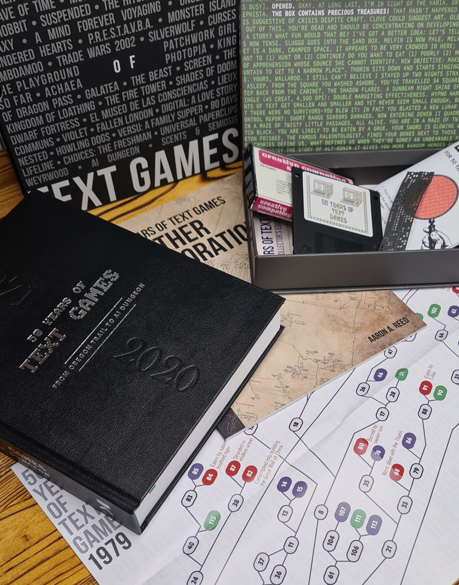
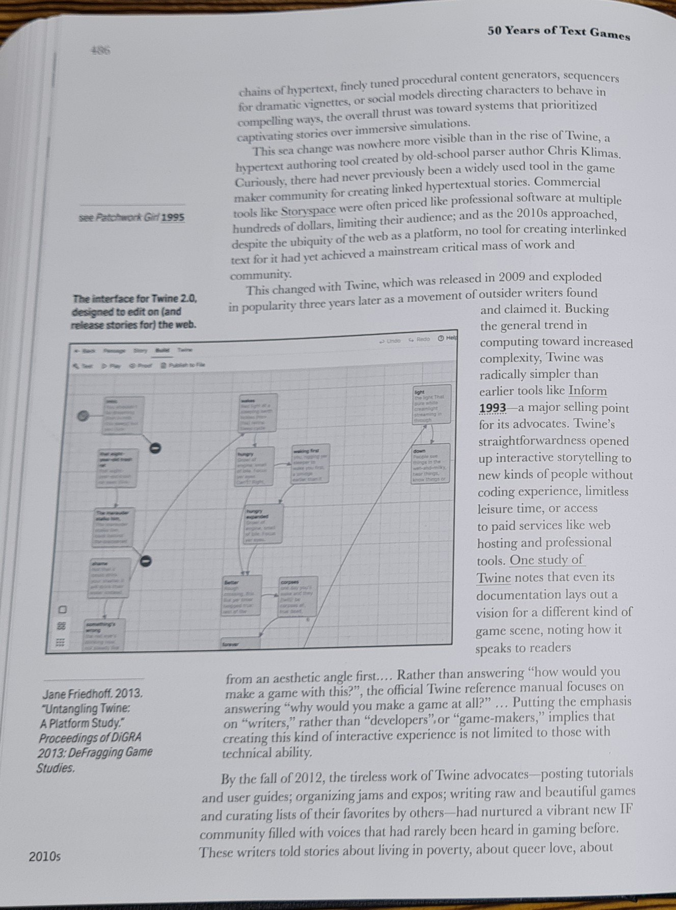
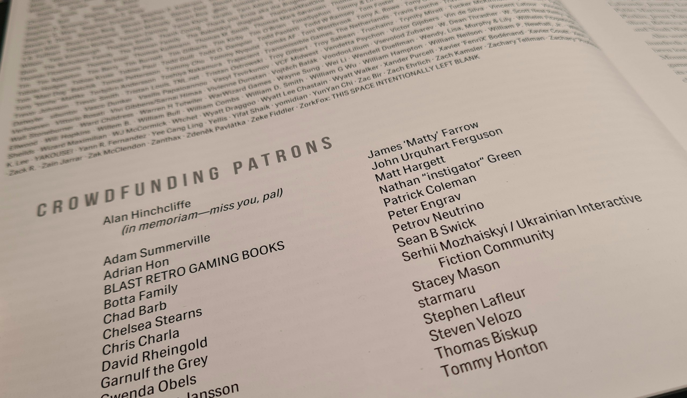
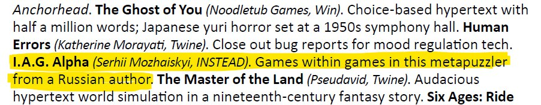

Проєкт Аарона Ріда "50 років текстових ігор" подолав довгий шлях від [серії статей на Substack](https://if50.substack.com/) до [повноцінної книги](https://if50.textories.com/), і українська спільнота ІЛ теж доклала до цього зусиль :)

"50 Years of Text Games" Ultimate Collector's Edition, в якому, окрім книги в твердій обкладинці, є ще буклет з додатковими матеріалами, постер та добірка артефактів ранньої епохи ІЛ.

Але розповідь про книгу буде неповною без згадки про прикру помилку автора. В переліку творів за 2018 рік, які варті уваги, він пише про ["I.A.G. Alpha"](https://technix.itch.io/iag-alpha) як гру російського (???) автора. Автор книги вже виправив помилку і включив її до списку [Errata](https://if50.textories.com/portal/errata.html) - але, на жаль, вже надруковані книги залишаться як є...

P.S. На сторінці гри я включив цитату з книги в такому вигляді, як вона має бути :)

