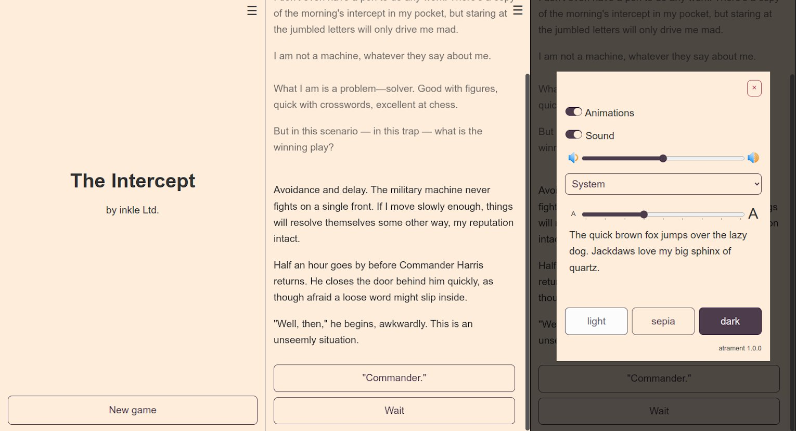

Нарешті довів до релізу свій довгобуд - рушій Atrament, який суттєво спрощує розробку веб-застосунків для відтворення ігор на ink.

Демонстраційний веб-застосунок можна подивитися тут: https://technix.github.io/atrament-preact-ui/

Весь вихідний код відкритий, документація в Гітхабі: 
- [@atrament/core](https://github.com/technix/atrament-core) 
- [@atrament/web](https://github.com/technix/atrament-web)
- [@atrament/preact-ui](https://github.com/technix/atrament-preact-ui)
