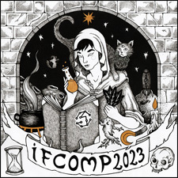

Почався щорічний конкурс інтерактивної літератури [IFComp 2023](https://ifcomp.org/). Цього року на ньому представлені 75 творів. 

[Оцінювання](https://ifcomp.org/ballot) відкрите для всіх, але щоб ваш голос врахували, потрібно оцінити мінімум 5 ігор. Голосування триватиме до 15 листопада.

Список рецензій на твори - [тут](https://docs.google.com/spreadsheets/d/15NCxKS-bI3kcLbl-lrtn5-mAAV_WP45t7JyENFq7f08/edit#gid=0).

P.S. А ще у IFComp 2023 є чудовий (неофіційний) [трейлер](https://youtu.be/bd1X9GrkCcs).
