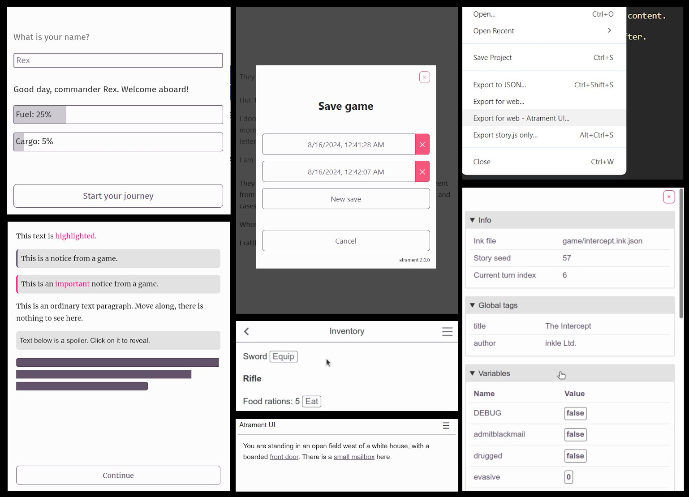

### Atrament 2.0

Опублікувано версію 2.0 рушія Atrament, який дозволяє створювати ігри з використанням Ink та публікувати їх в вебі.

Анонс версії 1.0 був майже рік тому, і за цей час з'явилося багато корисних функцій:
- кастомна розмітка, яка дозволяє додавати різні інтерфейсні елементи: кнопки, зображення, виділений текст, поля вводу тощо,
- панель інструментів та оверлеї з контентом,
- керування збереженими іграми, користувацькі сесії з окремими збереженнями,
- багато нових тегів: обкладинка гри, фонове зображення, звук та музика, неактивні вибори тощо,
- гіпертекстовий режим відображення,
- можливість збереження даних між перезапусками гри,
- вбудований засіб для дебагу ігор,
- а також експорт гри в Atrament із редактора Inky.

---

* [Документація та вихідний код](https://github.com/technix/atrament-web-ui)
* [Atrament Web UI 2.0 та його інтеграція з Inky](https://github.com/technix/atrament-web-ui/releases/tag/2.0.0)
* [Демонстраційна гра "The Coiled Crown"](https://technix.itch.io/the-coiled-crown)
