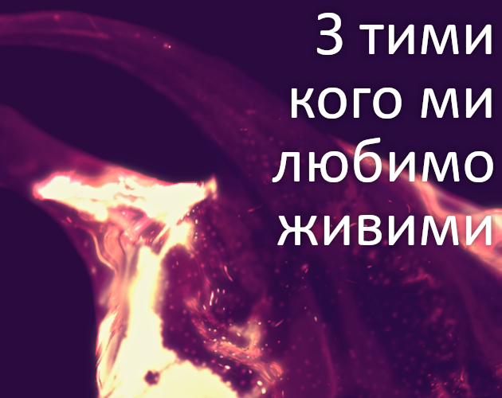

Невеличкий подарунок до Нового Року - переклад твору Porpentine "[With Those We Love Alive](https://technix.itch.io/wtwla)". Твір входить до переліку "50 найкращих творів ІЛ всіх часів".

> «З тими кого ми любимо живими» розповідає історію людини, яка живе за велінням чужорідної імператриці, створюючи нові об'єкти на її службі. Тут присутні багато ознак минулих робіт Porpentine: використання крові, кісток і біологічних рідин в огидних, але виразних способах; ідея головного героя, глибоко травмованого минулим насильством; фантазія про імперію, керовану чужорідними династіями і з чужорідних причин; красиві дивні слова. Музика додає ще один шар емоцій, часто задумливих, іноді тривожних.
> 
> Емілі Шорт

