```toc
#
```

## Передмова

Коли вперше знайомишся з інтерактивною літературою, кількість творів та їхнє розмаїття спантеличує. З якого твору варто почати читати? Які види ІЛ можуть бути мені цікавими?

Звісно, можна почати зі переліків "TOP-50 творів інтерактивної літератури" - за [2023](https://the-rosebush.com/2023/09/the-2023-interactive-fiction-top-50/), [2019](https://ifdb.org/viewcomp?id=1lv599reviaxvwo7), [2015](https://ifdb.org/viewcomp?id=p6s9uem6td8rfihv) та [2011](https://ifdb.org/viewcomp?id=oymvom4wrawhd4hr) роки. Але більшість творів у цих переліках - парсерні, а цей жанр не назвеш дружнім до новачків.

Тож пропоную вашій увазі підбірку творів, з яких варто почати своє знайомство з інтерактивною літературою.

---
## Твори з варіантами вибору

Найочевидніша інтерпретація терміну "інтерактивна література" - твори, які пропонують читачеві вибір наприкінці одного або декількох абзаців тексту. Читач обирає одну з можливих дій, які може виконати головний герой, і історія продовжується відповідно до вибору гравця. Такі твори здебільшого створюють відчуття причетності до сюжету, де кожен вибір рухає історію вперед та просуває читача ближче до фіналу, даючи йому можливість створити власне оповідання. 

---
<div style="float:left; width: 100px; height:100px; margin-right: 1em; margin-bottom: 1em"> 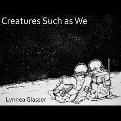 </div>

### Creatures Such As We

Цей твір про життя на Місяці та туристів. Про романтику, комп'ютерні ігри та романтику в комп'ютерних іграх. Про мистецтво та його сенс - для митців і для глядачів. А ще про те, як закінчуються історії в іграх та в житті.

<div style="clear: both" />

* [**Читати онлайн**](https://www.choiceofgames.com/creatures-such-as-we/)
* [Сторінка на IFDB](https://ifdb.org/viewgame?id=8l9cdcd1tbt77hfl)


---
<div style="float:left; width: 100px; height:100px; margin-right: 1em; margin-bottom: 1em">  </div>

### The Archivist and the Revolution

Твір про виживання в постапокаліптичній антиутопії, балансуючи між роботою та соціальними потребами.

*У далекому майбутньому, після століть конфліктів, населення Землі скоротилося до невеликих спільнот, що застрягли в аркологіях (міських куполах). В одному з них живе Ем, архіваріус (начебто), яка намагається вижити, як може (начебто), і налагодити стосунки, щоб покращити своє становище.*

<div style="clear: both" />

* [**Читати онлайн**](https://red-autumn.itch.io/archivist)
* [Завантажити](https://red-autumn.itch.io/archivist/purchase)
* [Сторінка на IFDB](https://ifdb.org/viewgame?id=rqnnjtzf436aw8ch)


---
<div style="float:left; width: 100px; height:100px; margin-right: 1em; margin-bottom: 1em"> 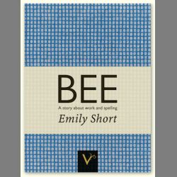 </div>

### Bee

*Історія дівчини, яка навчається вдома, готується до участі в національному конкурсі з правопису, переживає різні маленькі кризи з родиною та друзями і поступово примиряється з зіткненням субкультур, пов'язаних з її родиною.*

<div style="clear: both" />

* [**Читати онлайн**](https://inthewalls.itch.io/bee)
* [Завантажити](https://ifarchive.org/if-archive/games/html/bee.zip)
* [Сторінка на IFDB](https://ifdb.org/viewgame?id=8pe83e92v4nvabic)


---
<div style="float:left; width: 100px; height:100px; margin-right: 1em; margin-bottom: 1em">  </div>

### Lone Wolf

Одним з популярних жанрів ІЛ були книги-ігри, які дозволяли читачеві обирати напрямок розвитку сюжету. Більшість з них є комерційними (серії книг "Choose Your Own Adventure" або "Fighting Fantasy"), проте є і такі, що доступні безкоштовно.

*Події цих книг-ігор розгортаються в міфічному світі Магнамунд. Ви, читач, граєте за Самотнього Вовка, воїна-ченця, чий потенціал героя розкривається після трагічної поразки його вчителів і родичів, відомих як Лорди Кай. Ви не тільки приймаєте ключові рішення в тексті, але й обираєте своє спорядження та унікальні здібності, які можуть допомогти вам вижити в сутичках, що мають як стратегічні, так і випадкові елементи. Ці книги-ігри можна читати і грати як окремо, так і як частину великої серії, де ви можете використовувати навички та предмети, отримані з однієї книги, в іншій книзі.*

<div style="clear: both" />

* [**Завантажити**](https://www.projectaon.org/en/Main/Home)


---
## Гіпертекстові твори

Гіпертекстова ІЛ, як і ІЛ на основі вибору, явно пропонує варіанти можливих дій гравця, але подає їх інакше. Гіпертекстовий твір пропонує читачеві взаємодіяти безпосередньо з текстом історії, клікаючи по виділених словах або фразах, на кшталт навігації по сайтах в інтернеті. Результатом кліку може бути перехід читача на нову сцену або в нове місце, розкриття нового тексту (і, можливо, додавання нових виборів), або якийсь інший ефект.

---
<div style="float:left; width: 100px; height:100px; margin-right: 1em; margin-bottom: 1em">  </div>

### Fabricationist DeWit Remakes the World

*Після багатовікового сну до синтетичної істоти приходить несподіваний гість - разом із новою роллю у Великому Проєкті.*

<div style="clear: both" />

* [**Читати онлайн**](https://technix.itch.io/fabricationist) українською або англійською
* [Сторінка твору](https://thirdarchive.net/fabricationist-dewit-remakes-the-world)
* [Сторінка на IFDB](https://ifdb.org/viewgame?id=9w569l9s1zgzur1g)


---
<div style="float:left; width: 100px; height:100px; margin-right: 1em; margin-bottom: 1em"> 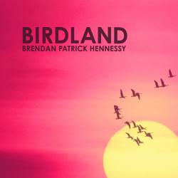 </div>

### Birdland

Твір-переможець XYZZY Awards 2015 у 6 номінаціях.

*Життя чотирнадцятирічної Бріджит у літньому таборі стає дивним, коли її потойбічні сни про птахів починають втілюватися в реальність.*

* [**Читати онлайн**](https://birdland.camp/)
* [Сторінка на IFDB](https://ifdb.org/viewgame?id=ap1651hvjldbuugj)


---
<div style="float:left; width: 100px; height:100px; margin-right: 1em; margin-bottom: 1em">  </div>

### With Those We Love Alive

Твори відомої та плідної Twine-авторки, Porpentine, можна впізнати відразу - образна поетична мова, яскраві та чужі простори, прекрасні та хвилюючі образи. Але цей твір ставить перед читачем особливе і дуже особисте завдання: малювати символи на власній шкірі під час гри. 

<div style="clear: both" />

* [**Читати онлайн українською**](https://technix.itch.io/wtwla)
* [Читати онлайн англійською](https://xrafstar.monster/games/twine/wtwla/)
* [Сторінка на IFDB](https://ifdb.org/viewgame?id=445d989vuwlh4cvz) 


---
<div style="float:left; width: 100px; height:100px; margin-right: 1em; margin-bottom: 1em">  </div>

### Cactus Blue Motel

*Десь між Нью-Мексико та Арізоною троє друзів їхали через безплідну пустелю з червоними скелями та широким порожнім небом. Це був кінець літа, кінець середньої школи, кінець багатьох речей.*

*А потім вони знайшли мотель "Cactus Blue".*

<div style="clear: both" />

* [**Читати онлайн**](https://astriddalmady.com/cactusblue.html)
* [Сторінка на IFDB](https://ifdb.org/viewgame?id=7e699ifb6u3767yr)

---
<div style="float:left; width: 100px; height:100px; margin-right: 1em; margin-bottom: 1em">  </div>

### Will Not Let Me Go

Це текстова гра - але вона не з тих ігор, в які грають заради розваги. Емоційна та трагічна історія головного героя підкреслюється інтерактивними елементами, і це поєднання справляє сильне враження.

*Даллас, штат Техас. 1996 рік. У Фреда Стрікленда хвороба Альцгеймера.*

<div style="clear: both" />

* [**Читати онлайн**](http://ifarchive.org/if-archive/games/competition2017/Will%20Not%20Let%20Me%20Go/Will%20Not%20Let%20Me%20Go.html)
* [Сторінка на IFDB](https://ifdb.org/viewgame?id=67r2qc21m5nzexv1)


---
<div style="float:left; width: 100px; height:100px; margin-right: 1em; margin-bottom: 1em">  </div>

### I.A.G. Alpha

Твір українського автора, відзначений XYZZY Award 2018.

*Ви можете подумати, що ця гра про пострадянський науково-дослідний інститут. Про експеримент, який вийшов з-під контролю. Ви можете подумати, що скорочення "I.A.G." якось пов'язані з інститутом. Ви можете подумати, що ця гра незавершена. Ви навіть можете подумати, що гра закінчиться саме тоді, коли про це скаже автор.*

*Але потім ви зрозумієте - ці твердження не зовсім відповідають дійсності.*

<div style="clear: both" />

* [**Грати онлайн**](https://technix.itch.io/iag-alpha)
* [Сторінка на IFDB](https://ifdb.org/viewgame?id=erj212utudi2kltv)


---
## Парсерні твори

В цих творах ви контролюєте головного героя, вводячи текстові команди. За роки існування цього жанру в ньому сформувалися певні умовності. Наприклад, переміщення між локаціями часто відбувається за допомогою сторін світу, навіть всередині приміщень. Існує перелік стандартних дієслів, які "розуміють" майже всі твори, а також загальноприйняті скорочення для них.

> You are standing in an open field west of a white house, with a boarded front door. There is a small mailbox here.

Гравець може спробувати роздивитися об'єкти поближче (`examine house`, `examine door`, `examine mailbox`, `examine field`, або скорочено `x house` і т.д.), подивися що у нього з собою в інвентарі(`inventory`, `inv` або `i`), спробувати відкрити поштову скриньку (`open mailbox`), роздивитися локацію ще раз (`look` або `l`), або спробувати прогулятися (`north`, `south`, `west`, `east`, або `n`, `s`, `w`, `e`).

Більш докладно про ці та інші команди - в [картці-шпаргалці по парсерним іграм](https://pr-if.org/doc/play-if-card/).

Більшість парсерних творів доступні онлайн. Для того, щоб читати їх на вашому комп'ютері чи мобільному пристрої, потрібно завантажити так званий *інтерпретатор* - програму для відтворення парсерних творів, в якій треба відкрити файл твору. Для комп'ютерів найкращим вибором буде [Lectrote](https://github.com/erkyrath/lectrote/releases), для мобільних пристроїв з Android - [Fabularium](https://f-droid.org/en/packages/io.davidar.fabularium/), для iOS - [Frotz](https://apps.apple.com/us/app/frotz/id287653015). Повний перелік інтерпретаторів під різні платформи можна знайти [тут](https://www.ifwiki.org/Recommended_interpreters).

---
<div style="float:left; width: 100px; height:100px; margin-right: 1em; margin-bottom: 1em"> 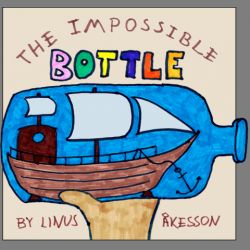 </div>

### The Impossible Bottle

Почати ознайомлення з парсерними іграми варто з цього твору. Окрім вводу команд, більшу частину гри можна пройти, клікаючи по виділеним словам або командам. Також гра підказує, що саме можна зробити в тій чи іншій ситуації.

*Робота по дому настільки нудна, наскільки нудна ваша уява. Приєднуйтесь до шестирічної Емми в грайливій пригоді незвичайних масштабів.*

<div style="clear: both" />

* [**Читати онлайн**](https://www.linusakesson.net/games/the-impossible-bottle/rel1/play.html)
* [Завантажити](https://ifarchive.org/if-archive/games/competition2020/Games/The%20Impossible%20Bottle/the-impossible-bottle-rel1/the-impossible-bottle.zblorb)
* [Сторінка на IFDB](https://ifdb.org/viewgame?id=41cr9x95gu6tlfeu)
* [Підказки по проходженню та карта](http://plover.net/~davidw/sol/i/impos20.html)

---
<div style="float:left; width: 100px; height:100px; margin-right: 1em; margin-bottom: 1em"> 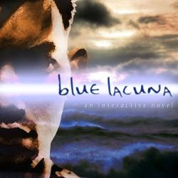 </div>

### Blue Lacuna

Цей твір також добре підходить для знайомства з жанром. На початку твору, окрім художнього тексту, даються підказки, як з ним взаємодіяти, а всі ключові слова в тексті виділені.

*Ви маєте здібність Мандрувати - подорожувати між світами та різними місцями. Коли інший Мандрівник покликав вас, ви поспішаєте на допомогу - і опиняєтеся на майже безлюдному острові. Хто покликав вас сюди? І чого вони від вас хочуть?*

<div style="clear: both" />

* [**Читати онлайн**](https://iplayif.com/?story=https%3A%2F%2Fifarchive.org%2Fif-archive%2Fgames%2Fglulx%2FBlueLacuna.gblorb)
* [Завантажити](https://ifarchive.org/if-archive/games/glulx/BlueLacuna.gblorb)
* [Сторінка твору](https://blue-lacuna.textories.com/)
* [Сторінка на IFDB](https://ifdb.org/viewgame?id=ez2mcyx4zi98qlkh)

---
<div style="float:left; width: 100px; height:100px; margin-right: 1em; margin-bottom: 1em">  </div>

### Photopia

"Фотопія" вважається одним з найкращих зразків інтерактивної літератури і суттєво вплинула на розвиток ІЛ в цілому. Обмежена порівняно з іншими парсерними творами інтерактивність підкреслює драматичність сюжету.

*"Почитаєш мені казку?"*

*"Почитати тобі казку? Що в цьому цікавого? У мене є краща ідея: давай розкажемо казку разом".*

<div style="clear: both" />

* [**Читати онлайн**](https://iplayif.com/?story=https%3A%2F%2Fifarchive.org%2Fif-archive%2Fgames%2Fzcode%2Fphotopia.z5)
* [Завантажити](https://ifarchive.org/if-archive/games/zcode/photopia.z5)
* [Сторінка на IFDB](https://ifdb.org/viewgame?id=ju778uv5xaswnlpl)

---
<div style="float:left; width: 100px; height:100px; margin-right: 1em; margin-bottom: 1em">  </div>

### Spider and Web

Один з класичних парсерних творів - шпигунська історія з дуже цікавими твістами, як в сюжеті, так і в геймплеї.

<div style="clear: both" />

* [**Читати онлайн**](https://iplayif.com/?story=https%3A%2F%2Fifarchive.org%2Fif-archive%2Fgames%2Fzcode%2FTangle.z5)
* [Завантажити](https://ifarchive.org/if-archive/games/zcode/Tangle.z5)
* [Сторінка на IFDB](https://ifdb.org/viewgame?id=2xyccw3pe0uovfad)

---
<div style="float:left; width: 100px; height:100px; margin-right: 1em; margin-bottom: 1em">  </div>

### Anchorhead

Традиційне парсерне оповідання з розгалуженим сюжетом та безліччю головоломок.

*Помандруйте до таємничого прибережного містечка Анкорхед в штаті Массачусетс і розкрийте коріння жахливої змови, натхненної творами Г. Ф. Лавкрафта. Шукайте в запліснявілих архівах і томах езотеричних легенд, ухиляйтеся від вороже налаштованих мешканців міста, боріться зі злом, що передається з покоління в покоління і загрожує вашій родині та всьому світові.*

<div style="clear: both" />

* [**Читати онлайн**](https://iplayif.com/?story=https%3A%2F%2Fifarchive.org%2Fif-archive%2Fgames%2Fzcode%2Fanchor.z8)
* [Завантажити](https://ifarchive.org/if-archive/games/zcode/anchor.z8)
* [Сторінка на IFDB](https://ifdb.org/viewgame?id=op0uw1gn1tjqmjt7)
* Комерційна версія з ілюстраціями та оновленим контентом - на [Steam](https://store.steampowered.com/app/726870/Anchorhead/) та [Itch](https://mikegentry5.itch.io/anchorhead).

---
<div style="float:left; width: 100px; height:100px; margin-right: 1em; margin-bottom: 1em"> 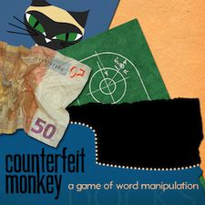 </div>

### Counterfeit Monkey

Один із прикладів творів, які можуть існувати виключно у парсерній формі - основою геймплею цієї гри є перетворення слів.

*На жаль, останнім часом Бюро правопису серйозно зацікавилося вашою діяльністю. Ваше обличчя зафіксовано, і ваше прикриття розкрито.*

*У вас є: ще вісім годин національного свята, яке розосередило поліцію; найнезручніше маскування, яке ви коли-небудь вдягали у своєму житті; і один засіб для видалення будь-яких літер алфавіту.*

*Щасти вам вибратися з острова.*

<div style="clear: both" />

* [**Читати онлайн**](https://iplayif.com/?story=https%3A%2F%2Fgithub.com%2Fi7%2Fcounterfeit-monkey%2Freleases%2Fdownload%2Fr11.1%2FCounterfeitMonkey-11.gblorb)
* [Завантажити](https://github.com/i7/counterfeit-monkey/releases/download/r11.1/CounterfeitMonkey-11.gblorb)
* [Сторінка на IFDB](https://ifdb.org/viewgame?id=aearuuxv83plclpl)

---
## Комерційна ІЛ


---
<div style="float:left; width: 100px; height:100px; margin-right: 1em; margin-bottom: 1em"> 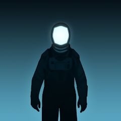 </div>

### Lifeline

Історія про астронавта, який загубився на іншій планеті, стала неймовірно популярною мобільною грою та натхненням для створення великої кількості схожих творів.

<div style="clear: both" />

* [Сторінка на IFDB](https://ifdb.org/viewgame?id=zor1al2my922f0w1)
* [Play Market (Android)](https://play.google.com/store/apps/details?id=com.threeminutegames.lifeline.google)
* [App Store (iOS)](https://apps.apple.com/ua/app/lifeline/id982354972)


---
<div style="float:left; width: 100px; height:100px; margin-right: 1em; margin-bottom: 1em"> 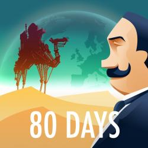 </div>

### 80 Days

Одна з найуспішніших ігор компанії Inkle, визнана "грою року" за версією журнала Time.

*1872 рік у стилі стімпанк. Філеас Фоґґ побився об заклад, що зможе обігнути світ всього за вісімдесят днів.*

*Оберіть власний маршрут навколо земної кулі, подорожуючи на дирижаблі, підводному човні, механічному верблюді, паровозі тощо, змагаючись з іншими гравцями та годинником, який ніколи не зупиняється.*

<div style="clear: both" />

* [Steam](https://store.steampowered.com/app/381780/80_Days/)
* [Play Market (Android)](https://play.google.com/store/apps/details?id=com.inkle.eightydays)
* [App Store (iOS)](https://apps.apple.com/us/app/80-days/id892812659)
* [Сторінка на IFDB](https://ifdb.org/viewgame?id=du51t0qrhjqlnbij)
* [Сторінка гри на сайті Inkle](https://www.inklestudios.com/80days/)

---
<div style="float:left; width: 100px; height:100px; margin-right: 1em; margin-bottom: 1em">  </div>

### Fallen London

Текстова браузерна гра, RPG з відкритим світом, яка розповідає химерні історії про похмурий і веселий готичний підземний світ.

<div style="clear: both" />

* [**Грати онлайн**](https://www.fallenlondon.com/)
* [Сторінка на IFDB](https://ifdb.org/viewgame?id=y9m60ythcj2xn9r)


---
<div style="float:left; width: 100px; height:100px; margin-right: 1em; margin-bottom: 1em">  </div>

### Vampire: The Masquerade — Night Road

Твір-переможець премії XYZZY Award 2020 в номінації "найкраща гра".

*Старійшини довірили вам, елітному вампірському кур'єру, доставити їхні таємниці. Чи зможете ви втекти від мисливців, інших водіїв і сонця, що сходить?*

<div style="clear: both" />

* [**Читати онлайн**](https://www.choiceofgames.com/vampire-the-masquerade/night-road/)
* [Сторінка на IFDB](https://ifdb.org/viewgame?id=vu1x61xc32whwir9)


---
<div style="float:left; width: 100px; height:100px; margin-right: 1em; margin-bottom: 1em"> 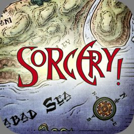 </div>

### Sorcery!

Еталонна комп'ютерна адаптація одноіменної серії з чотирьох книг-ігор - епічна інтерактивна фентезі-пригода у дивному світі магії.

<div style="clear: both" />

* [Сторінка гри на сайті Inkle](https://www.inklestudios.com/sorcery/) з посиланнями на версії для PC, Android, iOS, XBOX, PlayStation та Nintendo Switch.
* Сторінки на IFDB: частина [1](https://ifdb.org/viewgame?id=9i45md5bohgvzlqb), [2](https://ifdb.org/viewgame?id=a3559c86fe59c4on), [3](https://ifdb.org/viewgame?id=taemmwp7jhbej8ay), [4](https://ifdb.org/viewgame?id=u8mr9jhc1jgxksue)


---
<div style="float:left; width: 100px; height:100px; margin-right: 1em; margin-bottom: 1em">  </div>

### King of Dragon Pass

Унікальне поєднання текстового наративу із стратегічною та рольовою грою.

<div style="clear: both" />

* [Steam](https://store.steampowered.com/app/352220/King_of_Dragon_Pass/)
* [GOG](https://www.gog.com/game/king_of_dragon_pass)
* [Play Market (Android)](https://play.google.com/store/apps/details?id=com.herocraft.kodp)
* [App Store (iOS)](https://apps.apple.com/ua/app/king-of-dragon-pass/id335545504)


---
## Інше

Інтерактивна література дуже розмаїта, і подекуди приймає досить незвичні чи навіть несподівані форми. Незважаючи на роки існування і сформовані за цей час канони, в ІЛ все ще залишається місце для експериментів.


---
<div style="float:left; width: 100px; height:100px; margin-right: 1em; margin-bottom: 1em">  </div>

### A Dark Room

Клікер. Рогалік. Інтерактивна література. Більшість часу - щось одне з цього, а інколи - все відразу.

*Коли розпалите полум'я, до вас прийде незнайомець. Потім ще, і ще. Потім ви зможете видобувати та будувати щось нове. А потім почнеться ваша власна історія.*

<div style="clear: both" />

* [**Грати онлайн**](http://adarkroom.doublespeakgames.com/)
* [Сторінка на IFDB](https://ifdb.org/viewgame?id=3zg1tkj6qhheeka9)


---
<div style="float:left; width: 100px; height:100px; margin-right: 1em; margin-bottom: 1em"> 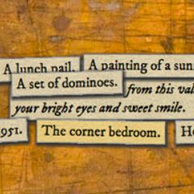 </div>

### 18 Cadence

Незвичайний наративний експеримент - дозволити читачеві самому скласти історію із розрізнених фрагментів.

*На вулиці Каденс був будинок під номером 18. Він був побудований у 1900 році, і згорів вщент у 2000 році. Між цими датами там жили люди: солдати, матері, банкіри, наркомани; люди з таємницями, з клопотами, з мріями, з жалем, з надмірною або недостатньою кількістю речей, з безсонними ночами, зі сміхом, і просто один з одним.*

<div style="clear: both" />

* [**Читати онлайн**](http://18cadence.textories.com/index.html)
* [Сайт проєкту](http://18cadence.textories.com/home.html)
* [Сторінка на IFDB](https://ifdb.org/viewgame?id=xu3axh98nft8qm8n)

---
<div style="float:left; width: 100px; height:100px; margin-right: 1em; margin-bottom: 1em"> 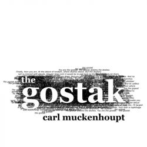 </div>

### The Gostak

Чи можна вважати літературою твір, в якому ти не розумієш більшу частину слів? Якщо ти не розумієш ціль гри та що треба робити, чи можна вважати це грою? Цей експериментальний парсерний твір, незважаючи на контроверсійне ставлення до нього, по праву вважається одною з перлин ІЛ.

*Finally, here you are. At the delcot of tondam, where doshes deave. But the doshery lutt is crenned with glauds.*

*Glauds! How rorm it would be to pell back to the bewl and distunk them, distunk the whole delcot, let the drokes uncren them.*

*But you are the gostak. The gostak distims the doshes. And no glaud will vorl them from you.*

<div style="clear: both" />

* [**Читати(?) онлайн**](https://iplayif.com/?story=https%3A%2F%2Fifarchive.org%2Fif-archive%2Fgames%2Fzcode%2Fgostak.z5)
* [Завантажити](https://ifarchive.org/if-archive/games/zcode/gostak.z5)
* [Сторінка на IFDB](https://ifdb.org/viewgame?id=w5s3sv43s3p98v45)
